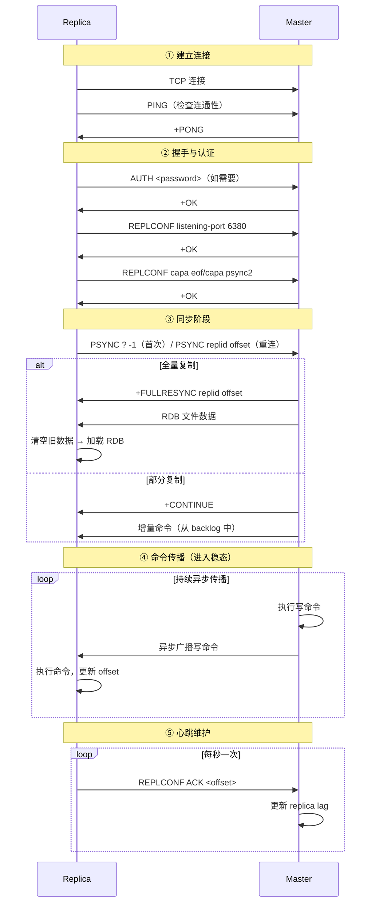
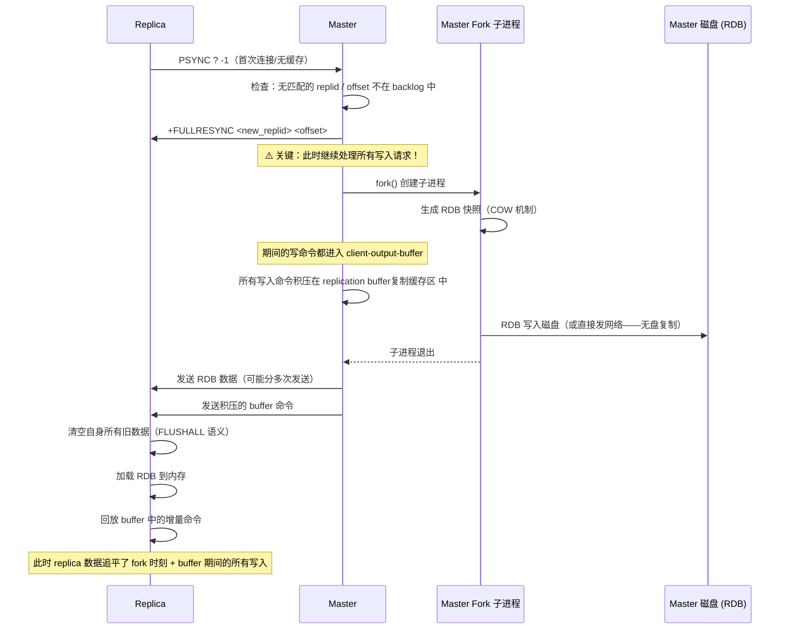
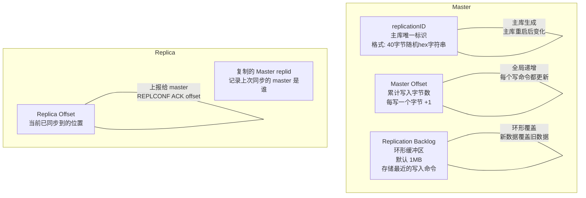
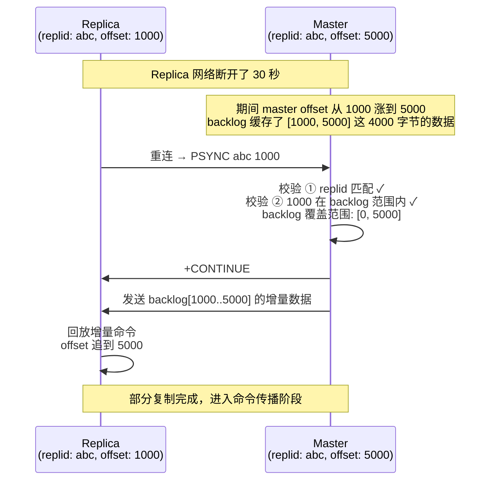
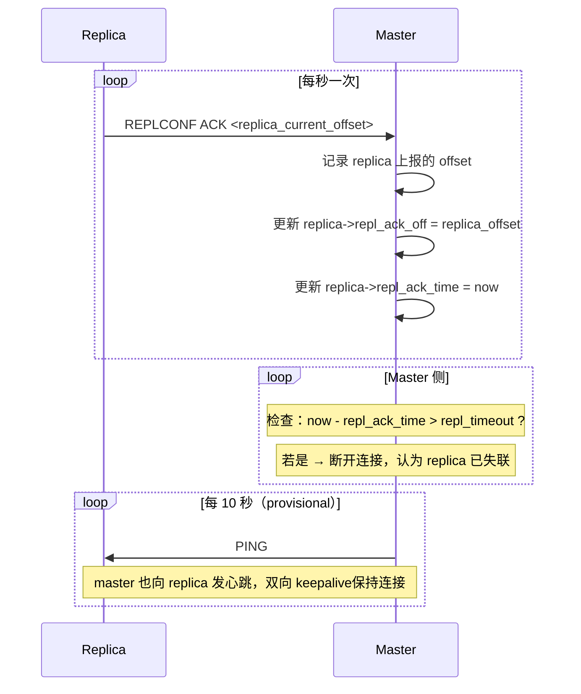
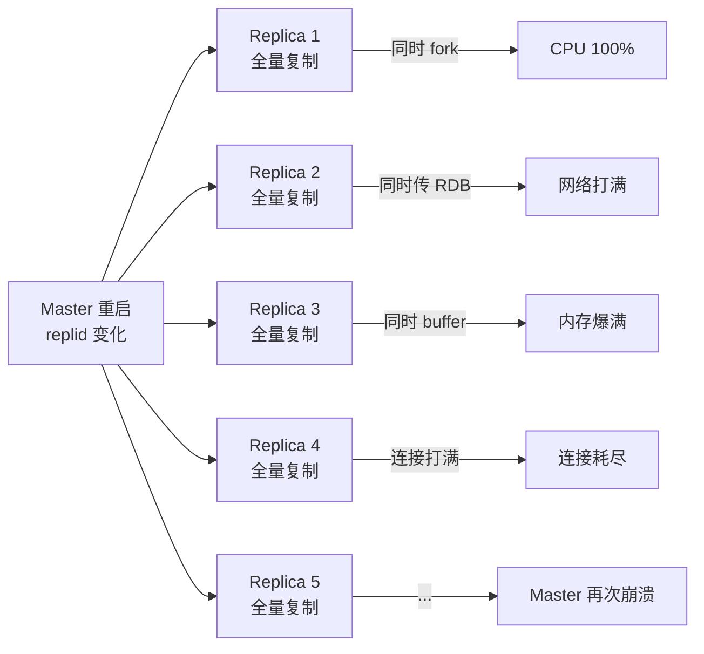
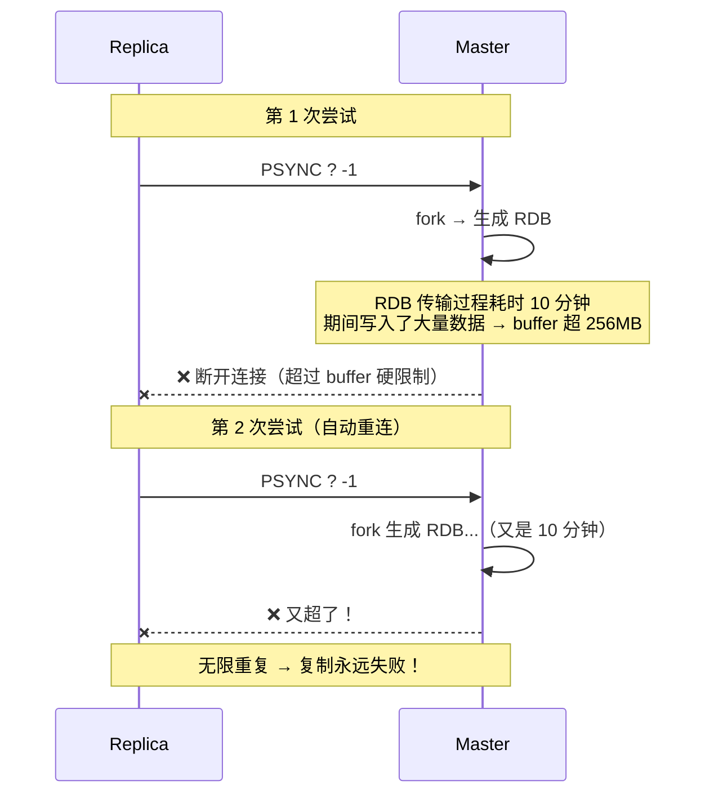
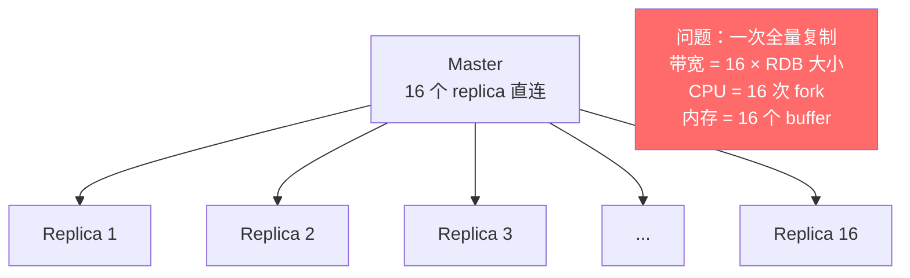
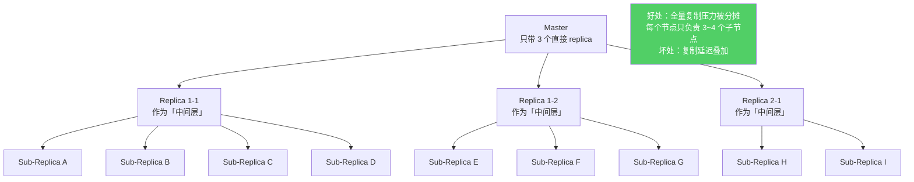
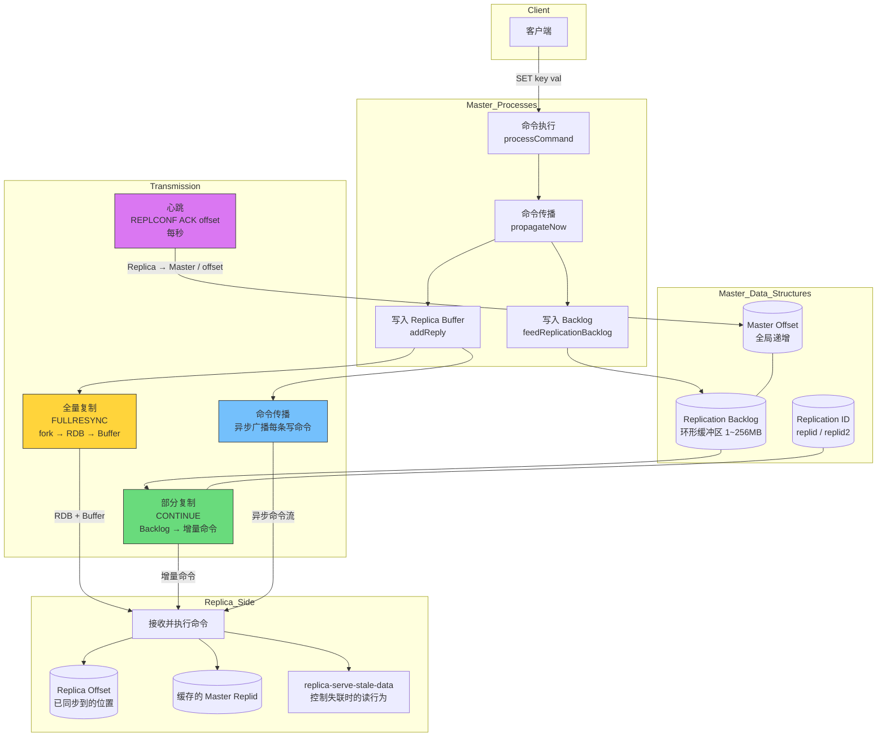

# Redis 主从复制 —— 深入源码级的全景剖解

---

## 核心论点（先读我）

> Redis 主从复制的本质是：**把一台 Redis 的写操作，异步地传播到另一台或多台 Redis 上**。这不是 CP 系统的一致性复制，而是 AP 系统的最终一致性。理解「异步」二字，就理解了一切。:o::o::o::o:

本文从三个层面展开：
1. **What**：每个阶段都在干什么
2. **Why**：为什么这样设计（源码设计决策）
3. **How**：出问题时怎么排查和调优

---

## 第一章：为什么需要主从复制

### 1.1 三大价值维度

```
没有主从复制的单体 Redis：
┌─────────────────────────────┐
│       Client 层              │
│   ┌──┐ ┌──┐ ┌──┐ ┌──┐      │
│   └──┘ └──┘ └──┘ └──┘      │
│      │    │    │    │       │
│      ▼    ▼    ▼    ▼       │
│   ┌──────────────────┐      │
│   │   单台 Redis      │      │
│   │   (读+写都在这里)  │      │
│   └──────────────────┘      │
│                              │
│   问题                       │
│   1. 这台挂了，全部不可用      │
│   2. 10w QPS 全打这一台       │
│   3. 无法做在线扩展           │
└─────────────────────────────┘

引入一主多从后：
┌─────────────────────────────────────────────┐
│                Client 层                      │
│   ┌──┐ ┌──┐ ┌──┐ ┌──┐ ┌──┐ ┌──┐           │
│   └──┘ └──┘ └──┘ └──┘ └──┘ └──┘           │
│     │    │    │    │    │    │              │
│     ▼    ▼    ▼    ▼    ▼    ▼              │
│   ┌────────────────────────────┐            │
│   │   Master（仅处理写请求）    │            │
│   │   QPS: ~1w (写)            │            │
│   └──────┬──────────┬──────────┘            │
│          │ 异步复制  │ 异步复制               │
│          ▼           ▼                       │
│   ┌──────────┐ ┌──────────┐ ┌──────────┐    │
│   │ Replica1  │ │ Replica2  │ │ Replica3  │    │
│   │ 只读       │ │ 只读       │ │ 只读       │    │
│   │ QPS:~3w   │ │ QPS:~3w   │ │ QPS:~3w   │    │
│   └──────────┘ └──────────┘ └──────────┘    │
│                                              │
│   收益                                       │
│   1. 读写分离 → 读 QPS 水平扩展 3 倍          │
│   2. 数据冗余 → 一台挂了还有其他副本           │
│   3. 架构演进 → 为哨兵/集群打基础              │
└─────────────────────────────────────────────┘
```

| 维度 | 没有主从 | 有主从 |
|------|---------|--------|
| **性能** | 读写全压在一台，QPS 上限 = 单机上限 | 读请求分散到多台，写瓶颈不变但读可水平扩展 |
| **可靠性** | 单点故障，数据全丢 | 多副本冗余，主库挂了数据还在 |
| **架构演进** | 死胡同 | 为 Sentinel（哨兵）/ Cluster（集群）铺路 |

**面试金句：** "主从复制是 Redis 高可用的基石。没有它，哨兵无从监控，集群无从分片。它是 Redis 从单体走向分布式的第一步。"

---

## 第二章：主从复制的配置方式

### 2.1 `replicaof` vs `slaveof`:rocket:

```bash
# Redis 5.0 之前（仍然可用，但已标记为 deprecated）
SLAVEOF 127.0.0.1 6379

# Redis 5.0 之后（推荐使用）
REPLICAOF 127.0.0.1 6379
```

**为什么改名？**
> Redis 作者 antirez 在 2018 年决定将 master/slave 术语替换为 master/replica，并在 5.0 版本中引入了 `REPLICAOF` 命令。这是社区对包容性术语的响应，底层实现完全一致，旧命令仍然可用但建议迁移。

**源码对应关系**（`server.c`）：
```c
// 两个命令指向同一个底层 flag
// SLAVEOF 和 REPLICAOF 都设置了 REPLICAOF flag
// 所以执行效果完全一样，只是命令名不同
{"replicaof", replicaofCommand, ...},
{"slaveof",   replicaofCommand, ...},  // 同一个处理函数
```

### 2.2 配置方式对比

| 方式 | 命令 | 持久性 | 使用场景 |
|------|------|--------|---------|
| **配置文件** | `replicaof 192.168.1.100 6379` 写入 redis.conf | 重启后仍生效 | 生产环境固定拓扑 |
| **动态命令** | `redis-cli> REPLICAOF 192.168.1.100 6379` | 重启后失效 | 在线扩缩容、故障处理 |

**伪终端演示：一主两从搭建**

```bash
# ============ 第1步：启动三个 Redis 实例 ============
# Master（端口 6379）
$ redis-server --port 6379 --daemonize yes

# Replica-1（端口 6380）
$ redis-server --port 6380 --daemonize yes

# Replica-2（端口 6381）
$ redis-server --port 6381 --daemonize yes

# ============ 第2步：建立主从关系 ============
$ redis-cli -p 6380 REPLICAOF 127.0.0.1 6379
OK

$ redis-cli -p 6381 REPLICAOF 127.0.0.1 6379
OK

# ============ 第3步：验证 ============
$ redis-cli -p 6379 INFO replication
# Replication
role:master
connected_slaves:2
slave0:ip=127.0.0.1,port=6380,state=online,offset=126,lag=0
slave1:ip=127.0.0.1,port=6381,state=online,offset=126,lag=0

$ redis-cli -p 6380 INFO replication
# Replication
role:slave
master_host:127.0.0.1
master_port:6379
master_link_status:up
slave_read_only:1

# ============ 第4步：验证数据同步 ============
$ redis-cli -p 6379 SET key1 "hello"
OK

$ redis-cli -p 6380 GET key1
"hello"    # ← 数据自动同步过来了
```

### 2.3 replica-read-only：为什么从库默认只读？

```
│  Master                                       │  Replica
│  SET key "value"  ✅ 可以写                    │  SET key "value"  ❌
│                                                │  -READONLY You can't write against
│  原因：                                        │    a read only replica.
│  1. 主从数据一致性——如果从库可写，              │
│     主库不知道这事，数据立刻出现分歧             │
│  2. 全量复制时 replica 清空自己全部数据         │
│     你写过的东西，一个全量复制后就没了            │
│  3. 如果要「数据预处理」，可以在从库写，          │
│     但这不是标准做法                            │
```

**源码级原理**（`server.c` → `processCommand()`）：
```c
// 每个命令执行前都会经过这个检查
int processCommand(client *c) {
    // ...
    // 如果当前实例是 replica，且配置为只读
    // 并且客户端不是从 master 过来的复制连接
    // 并且命令不是只读命令
    if (server.masterhost &&
        server.repl_slave_ro &&
        !(c->flags & CLIENT_MASTER) &&
        !(c->cmd->flags & CMD_READONLY))
    {
        addReplyError(c, "READONLY You can't write against a read only replica.");
        return C_OK;  // 直接拒绝，不会执行
    }
    // ...
}
```

**追问：如果关闭只读，在 replica 上写入数据会发生什么？**

- 数据确实会写入 replica 的内存
- 但这些数据**不会被复制到 master**（复制是单向的：master → replica）
- 一旦触发全量复制，replica 会**清空自己的所有数据**，包括你写入的那些
- 如果 replica 被哨兵提升为 master，这些"脏数据"会被带到新的 master 上，造成严重的数据不一致
- **结论：生产环境绝对不要关闭 replica-read-only**

---

## 第三章：主从复制的核心流程——深入源码级分析

### 3.0 全景流程概览



### 3.1 建立连接阶段——源码级分析

**核心调用链：**

```
replica 端（关键源码路径：replication.c）：
  replicationSetMaster()
    → connectWithMaster()        // 创建 TCP 连接（非阻塞 socket）
      → syncWithMaster()         // 主状态机，处理握手全流程
        → slaveTryPartialResynchronization()  // 发送 PSYNCPSYNC 是 ,Redis 主从复制中的核心命令，全称是 Partial Synchronization（部分同步）
```

**`syncWithMaster()` 事件处理状态机：**

### 状态机是什么？

**状态机（State Machine）** 是一种编程模型，一个系统在任何时刻都处于**某个状态**，当**某个事件**发生时，系统根据当前状态和事件，执行对应的动作，并转移到下一个状态。

在 Redis 的事件循环中，状态机长这样：

```
while (服务没有停止) {
    // 等待并收集此刻发生的事件（可读、可写、定时任务）
    events = 收集事件()
    
    // 针对每个事件，调用预先注册的回调函数
    for 事件 in events {
        if 事件是"客户端连接"     → 执行连接处理函数
        if 事件是"命令请求可读"   → 执行命令读取函数
        if 事件是"回复可写"       → 执行回复发送函数
        if 事件是"定时任务到期"   → 执行定时任务函数
    }
}
```

这不是一个复杂的“多状态转换”状态机，而是一个**事件循环 + 回调驱动**的模式，本质上就是**事件驱动的反应式状态机**。它的状态是“当前在处理哪个事件”，事件是“网络 I/O 就绪”或“定时器到期”。

```c
// 源码精简版：replication.c 中的状态机
// 每个状态对应握手的一个阶段

#define REPL_STATE_CONNECTING 1          // 正在建立 TCP 连接
#define REPL_STATE_RECEIVE_PONG 2        // 等待 PONG 响应
#define REPL_STATE_SEND_AUTH 3           // 发送 AUTH
#define REPL_STATE_RECEIVE_AUTH 4        // 等待 AUTH 响应
#define REPL_STATE_SEND_PORT 5           // 发送 REPLCONF listening-port
#define REPL_STATE_RECEIVE_PORT 6        // 等待 REPLCONF 响应
#define REPL_STATE_SEND_CAPA 7           // 发送 REPLCONF capa（能力协商）
#define REPL_STATE_RECEIVE_CAPA 8        // 等待 capa 响应
#define REPL_STATE_SEND_PSYNC 9          // 发送 PSYNC 命令
#define REPL_STATE_RECEIVE_PSYNC 10      // 等待 PSYNC 响应

// 为什么设计成状态机？
// 答案：全流程是异步的。socket 是非阻塞的，每次事件触发只能推进一个状态。
//      如果做成同步阻塞，一次网络抖动就会卡住整个 replica 进程。
```

**Redis 的事件处理状态机和 Netty 的核心思想一模一样**，因为它们都是基于 **Reactor 模式** 的实现。

**epoll 是个“通知机制”，而 Reactor 是一套“怎么利用这个通知来组织代码”的设计模式。**:o::o::o::o::o::o::o::o::o::o::o::o::o::o::o:

epoll 是 Linux 内核提供的 **I/O 多路复用** 技术，只负责告诉你“哪些连接上有数据可读/可写了”。
Reactor 是一种 **事件驱动架构模式**，它定义了一个中心组件（Reactor）如何监听事件，并分发给对应的处理器（Handler）来执行读写和处理逻辑

------

### 为什么觉得redis,netty一样？

因为它们都遵循同一套“骨架”：

1. **事件循环（Event Loop）**
   - Redis 的 `aeMain` 循环 vs Netty 的 `NioEventLoop` 循环
   - 都是一个死循环，不断地 `select`（等待事件）→ `dispatch`（分发给 handler）
2. **非阻塞 I/O + 多路复用**
   - Redis 封装了 `epoll`/`kqueue`/`select`
   - Netty 也封装了 `epoll`/`kqueue`（甚至提供 native transport）
3. **事件驱动回调**
   - Redis 为每个 `fd` 注册 `rfileProc` / `wfileProc` 回调
   - Netty 的 `ChannelPipeline` 是一串 `ChannelHandler` 回调链
4. **单线程事件处理**
   - Redis 主线程就是单线程 reactor
   - Netty 的 `NioEventLoop` 内部也是单线程处理 I/O（虽然可以有多个 EventLoop）

**面试追问：为什么握手要分这么多步骤？**

> 每个步骤解决一个问题：
> 1. PING/PONG → 确保 master 确实可达且能响应:rocket:
> 2. AUTH → 安全认证，防止未授权接入:rocket:
> 3. REPLCONF port → master 需要知道 replica 的端口，用于 `INFO replication` 展示:rocket:
> 4. REPLCONF capa → **能力协商**:rocket:，replica 告诉 master 自己支持什么特性（如 PSYNC2、eof）
> 5. PSYNC → 核心同步请求:rockt:


### 3.2 全量复制（Full Resynchronization）

#### 3.2.1 完整时序流程



#### 3.2.2 全量复制期间的三大核心问题

**问题1：fork 子进程时，master 能继续处理写请求吗？**

> **能。** 这得益于操作系统的 **COW（Copy-On-Write，写时复制）** 机制。
>
> ```
> fork() 的工作原理（精简版）：
>
>   父进程页表                      物理内存                子进程页表
>   ┌──────────┐                ┌──────────────┐        ┌──────────┐
>   │ Page 0 R │───────────────▶│  真实数据页   │◀───────│ Page 0 R │
>   │ Page 1 R │──┐             └──────────────┘    ┌───│ Page 1 R │
>   │ Page 2 R │  │                                 │   │ Page 2 R │
>   └──────────┘  │                                 │   └──────────┘
>                 │            ┌──────────────┐     │
>                 └───────────▶│  真实数据页   │◀────┘
>                              └──────────────┘
>
>   fork 之后：
>   - 父子进程共享同一块物理内存，页表都标记为只读（R）
>   - 不复制任何数据！fork() 的速度和内存大小无关
>
>   父进程（master）执行写入时：
>   ┌──────────┐                ┌──────────────┐        ┌──────────┐
>   │ Page 0 R │───X            │  原始数据页   │◀───────│ Page 0 R │
>   │ Page 1 W │───┐            └──────────────┘        │          │
>   │          │   │                                    │          │
>   └──────────┘   │     ┌──────────────┐              └──────────┘
>                  └────▶│  新数据页(COPY)│
>                        └──────────────┘
>   - 触发「页故障」(page fault)，操作系统拷贝一个新页给父进程
>   - 子进程仍然指向原始页，不受影响
>   - COW 的代价 = 被修改的页数 × 4KB（一页），而不是整个数据量
> ```
>
> **所以，master 在 fork 期间和 fork 之后都能正常处理请求。**
> 但要注意两个风险：
> 1. fork 操作本身是瞬时阻塞的（调用 fork() 的一瞬间），数据量大时这个瞬间可能较长
> 2. 如果写操作太密集，COW 复制很多页，内存会膨胀

**问题2：如果 RDB 文件很大（如 20GB），会有什么问题？**

> | 阶段 | 问题 | 后果 |
> |------|------|------|
> | **fork** | 大内存实例 fork 耗时可达数百毫秒，期间 master 阻塞 | 请求延迟尖刺 |
> | **RDB 生成** | 子进程写 RDB 消耗磁盘 I/O | 影响 master 的 AOF/RDB 持久化 I/O |
> | **RDB 传输** | 20GB 文件跨网络传输，耗时可能 >= 10 分钟 | 带宽打满影响其他服务 |
> | **replication buffer** | 传输期间的大量写入可能撑爆 buffer | 复制中断，重新开始（死循环）|
> | **replica 加载 RDB** | replica 清空数据 + 加载 20GB 耗时数分钟 | replica 在此期间不可服务 |
>
> **解决方案：**
> - 无盘复制（`repl-diskless-sync`）：RDB 不落盘，直接通过网络发送:rocket::rocket::rocket::rocket::o::o::o::o:
> - 级联复制：不要让所有 replica 都从 master 全量同步:rocket::rocket::rocket::rocket::o::o::o::o::o::o::o::o::o:
> - 拆分大实例：一个 20GB 的实例拆成多个小实例

**问题3：`client-output-buffer-limit slave` 的机制**:rocket::rocket::rocket::rocket::rocket::rocket::o::o::o::o::o::o::o::o::o::o::o::o::o:

`client-output-buffer-limit slave` 是 Redis 主节点上专门用来控制**主从复制缓冲区**大小的一项关键配置。它的核心作用是：**防止主节点因为从节点同步太慢而被撑爆内存**。

当 Redis 实例作为**主节点**时，每个连接到它的从节点，在主节点内部都会有一个**输出缓冲区（output buffer）**。主节点会把所有写命令写入这个缓冲区，然后通过网络发给从节点。

如果从节点因为机器性能差、网络延迟高、加载 RDB 文件慢等原因处理不过来，主节点的这个缓冲区就会越来越大，无限制增长的话会耗尽主节点内存，导致主节点 OOM 崩溃。

`client-output-buffer-limit slave` 就是用来限制这个缓冲区的大小的。超过限制，主节点会**主动断开这个从节点的复制连接**，保护自己。

```c
// 源码配置结构
// client-output-buffer-limit <class> <hard_limit> <soft_limit> <soft_seconds>
//
// 默认值：client-output-buffer-limit slave 256mb 64mb 60

// 含义：
// hard_limit = 256MB：超过这个值，立即断开连接
// soft_limit = 64MB：超过这个值，开始计时
// soft_seconds = 60：连续超过 soft_limit 60 秒，断开连接

// 判断逻辑（源码精简）：
int checkClientOutputBufferLimits(client *c) {
    unsigned long used = getClientOutputBufferMemoryUsage(c);
    if (used > hard_limit) {
        // 超过硬限制 → 立即断开
        freeClient(c);
        return 1;
    }
    if (used > soft_limit) {
        // 超过软限制 → 开始计时
        if (c->obuf_soft_limit_reached_time == 0) {
            c->obuf_soft_limit_reached_time = server.unixtime;
        } else if (server.unixtime - c->obuf_soft_limit_reached_time > soft_seconds) {
            // 持续时间超过 60 秒 → 断开
            freeClient(c);
            return 1;
        }
    } else {
        // 降到软限制以下 → 重置计时器
        c->obuf_soft_limit_reached_time = 0;
    }
    return 0;
}
```

**调优公式：**

```
buffer 容量的基本公式：
  buffer_size ≥ (RDB 传输时间 + RDB 加载时间) × 写入速率

实例：
  RDB 大小 = 10GB
  网络带宽 = 1Gbps → 理论传输时间 ≈ 80 秒
  写入速率 = 10MB/s
  → buffer 需求 ≥ 80s × 10MB/s = 800MB

  所以默认的 256MB 硬限制在 RDB 较大时很可能不够！
```

---

### 3.3 部分复制（Partial Resynchronization）

#### 3.3.1 为什么需要部分复制？

```
场景：replica 和 master 网络闪断了几秒钟
  - 如果用全量复制：重新 fork + 生成 RDB + 传输 + 加载
    → 10GB 实例：几分钟的代价，期间 master CPU/内存/网络都受冲击

  - 如果用部分复制：master 把断线期间的增量命令直接发给 replica
    → 可能只有几百 KB，瞬间完成

这就是 PSYNC 的价值：让「短暂断线」≠「全量复制」
```

### 全量同步的笨办法

- 主库 = 老师，从库 = 学生抄笔记。
- 老方式（`SYNC`）：学生哪怕只走神了 1 秒，老师也必须把整本笔记（RDB 快照）从头到尾重新念一遍，效率极低。

------

### 部分重同步怎么工作？

老师（主库）想了个办法：

- 他有一个 **录音机（replication backlog）**，会录下自己讲过的每一句话（写命令），并给每句话编上序号（offset）。
- 学生（从库）走神回来，只要说：“老师，我最后听到的是第 **1000** 号指令。”
- 老师检查录音机，发现从 1000 号之后的录音都还在（因为录音机容量有限，太旧的可能被覆盖），于是直接播放 **1001 号、1002 号……一直到当前最新** 的录音。:rocket::rocket::rocket::rocket::rocket:
- 学生补上这些笔记后，继续听老师讲新课（实时复制流）。

**注意：“缺失的数据”正是这 1001 号到当前最新之间的录音，补完之后，后面的新课（后续命令）学生自然会继续听，不会漏掉。**

### 回到 Redis 的实际流程:rocket:

从库断线重连后，发送 `PSYNC <run_id> <offset>`：

- `offset` 是从库已经收到的最后一个命令的偏移量。
- 主库检查自己的 **复制积压缓冲区（replication backlog）**：
  - 如果 `offset` 还在缓冲区内，主库就把 **offset+1 一直到当前最新** 的所有命令打包发给从库。
  - 从库按顺序执行这些命令，状态追上主库。
- 之后，主库产生的每一个新写命令，依然会**实时**发送给从库。

#### 3.3.2 三大核心数据结构



**replication backlog 源码结构：**

```c
// replication.c 中 backlog 的核心实现
struct redisServer {
    // ...
    char *repl_backlog;       // 环形缓冲区的起始指针
    long long repl_backlog_size;   // 缓冲区总大小（字节）
    long long repl_backlog_histlen; // 当前已使用的大小
    long long repl_backlog_idx;    // 下一个写入位置（环形指针）
    long long repl_backlog_off;    // 缓冲区中最老数据的 offset（全局offset）
    // ...
};

// 写入 backlog（每次执行写命令后调用）
void feedReplicationBacklog(void *ptr, size_t len) {
    // 如果 buffer 满了，需要环形覆盖
    while (len > 0) {
        size_t thislen = min(len, server.repl_backlog_size - server.repl_backlog_idx);
        memcpy(server.repl_backlog + server.repl_backlog_idx, ptr, thislen);
        server.repl_backlog_idx = (server.repl_backlog_idx + thislen)
                                  % server.repl_backlog_size;
        server.repl_backlog_histlen += thislen;
        server.repl_backlog_off += thislen;
        ptr = (char*)ptr + thislen;
        len -= thislen;
    }
}

// 判断是否可以部分复制
int canPartialResync(long long replica_offset) {
    // replica 请求的 offset 必须在 backlog 范围内
    // backlog 中最老数据的 offset < replica_offset
    if (replica_offset >= server.repl_backlog_off &&
        replica_offset < server.repl_backlog_off + server.repl_backlog_histlen)
    {
        return 1;  // 可以部分复制！
    }
    return 0;  // 数据已被覆盖 → 只能全量复制
}
```

#### 3.3.3 部分复制交互流程



#### 3.3.4 部分复制退化为全量复制的场景

| 场景 | 原因 | 预防措施 |
|------|------|---------|
| **断线时间太长**:o::o: | replica 请求的 offset 已被 backlog 覆盖掉 | `repl-backlog-size` 调大 = 断线时长 × 写入速率 × 2 |
| **Master 重启** | replid 变化，replica 的旧 replid 无法匹配 | 使用哨兵/cluster 做故障转移，避免直接重启主库 |
| **Replica 重启**（无持久化） | replica 丢失了缓存的 replid 和 offset | replica 也开启 AOF/RDB 持久化:o: |
| **主从切换** | 新 master 的 replid 变化 | PSYNC2（Redis 4.0+）通过 `replid2` 缓存旧主 replid |

**backlog 大小计算公式：**

```
需求分析：
  假设断线可能持续 T 秒，每秒写入 W 字节

  backlog_size ≥ T × W × 2
                ↑      ↑
                │      └─── 安全系数（应对突发流量）
                └── 断线窗口内的总写入量

实例：
  T = 60 秒（假设最坏情况断线 1 分钟）
  W = 1MB/s（10000 writes/s × 100 bytes/write）
  → backlog ≥ 60 × 1MB × 2 = 120MB

默认 1MB 对于绝大多数场景都太小！
生产环境建议：根据 INFO replication 中的 offset 增长速度来测算，设置为 10MB ~ 256MB
```

---

### 3.4 命令传播阶段——进入稳态

```
命令传播伪代码（replication.c - propagateNow() / replicationFeedSlaves()）：

void propagateNow() {
    // ① 写入 AOF 文件（如果开启了 AOF）
    if (server.aof_state != AOF_OFF)
        feedAppendOnlyFile(cmd, dbid, argv, argc);

    // ② 写入所有 replica 的输出缓冲区
    replicationFeedSlaves(server.slaves, dbid, argv, argc);
}

void replicationFeedSlaves(list *slaves, int dictid, robj **argv, int argc) {
    // ③ 先写入 backlog（为部分复制做准备）
    if (server.repl_backlog) {
        feedReplicationBacklog(buf, len);      // 写入环形缓冲区
    }

    // ④ 遍历所有 replica，异步发送命令
    listRewind(slaves, &li);
    while ((ln = listNext(&li))) {
        client *slave = ln->value;
        addReply(slave, buf, len);             // 写入 replica 的 output buffer
        // 注意：这是异步的！addReply 只是把数据放到缓冲区，
        // 真正的网络发送由 epoll 事件循环在下一次 loop 中处理
    }
}
```

**关键结论：**

> **异步复制 = 最终一致性。** Master 执行完写命令后，不会等待 replica 确认就返回客户端。这意味着：
> 1. 客户端收到 OK 后，replica 可能还没收到这条命令
> 2. Master 宕机时，未传播到 replica 的命令会丢失
> 3. 这是 Redis 的设计选择——用一致性换性能

---

### 3.5 心跳与连接维护



**心跳的三大作用：**

| 作用 | 说明 |
|------|------|
| **① 检测连接状态** | timeout 未收到 ACK → 断开，避免半死连接 |
| **② 上报 offset**:rocket::rocket::rocket::rocket::rocket::rocket::rocket:和mq的心跳一样，也是上报offset | master 用 `repl_ack_off` 判断 replica 追到哪里了（`INFO replication` 里的 `lag`） |
| **③ 辅助 min-replicas** | `min-replicas-to-write` 依赖心跳时序来判断 "多少 replica 在线" 和 "延迟多大":rocket: |

#### 深入追问：`min-replicas-to-write` 能保证强一致性吗？

假设你有 **1 主 2 从 + 哨兵** 的 Redis 架构：:rocket::rocket::rocket::rocket::rocket::rocket:

1. 客户端执行 `SET key "important"`。
2. 主节点执行成功，**立即返回 OK 给客户端**。
3. 主节点把这个写命令**异步**发送给从节点，但还没来得及发，**主节点的服务器突然断电烧毁**。
4. 哨兵检测到主节点挂了，从剩余从节点中选出 **一个作为新主**。
5. 客户端连上新主，执行 `GET key` → 返回 `nil`。

虽然说主节点持久化了，但是这个时候选了新主的话，然后还添加了数据，新主里面有一些数据在旧主里面没有，而旧主里面还有因为旧主宕机而没有同步到新主的数据。:o::o::o::o::o::o::o::o::o::o::o::o::o::o::o::o::o::o::o::o::o::o::o::o::o::o::o:

当旧主重启回来时，哨兵已经选出了新主。**旧主只能作为新主的一个从节点重新加入集群**。作为从节点，它要做的第一件事就是：

> **清空自己的所有数据，然后从新主节点做一个全量同步 (或部分同步)。**

因为新主节点上没有 `key "important"` 这条数据，最终旧主从新主同步来的数据里也不会有它。那条数据就这样彻底消失了。

**这条数据就永久丢了。**


`min-replicas-to-write` 是 Redis 主节点上的一项**数据安全配置**，它让主节点在**从节点数量不足**时直接拒绝写请求，从而避免主节点宕机后数据丢失。

默认的主从复制是**异步**的：主节点执行完写命令后，不等从节点确认就返回客户端。
如果主节点突然宕机，而数据还没来得及复制到从节点，这部分数据就会永久丢失（即使哨兵做了故障切换）。

`min-replicas-to-write` 提供了一种**弱一致性保证**：
**“只有当足够多的从节点‘健康’时，主节点才接受写操作”。**

```
配置：
  min-replicas-to-write 3
  min-replicas-max-lag 10

语义：
  只有当 >= 3 个 replica 的 lag（延迟）<= 10 秒时，master 才接受写请求。
  如果健康 replica 不足 3 个，master 拒绝写请求并返回错误。

为什么不能保证强一致性？

  假设时间线：
  T0: 3 个 replica 都健康，lag < 10s → master 接受写入
  T1: master 执行 SET key "value"，返回 OK 给客户端
  T2: master 还没来得及把这条命令发给 replica
  T3: master 突然宕机了！

  结果：客户端认为写成功了，但 replica 上根本没有这条数据。
       min-replicas 机制只是用「历史 lag」来推断，并不能保证毫秒级的实时同步。


```

  真正的强一致性需要：:o::o::o::o::o::o::o::o:
  - 同步复制（master 必须等至少 N 个 replica 确认后才返回）:o:
  - 或者 Raft/Paxos 等共识协议:o:
  - Redis Cluster + WAIT 命令可以接近同步确认，但仍不是严格的 CP 保证:o:

### WAIT它是怎么起效果的？

我们把你之前那个丢数据的例子改进一下，用 `WAIT` 重新执行：

```
# 客户端执行
SET key "important"
WAIT 1 5000   # 命令 1：等待至少 1 个从节点确认，最长等 5 秒
```

这次，时间线变成了这样：

1. 主节点执行 `SET key "important"`。
2. 主节点**没有立刻返回 OK**，而是立刻把这条写命令发送给所有从节点。
3. 从节点 A 收到命令，执行成功，向主节点回复一个 `ACK`（确认），表示“我内存里已经有了”。
4. 主节点收到从节点 A 的确认，计数 +1。此时已经有 **1 个从节点确认**。
5. 主节点这才对客户端返回 `OK`。

现在，如果主节点在返回 OK **之后**突然断电烧毁，哨兵开始选新主。因为从节点 A 已经确认收到了 `key "important"`，它的数据偏移量是最新的。**哨兵会优先选择数据最完整（偏移量最大）的从节点作为新主。** 从节点 A 会成为新主，客户端连上后执行 `GET key`，就会返回 `"important"`。数据保住了。

**`WAIT` 之后的瞬间风险**
`WAIT` 只能保证**执行 WAIT 命令那一刻**，数据至少有 N 个副本。在那之后，如果从节点又立马挂掉，而主节点紧接着也挂了，数据依然会丢。


面试话术：
  "Redis 主从复制是异步复制，即使配置了 min-replicas-to-write，
   也只能保证'至少有 N 个 replica 在过去 10 秒内是存活的'，
   而不是'至少有 N 个 replica 已经确认收到了这条写命令'。
   本质上是 AP 的，不是 CP 的。"


#### 深入追问：`repl-timeout` 设为多大合适？

| 设置 | 问题 |
|------|------|
| **太小（如 5s）** | 正常的网络抖动就会被判定为超时 → 频繁断开重连 → 频繁全量/部分复制 |
| **太大（如 600s）** | replica 已经"假死"很久了，master 还认为它在线 → `min-replicas` 判断失效 → 假死 replica 过期数据被读到 |
| **推荐：内网 30~60s** | 内网 RTT < 1ms，30 秒足以排除真正的故障 |

---

## 第四章：关键配置参数深度解析

| 参数 | 默认值 | 源码位置 | 含义 | 调优建议 |
|------|--------|---------|------|----------|
| `repl-backlog-size` | 1MB | `server.repl_backlog_size` | 部分复制的环形缓冲区大小:rocket::rocket::rocket: | **生产必调！** 根据写入速率 × 预估断线时长 × 2 计算，建议 64MB~256MB |
| `repl-backlog-ttl` | 3600s | `server.repl_backlog_time_limit` | 所有 replica 断开后，backlog 保留多久才释放内存 | 减小无用内存占用，不需要调 |
| `repl-timeout` | 60s | `server.repl_timeout` | 复制超时，包括同步阶段的超时和数据传输的超时 | 内网 30~60s，跨机房 120s |
| `client-output-buffer-limit slave` | 256mb/64mb/60 | 见 `checkClientOutputBufferLimits()` | replica 输出缓冲区：硬限制/软限制/软限制时间 | RDB > 5GB 的生产环境，建议硬限制调到 512MB+ |
| `replica-read-only` | yes | `server.repl_slave_ro` | 从库是否只读 | **不要改**。除非你做特殊的数据预处理管线 |
| `min-replicas-to-write` | 0 | `server.repl_min_slaves_to_write` | 最少健康 replica 数（不满足则拒绝写入） | 高可用场景设为 >= 1，配合 `min-replicas-max-lag` |
| `min-replicas-max-lag` | 10s | `server.repl_min_slaves_max_lag` | replica lag 超过此值视为不健康 | 根据业务 SLA 调整，5~30s |
| `repl-diskless-sync` | no | `server.repl_diskless_sync` | 无盘复制：RDB 不写磁盘直接发网络 | 磁盘慢/网络快的场景开启，减少磁盘 I/O |
| `repl-diskless-sync-delay` | 5s | `server.repl_diskless_sync_delay` | 等 N 秒，让更多 replica 排队一起做无盘同步 | 防止多个 replica 同时触发 fork |
| `replica-serve-stale-data` | yes | `server.repl_serve_stale_data` | replica 与 master 失联后是否继续服务读请求 | 见 6.5 节详细分析 |
| `repl-ping-replica-period` | 10s | `server.repl_ping_slave_period` | master 向 replica 发 PING 的间隔 | 配合 repl-timeout 设置，一般不需调整 |
| `repl-diskless-load` | disabled | `server.repl_diskless_load` | replica 边接收 RDB 边加载（无盘加载） | 大 RDB 场景可减少加载时间 |

---

## 第五章：常见问题与事故排查

### 5.1 从库延迟越来越大（复制延迟）

**问题场景：**
```
$ redis-cli -p 6379 INFO replication
# Master
master_repl_offset:1234567890

$ redis-cli -p 6380 INFO replication
# Replica
slave_repl_offset:1234000000

# → 差距 = 567890 字节，而且越来越大
```

**根因分析：**:rocket::rocket::rocket::rocket::rocket::rocket:

```
Replica 只有一个命令处理线程！它的工作包括：
  1. 处理来自 master 的复制命令（需要执行 SET/DEL 等操作）
  2. 处理来自客户端的读请求

如果客户端读请求太多，复制命令的处理时间被挤压 → offset 追不上 master。

这本质上是一个单线程的队列堆积问题：

  Master:         Replica:
  [写][写][写]    [读][读][读][ 复制命令 ][读][读][读]...
     ↓                ↑                       ↑
   写入 10MB/s      客户端 QPS 3w          复制命令在排队等待
```

**定位手段：**

```bash
# 1. 查看复制状态
redis-cli INFO replication | grep -E "master_repl_offset|slave_repl_offset|lag"

# 2. 查看从库的瞬时 QPS
redis-cli --stat   # 持续输出 QPS

# 3. 采样查看从库在跑的慢命令
redis-cli SLOWLOG GET 10

# 4. 查看从库的 CPU 使用率和内存带宽
```

**解决方案：**

1. **减小从库读压力**：把读请求分流到更多 replica:rocket::rocket:
2. **增加从库机器性能**：更好的 CPU / 内存（Redis 主要瓶颈在职内存带宽）
3. **使用客户端做二次路由**：客户端感知主从拓扑，将特定 replica 上延迟过高的请求路由到其他 replica

---

### 5.2 主库重启后所有从库全量复制——复制雪崩:o::o::o::o::o::o::o::o::o::o::o::o::o:

```
事故时间线：

T0: Master 正常运行，5 个 replica 连接在线
    每个 replica 持有数据 ① all>

T1: Master 进程崩溃（或运维执行了重启）

T2: Master 重启，replid 变成新值 (原 replid = AAA → 新的 = BBB)

T3: 5 个 replica 全部重新连接
    → 发送 PSYNC AAA <offset>（带着旧的 replid）
    → Master:"我不认识 AAA" → 返回 +FULLRESYNC

T4: 5 个 replica 同时触发全量复制！
    Master: fork × 5 次 → CPU 爆满
            发送 5 份 RDB → 网络带宽打满
            5 个 client-output-buffer → 内存爆满

T5: ❌ Master 被压垮，整个 Redis 体系崩溃
```



**解决方案：**

1. **Redis 4.0+ PSYNC2**：RDB 文件中保存 replid（从 RDB 加载后，master 继承旧的 replid 作为 `replid2`），replica 连上来时可匹配
2. **使用哨兵做故障转移**：不要直接重启主库，让哨兵把 replica 晋升为新 master（新 master 的 replid 不变）:o::o::o::o::o::o::o:
3. **级联复制拓扑**：不要让所有 replica 直连 master，减少同时全量复制的数量:o::o::o::o::o::o::o::o::o::o::o::o::o::o::o::o::o:

---

### 5.3 全量复制反复失败——Buffer 死循环



**解决方案：**
1. **增大 buffer**：`client-output-buffer-limit slave 512mb 128mb 120`:rocket::o::o::o::o::o::o:
2. **无盘复制**：`repl-diskless-sync yes`（RDB 直接流式发送，不写盘不等 IO）:rocket::o::o::o::o::o:
3. **拆分实例**：把大实例拆成多个小实例（每个 5GB 以下）
4. **写流量控制**：全量复制期间对写请求做限流（业务层面配合）

---

### 5.4 复制风暴——一个主库挂太多从库



**级联复制——树状拓扑：**:rocket::o:o::o::o::



```
级联复制配置：
  # Master（6379）
  # 中间 Replica（6380）
  REPLICAOF 127.0.0.1 6379  # 从 Master 同步

  # 叶子 Replica（6381）
  REPLICAOF 127.0.0.1 6380  # 从中间 Replica 同步

坏处：
  - 延迟叠加：Master → 中间 → 叶子，数据到达叶子需要双重延迟
  - 中间节点挂了 → 下面所有叶子断连
  - INFO replication 在中间节点上，叶子 replica 显示 master 是中间节点
```

---

## 第六章：深入专题

### 6.1 Redis 2.8 前后的复制演进

```
时间线：

Redis 2.6 及之前：  SYNC
  ┌─────────────────────────────────────┐
  │ 每次重连 → 全量复制 → fork + RDB    │
  │ 不管断线多久，哪怕只断了 0.1 秒      │
  │ 问题：资源消耗巨大，毫秒级抖动引发    │
  │       全量复制，闭环放大故障          │
  └─────────────────────────────────────┘

Redis 2.8：         PSYNC
  ┌─────────────────────────────────────┐
  │ 引入 Replication ID + Offset +       │
  │      Backlog 三大机制               │
  │ 短暂断线 → 部分复制（增量同步）      │
  │ 只发断线期间的增量命令               │
  │ 问题：主库重启 → replid 变化          │
  │       → 全部 replica 又全量复制       │
  └─────────────────────────────────────┘

Redis 4.0：         PSYNC2
  ┌─────────────────────────────────────┐
  │ 引入 replid2（备份复制ID）            │
  │ 主库重启后：                          │
  │   - 新的 replid = <新生成>           │
  │   - 旧的 replid → 保存到 replid2    │
  │ Replica 连接时：                      │
  │   - 先尝试用旧 replid 匹配           │
  │   - 如果 replid2 匹配 → 仍可部分复制  │
  │ 解决了主库重启导致的全量复制雪崩       │
  └─────────────────────────────────────┘
```

**PSYNC2 的核心改进（源码层面）：**

```c
// Redis 4.0+ 的 replid 模型
struct redisServer {
    char replid[CONFIG_RUN_ID_SIZE+1];   // 当前 replid（主库重启后重新生成）
    char replid2[CONFIG_RUN_ID_SIZE+1];  // 前一个 replid（主库重启前的）
    long long second_replid_offset;      // replid2 生效时的 offset
};

// replica 请求 PSYNC 时的匹配逻辑
int masterTryPartialResynchronization(client *c, char *replid, long long psync_offset) {
    // ① 先匹配当前 replid
    if (strcasecmp(replid, server.replid) == 0) {
        if (canPartialResync(psync_offset)) {
            return PSYNC_CONTINUE;  // 正常部分复制
        }
    }

    // ② 再匹配 replid2（PSYNC2 新增！）
    if (strcasecmp(replid, server.replid2) == 0 &&
        psync_offset >= server.second_replid_offset)
    {
        // 用旧 replid 找到匹配 → 从这个 offset 开始可以部分复制
        // 这意味着主库重启后，replica 仍可部分复制！
        return PSYNC_CONTINUE;
    }

    // ③ 都不匹配 → 只能全量复制
    return PSYNC_FULLRESYNC;
}
```

**面试追问：PSYNC2 能解决所有场景的主从切换吗？**

> 不能。PSYNC2 只能解决「同一个主库重启」的场景（replid2 机制）。对于「哨兵选举 replica 成为新 master」，新 master 的 replid 是它自己的（不是旧 master 的），所以连接新 master 的其他 replica 仍可能触发全量复制——除非它们跟新 master 有同步过的历史关系。

---

### 6.2 无盘复制（Diskless Replication）:rocket::rocket::rocket::rocket:

```
传统全量复制（有盘）：
  Master: fork → 写 RDB 到磁盘 → 读 RDB 从磁盘 → 发网络
  问题：磁盘 I/O 两次（写 + 读），慢 + 磁盘成为瓶颈

无盘复制（Diskless）：
  Master: fork → 子进程直接通过 socket 把 RDB 数据流式发给 replica
  好处：跳过磁盘，速度取决于网络带宽

对比：

  有盘模式：
  ┌─────┐      ┌──────┐      ┌──────┐
  │fork │─→─磁盘│RDB 文件│─→─│ 发送  │
  └─────┘      └──────┘      └──────┘

  无盘模式：
  ┌─────┐      ┌──────────────┐
  │fork │─→─直接│→ 网络 socket │
  └─────┘      └──────────────┘

什么时候用无盘复制？
  ✅ 磁盘慢（机械硬盘），网络快（万兆网卡）
  ✅ 数据安全不关心（RDB 不落盘也没什么）
  ❌ 磁盘快，网络慢（仍然是磁盘更快）
  ❌ 需要 RDB 用于灾难恢复（无盘复制不产生 RDB 文件）
```

**`repl-diskless-sync-delay` 的作用：**

```
场景：同时有 3 个 replica 发起全量复制

如果不 delay：
  Master: fork #1 → 发送 replica-1
          fork #2 → 发送 replica-2    ← 三次 fork，内存三份 COW
          fork #3 → 发送 replica-3

如果有 delay（5秒）：
  replica-1 触发全量复制 → master 等 5 秒
  replica-2 在这 5 秒内到达 → 加入"等待队列"
  replica-3 也在这 5 秒内到达 → 加入"等待队列"
  5 秒到期 → 一次 fork，同时发给 3 个 replica！

好处：只有一次 fork，一次 COW，内存压力大大降低
```

---

### 6.3 从库如何删除过期键？

```
核心原则：Master 说了算。

1. 主库删除一个过期 key → 向 replica 发送 DEL <key>
2. Replica 不会主动删除过期 key（即使 TTL 已到）
3. Replica 在读取时发现 key 已过期 → 不返回该 key
   （但不主动删除！等 master 发 DEL）

为什么这样设计？
  目的：保持主从时钟不一致时的正确性。

  假设 replica 主动删除：
    主库时钟：T = 100，key 的 EXPIRE = 150，还未过期
    从库时钟：T = 200（时钟快了 100 秒），key 的 EXPIRE = 150，"看起来"已经过期
    从库删了这个 key → 主从数据不一致！

  replica 不主动删除：
    主库到 T = 150 时，删除 key，发 DEL 给 replica
    replica 收到 DEL，删除 key
    主从一致 ✅

源码实现（expireIfNeeded）：
  int expireIfNeeded(redisDb *db, robj *key) {
      if (!keyIsExpired(db, key)) return 0;

      // 如果当前是 replica → 只返回"过期了"，但不删除
      if (server.masterhost != NULL) {
          return 1;  // 返回 1 表示过期，但不调用 dbDelete
      }

      // Master 侧 → 正常删除 + 传播
      dbDelete(db, key);
      propagateExpire(db, key, server.lazyfree_lazy_expire);
      return 1;
  }
```

---

### 6.4 为什么主从都要开启持久化？

```
事故场景：
  1. Master 和 Replica 都关闭了持久化
  2. Master 进程重启（运维误操作）
  3. Master 重启后内存是空的
  4. Replica 连上 Master → 发起全量复制
  5. Replica 清空自己的数据，从 Master 同步空数据
  6. 结果：所有数据永久丢失！

即使 Replica 有持久化而 Master 没有：
  - Master 重启 → 内存空
  - Replica 全量复制 → 清空数据 → 数据也丢了

所以：
  主库持久化：防止重启后数据丢失，影响所有 replica
  从库持久化：至少有一个包含完整数据的 RDB/AOF 副本
             → 即使全量复制触发，从库 RDB 中还有数据可恢复

最佳实践：
  - Master：开启 AOF（everysec）或 RDB
  - 至少一个 Replica：开启 RDB 或 AOF（用作冷备份）
```

---

### 6.5 `replica-serve-stale-data` 三个选项详解

| 值 | 行为 | 适用场景 |
|----|------|---------|
| **yes** | replica 失联后，继续使用本地（可能过期）的数据服务读请求 | 对数据时效性不敏感的场景（如展示型数据） |
| **no** | replica 失联后，对所有请求返回 `SYNC with master in progress` 错误 | 对一致性要求严苛的读场景 |
| **clients** | 复制流正常，但 replica 还没完成全量同步时（loading RDB），只有 master 创建的复制连接可通信，客户端连接返回错误 | 这是 fine-grained 控制 |

**源码对应（`processCommand` 中的判断）：**

```c
// 当 replica 与 master 失联时
if (server.masterhost &&
    server.repl_state != REPL_STATE_CONNECTED &&
    server.repl_serve_stale_data == 0 &&
    !(c->cmd->flags & CMD_STALE))  // INFO 等命令除外
{
    addReplyError(c, "MASTERDOWN Link with MASTER is down "
                     "and replica-serve-stale-data is set to 'no'.");
    return C_OK;
}
```

**面试追问：`replica-serve-stale-data clients` 和 `no` 有什么本质区别？**

> `no`：只要 replica 没连上 master 就拒绝所有请求。
> `clients`：replica 已经连上 master 但在**接收 RDB 数据/加载 RDB 期间**，拒绝客户端请求但允许复制继续。这个状态更细分，适合"不希望客户端读到老数据，但也不想因为全量复制刚开始就拒绝所有请求"的场景。:o::o::o::o::o::o::o::o::o::o::o::o::o::o::o:

---

## 第七章：面试模拟——10 个高频追问（满分答案）

### Q1：Redis 主从复制是全量还是增量？

> **满分回答**：
>
> 「Redis 主从复制既有全量也有增量，它是按需切换的。
>
> **首次连接**或**断连后 offset 不在 backlog 范围**时走全量复制（FULLRESYNC），master fork 子进程生成 RDB 发给 replica。
>
> **短暂断连**时走部分复制（增量同步，PSYNC +CONTINUE），master 从 replication backlog 环形缓冲区中把断连期间的增量命令发给 replica。
>
> 判断能否部分复制的条件是：① replica 上报的 replid 能被 master 识别（当前 replid 或 replid2），② replica 请求的 offset 还在 master 的 backlog 覆盖范围内。这两个条件任何一个不满足就退化为全量复制。」

---

### Q2：全量复制期间，master 的写请求怎么处理？会丢吗？

> **满分回答**：
>
> 「不会丢。
>
> 全量复制期间，master 照常处理写请求——对客户端完全透明。关键机制分两步：
>
> 1. **fork 后的 COW**：子进程通过写时复制机制拿到的是 fork 瞬间的数据快照，父进程（master）后续的写入不会影响子进程的 RDB 生成。
>
> 2. **Replication Buffer 积压**：fork 之后到 RDB 传输完成这段时间内，master 所有写命令除了正常执行外，还会被写入 client-output-buffer（replication buffer），等 RDB 传输完毕后一并发送给 replica。replica 加载完 RDB 后会回放这些 buffer 命令，最终数据一致。
>
> 需要补充的是，如果 RDB 太大、传输时间太长、写入又太密集，buffer 可能超过限制导致复制中断。这是工程问题，不是设计缺陷。」

---

### Q3：部分复制的 backlog 是什么数据结构？大小如何计算？

> **满分回答**：
>
> 这种叫循环写:o::o:
>
> 「Backlog 是一个**环形缓冲区**（circular buffer），在 Redis 源码中就是一个 `char*` 数组 + 一个全局 offset 指针。
>
> 工作原理：
> - 写指针（`repl_backlog_idx`）每次写入后前移，到头后回到起点（取模）
> - 每个字节对应的全局 offset 记录在 `repl_backlog_off` 中
> - replica 请求的 offset 如果 < `repl_backlog_off`，说明数据已被新数据覆盖，只能全量
>
> 大小计算：
> ```
> backlog_size ≥ 预估最长断线时间（秒） × 写入速率（字节/秒） × 2
> ```
> 这个 ×2 是安全系数，应对写入速率波动和断线时间比预想长的情况。
>
> 默认 1MB 在生产环境下往往偏小。可以根据 `INFO replication` 中 `master_repl_offset` 的增长速度来精确测算。生产建议 64MB~256MB。」

---

### Q4：主从断开重连后，什么情况下走部分复制，什么情况下走全量复制？

> **满分回答**：
>
> 「重连后 replica 发送 `PSYNC <replid> <offset>`，master 做两个判断：
>
> **条件 1——Replication ID 校验：**
> - replica 的 replid 必须匹配 master 的 `replid` 或 `replid2`（PSYNC2）
> - 如果不匹配（主库重启或主从切换），直接全量
>
> **条件 2——Offset 校验：**
> - replica 请求的 offset 必须在 master 的 backlog 覆盖范围内
> - offset < backlog 起始位置 → 数据已被覆盖 → 全量
> - offset >= backlog 起始位置 → 数据还在 → 部分复制
>
> 用一句话总结：**主库还认识你 + 你缺的数据还在，就走增量；否则全量。**

---

### Q5：Redis 主从复制的原理是什么？完整流程。

> **满分回答**：
>
> 「我分五个阶段展开：
>
> **阶段 1——建立连接**：replica 通过非阻塞 socket 连接 master，经过 PING/PONG、AUTH、端口上报、能力协商（REPLCONF capa）四个步骤。
>
> **阶段 2——同步**：replica 发送 PSYNC，master 判断全量还是部分复制。全量：fork 子进程生成 RDB，通过 buffer 积压增量命令，RDB 传完后发 buffer；部分：从 backlog 直接发增量。
>
> **阶段 3——RDB 加载**：replica 收到 RDB 后，清空自身数据（等价于 FLUSHALL），加载 RDB，然后回放 buffer 中的增量命令。这一步完成后 replica 数据追上了 master。
>
> **阶段 4——命令传播**：进入稳态，master 每执行一条写命令，就异步广播给所有 replica，写入各自的 output buffer，等待事件循环真正发送。
>
> **阶段 5——心跳维护**：replica 每秒向 master 发送 `REPLCONF ACK <offset>`，用于检测连接状态、汇报复制进度、辅助 min-replicas 判断。
>
> 整个流程是**异步**的，这意味着 Redis 主从复制是最终一致性模型。」

---

### Q6：从库会删除过期 key 吗？策略是什么？

> **满分回答**：
>
> 「**从库不会主动删除过期 key。** 这是有意为之的设计。
>
> 原因：主从时钟可能不一致。如果 replica 因为本地时钟快了而"主动"认为一个 key 过期并删除它，而 master 上这个 key 实际上还没过期，就会产生数据不一致。
>
> 策略：
> 1. Master 上的 key 过期 → master 删除 key → 向 replica 发送 `DEL <key>` → replica 执行 DEL 删除键
> 2. Replica 读取一个已过期的 key → 返回 nil（装作 key 不存在），但**不删除它**
> 3. 源码中 `expireIfNeeded()` 会判断 `server.masterhost != NULL`，如果是 replica 就直接返回"过期"而不执行删除
>
> 这个策略保证了主从数据的一致性，不依赖时钟同步。」

---

### Q7：主从复制有哪些延迟问题？如何监控和优化？

> **满分回答**：
>
> 「延迟来源分三类：
>
> **1. 网络延迟**：master 到 replica 的 RTT。跨机房可能 1~10ms，同机房 < 1ms。通过 `redis-cli --latency` 监控。
>
> **2. 复制延迟（lag）**：replica 执行复制命令的延迟。通过 `INFO replication` 中 `master_repl_offset - slave_repl_offset` 判断。原因通常是 replica 的读请求太多把单线程打满了。
>
> **3. 全量复制延迟**：fork 阻塞 + RDB 生成 + RDB 传输 + RDB 加载。大实例可达数十分钟。
>
> 监控手段：
> ```bash
> # 在 master 查看每个 replica 的 lag
> redis-cli INFO replication | grep lag
>
> # 计算 offset 差距
> echo "Master offset: $(redis-cli -p 6379 INFO replication | grep master_repl_offset | cut -d: -f2)"
> echo "Replica offset: $(redis-cli -p 6380 INFO replication | grep slave_repl_offset | cut -d: -f2)"
>
> # Prometheus 指标
> redis_master_repl_offset
> redis_slave_repl_offset
> redis_connected_slaves
> ```
>
> 优化：
> - 级别 1：增加 replica 机器数量和质量
> - 级别 2：客户端做读请求分流（感知主从拓扑）
> - 级别 3：级联复制，减少 master 的广播压力
> - 级别 4：拆分大 key / 大实例」

---

### Q8：为什么建议 Redis 主从都开启持久化？

> **满分回答**：
>
> 「这是一个血泪教训总结出来的结论。
>
> **场景推演**：如果主库不开启持久化，某天主库进程重启（OOM、运维误操作），内存空了。所有 replica 连接上来，触发全量复制，收到空的 RDB，清空自己的数据，加载空 RDB。**所有数据永久丢失。**
>
> 即使 replica 开启了持久化，在「全量复制 → 清空数据 → 加载空 RDB」这个过程中，replica 上的旧数据也会被覆盖掉。除非你在检测到异常时及时备份了 replica 的 RDB 文件。
>
> 所以：
> - **主库必须开持久化**（防自己重启连累所有 replica）
> - **至少一个从库开持久化**（作为最后的救命稻草）
>
> 这里的持久化可以是 RDB 或 AOF，两者选一个即可，当然都开最好。」

---

### Q9：`replica-serve-stale-data` 三个选项有什么区别？

> **满分回答**：
>
> 「这个参数控制 replica 在与 master 断开连接时的行为：
>
> - **yes（默认）**：继续用本地数据服务读请求。适合对数据新鲜度不敏感的场景。风险：可能读到过期很久的数据。
>
> - **no**：直接返回 `MASTERDOWN` 错误，什么请求都不处理（除了 INFO 等特殊命令）。适合一致性优先的场景。
>
> - **clients**（Redis 6.2+）：与 no 类似，但更精细——只在 replica 正在做全量同步（loading RDB）时才拒绝请求。一旦 RDB 加载完成进入命令传播阶段，客户端就可以读取数据了。而 no 在 loading 期间和断连期间都拒绝。
>
> 源码中的区分点在于判断的是 `repl_state != REPL_STATE_CONNECTED`（no 模式）还是 `repl_state == REPL_STATE_TRANSFER`（clients 模式）。
>
> 实际生产中最常用的是 yes 和 no。为了绝对一致性选 no，为了可用性选 yes。」

---

### Q10：如果让你设计一个 Redis 全量同步的优化方案，你怎么做？

> **满分回答**：
>
> 「我会从四个维度优化：
>
> **1. 无盘 + 流式传输（Redis 已实现 `repl-diskless-sync`）**
> RDB 生成时不写磁盘，直接流式发给 replica。省去磁盘 I/O 环节，传输和生成并行。
>
> **2. RDB 增量生成（Redis 未实现）**
> 当前每次全量复制都要 fork 生成完整 RDB。如果多个 replica 在相近时间请求全量复制，可以复用同一次 fork 的结果（`repl-diskless-sync-delay` 部分做到了）。更进一步：维护一个"实时 RDB 生成线程"，不需要每次 fork。
>
> **3. 断点续传（Redis 未实现）**
> 如果传输中断（已经发了 8GB/10GB），不要从头开始，而是从断点继续发。需要在 replica 侧维护一个临时接收文件。
>
> **4. Replica 预热**
> 利用已有的 RDB 备份文件（如定时备份到 S3），新 replica 先加载备份 RDB，再向 master 请求增量（offset 从备份文件的 offset 开始）。把全量同步的时间从"全网传输"缩短为"增量追赶"。
>
> 这里面**无盘复制**和**断点续传**的工程收益最大。无盘复制 Redis 已实现，断点续传目前需要自研。」

---

## 第八章：全景架构总结

### 8.1 全景架构图



### 8.2 一页纸总结（面试前 5 分钟复习）

```
┌─────────────────────────────────────────────────────────────────────────────┐
│                          Redis 主从复制 核心要点                               │
├─────────────────────────────────────────────────────────────────────────────┤
│                                                                             │
│  【三大价值】读写分离 → 读 QPS 水平扩展 / 数据冗余 → 多副本可靠 / 为哨兵集群铺路     │
│                                                                             │
│  【配置】REPLICAOF <ip> <port>（Redis 5.0+） / replica-read-only yes 不要改    │
│                                                                             │
│  【复制流程 5 阶段】                                                            │
│    1. 连接 → PING/AUTH/端口/能力协商（4 步握手状态机）                            │
│    2. 同步 → PSYNC → FULLRESYNC 或 CONTINUE                                  │
│    3. 全量 → fork(COW) + RDB + Buffer 积压 → replica 清空+加载+回放              │
│    4. 部分 → backlog 中取增量命令（replid 匹配 + offset 在范围内）                 │
│    5. 稳态 → 异步命令传播 + 每秒心跳 REPLCONF ACK                                │
│                                                                             │
│  【三大数据结构】replid + offset + backlog（环形缓冲区）                            │
│                                                                             │
│  【关键判断：全量 vs 部分】                                                       │
│    全量：首次连接 / 主库重启 replid 变化 / offset 超出 backlog 范围                │
│    部分：replid 匹配（含 replid2）+ offset 在 backlog 内                          │
│                                                                             │
│  【PSYNC2 改进】replid2 备份旧 replid，主库重启后 replica 仍可部分复制               │
│                                                                             │
│  【Backlog 公式】backlog_size ≥ 断线时长 × 写入速率 × 2，默认 1MB 太小说对了          │
│                                                                             │
│  【一致性模型】异步复制 = 最终一致性，不是强一致性                                    │
│     - min-replicas-to-write 只保证「至少有 N 个 replica 存活」，不保证「已确认收到」   │
│     - 这也是为什么 Redis 叫 AP 系统                                              │
│                                                                             │
│  【常见事故】                                                                  │
│    1. 延迟增大 → 从库读太多，单线程阻塞                                             │
│    2. 主库重启 → 全量复制雪崩（用 PSYNC2 + 级联复制解决）                             │
│    3. Buffer 溢出 → 全量复制无限失败（增大 buffer + 无盘复制）                        │
│    4. 复制风暴 → 太多 replica 直连 master（用级联复制分摊）                            │
│                                                                             │
│  【必背配置】                                                                  │
│    增大 backlog（≥64MB） / 增大 buffer（大实例） / repl-diskless-sync（磁盘慢）       │
│    min-replicas-to-write ≥ 1（高可靠） / repl-timeout = 30s（内网）               │
│                                                                             │
│  【面试必答】主从复制是异步的，牺牲一致性换性能；部分复制靠 backlog 实现增量；             │
│             PSYNC2 靠 replid2 解决主库重启后全量复制雪崩                              │
│                                                                             │
└─────────────────────────────────────────────────────────────────────────────┘
```

---

## 附录：速查命令

```bash
# 查看复制状态（主/从通用）
redis-cli INFO replication

# 查看主从延迟（在 master 上执行）
redis-cli INFO replication | grep -E "lag|offset"

# 查看复制历史
redis-cli INFO stats | grep repl

# 手动触发主从切换
redis-cli REPLICAOF NO ONE          # 断开主从关系，提升为 master

# 查看所有连接的客户端
redis-cli CLIENT LIST | grep slave

# 实时监控 QPS
redis-cli --stat

# 网络延迟测试
redis-cli --latency -h <master_ip>
```
