# Redis 哨兵（Sentinel）—— 深入源码级的全景剖解

---

## 核心论点（先读我）

> Redis 哨兵的本质:rocket::rocket::rocket::rocket:是：**一个运行在特殊模式下的 Redis 进程**，它不处理数据读写，只做四件事——**监控、通知、自动故障转移、配置提供**。理解哨兵，就是理解一个「微型分布式共识系统」是如何在 Redis 生态中实现的。

本文从三个层面展开：
1. **What**：哨兵在每个阶段做什么
2. **Why**：为什么这样设计（源码级设计决策 + 分布式共识原理）
3. **How**：出问题时怎么排查、怎么应急、怎么根治

---

## 第一章：为什么需要哨兵

### 1.1 纯主从架构的致命缺陷

```
深夜 3:00，生产事故：

  Master 进程突然崩溃（OOM Kill / 机器宕机 / 网络故障）

  纯主从架构：
  ┌─────────────────────────────────────────────────────────┐
  │  Master  ──X── 挂了                                      │
  │                                                         │
  │  Replica-1  还在，数据也还在                               │
  │  Replica-2  还在，数据也还在                               │
  │                                                         │
  │  但是：                                                  │
  │  1. 没人通知你 master 挂了                                │
  │  2. 没人把 replica 提升为新 master                        │
  │  3. 客户端连的还是旧 master → 全部写请求失败               │
  │  4. 你需要：                                              │
  │     - 被监控告警叫醒（或者用户投诉把你叫醒）                 │
  │     - 迷迷糊糊 SSH 上去                                   │
  │     - 选一个 replica 执行 REPLICAOF NO ONE               │
  │     - 改其他 replica 的 REPLICAOF 指向新主                │
  │     - 改客户端配置                                        │
  │     - 祈祷没搞错（搞错了数据全乱）                          │
  └─────────────────────────────────────────────────────────┘
```

**哨兵要解决的问题就一个：把上面这个手忙脚乱的过程，变成全自动。**

### 1.2 哨兵的本质:rocket::rocket:

```
哨兵 = 一个 Redis 进程，但走的是完全不同的代码路径

普通 Redis 启动：
  $ redis-server redis.conf
  → 加载数据 → 监听端口 → 处理 GET/SET

哨兵 Redis 启动：
  $ redis-sentinel sentinel.conf
  或
  $ redis-server sentinel.conf --sentinel
  → 加载哨兵配置 → 不加载数据 → 不处理 GET/SET
  → 只执行哨兵命令：PING / INFO / PUBLISH / SENTINEL ...
```

**源码层面**（`server.c`）：
```c
// 哨兵模式的初始化入口
int main(int argc, char **argv) {
    // ...
    if (server.sentinel_mode) {
        initSentinelConfig();   // 哨兵专用配置
        initSentinel();         // 哨兵初始化：状态机、定时任务、连接池
    }
    // ...
    // 哨兵模式下，不会调用 loadDataFromDisk()
    // 因为哨兵不需要加载任何业务数据
}
```

### 1.3 哨兵四大核心能力

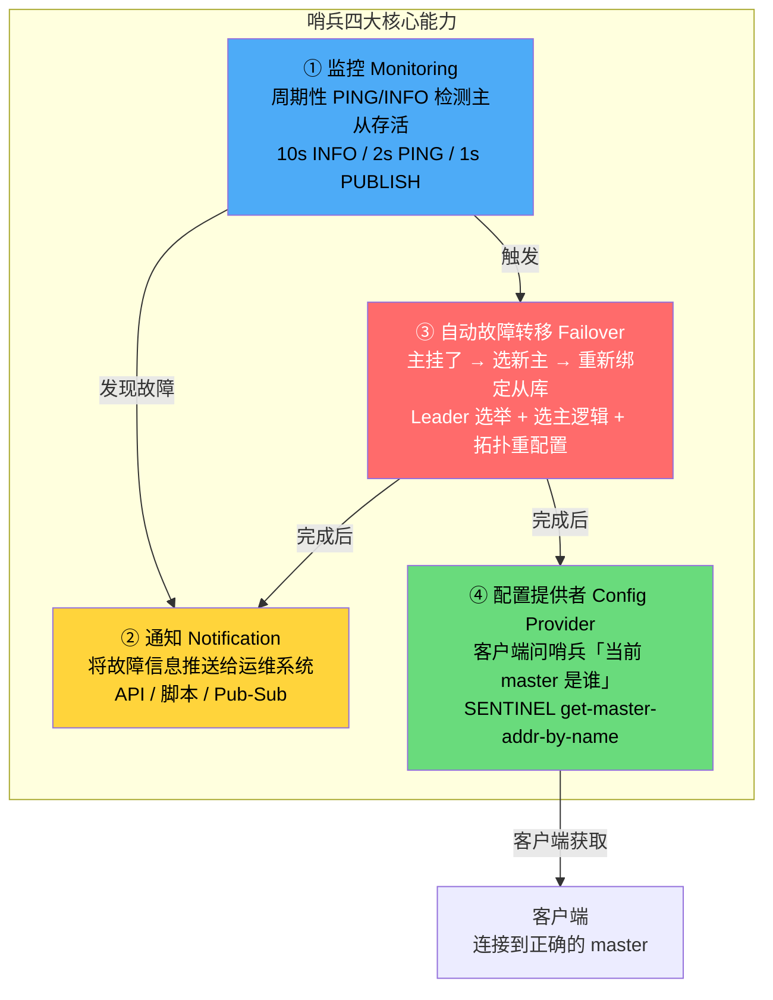
```mermaid
graph TB
    subgraph Sentinel_4_Capabilities["哨兵四大核心能力"]
        MONITOR[① 监控 Monitoring<br/>周期性 PING/INFO 检测主从存活<br/>10s INFO / 2s PING / 1s PUBLISH]
        NOTIFY[② 通知 Notification<br/>将故障信息推送给运维系统<br/>API / 脚本 / Pub-Sub]
        FAILOVER[③ 自动故障转移 Failover<br/>主挂了 → 选新主 → 重新绑定从库<br/>Leader 选举 + 选主逻辑 + 拓扑重配置]
        CONFIG[④ 配置提供者 Config Provider<br/>客户端问哨兵「当前 master 是谁」<br/>SENTINEL get-master-addr-by-name]
    end

    MONITOR -->|发现故障| NOTIFY
    MONITOR -->|触发| FAILOVER
    FAILOVER -->|完成后| CONFIG
    FAILOVER -->|完成后| NOTIFY
    CONFIG -->|客户端获取| CLIENT[客户端<br/>连接到正确的 master]

    style MONITOR fill:#4dabf7,color:#000
    style NOTIFY fill:#ffd43b,color:#000
    style FAILOVER fill:#ff6b6b,color:#fff
    style CONFIG fill:#69db7c,color:#000
```

**面试追问：哨兵本身能用单节点吗？为什么最少要 3 个？**

> 如果只用 1 个哨兵：
> - 哨兵自己挂了 → 整个监控系统失效 → 主库再挂就没人管了
> - 哨兵和主库之间网络不通 → 哨兵以为主库挂了，执行故障转移 → 实际上主库还活着 → **脑裂**
>
> 如果用 2 个哨兵：
> - 一个哨兵挂了，剩 1 个无法构成多数派 → 僵死
> - 两个哨兵之间网络不通 → 各自为政 → 谁都无法获得多数票
>
> **3 个哨兵是满足「多数派可用」的最小奇数**。公式本质是：
>
> ```
> 容忍的故障数 = (N - 1) / 2
> N=3 → 容忍 1 个故障 → 仍剩 2 个，满足多数派
> N=5 → 容忍 2 个故障 → 仍剩 3 个，满足多数派
> ```

---

## 第二章：哨兵的部署架构

### 2.1 经典拓扑：3 哨兵 + 1 主 2 从

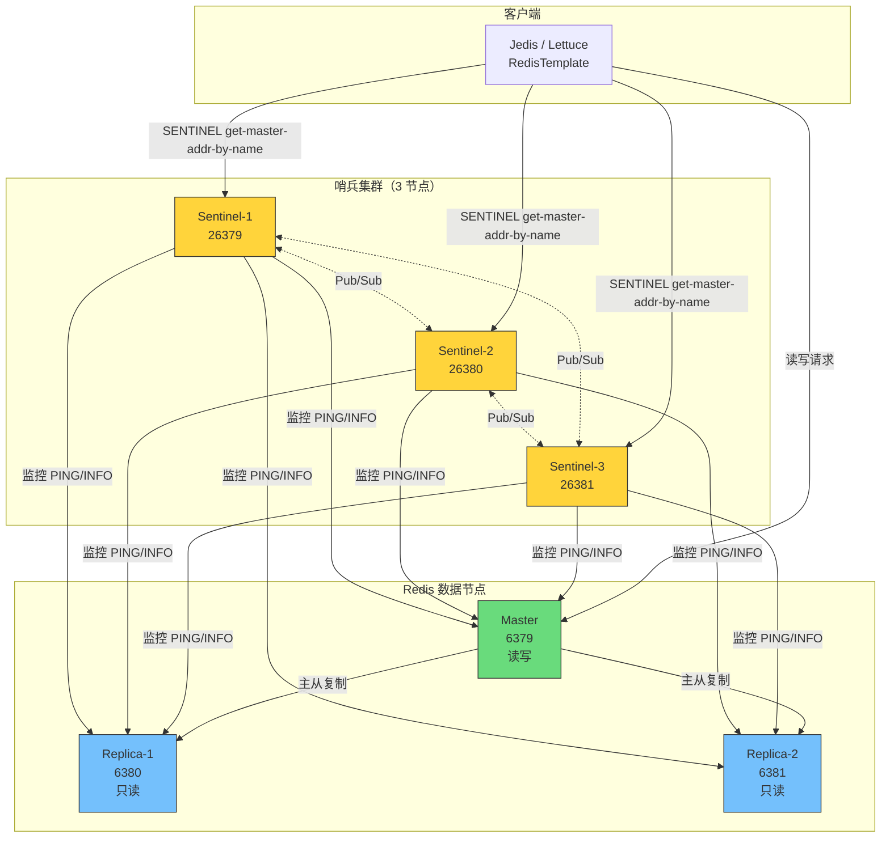
```mermaid
graph TB
    subgraph Sentinel_Cluster["哨兵集群（3 节点）"]
        S1[Sentinel-1<br/>26379]
        S2[Sentinel-2<br/>26380]
        S3[Sentinel-3<br/>26381]
    end

    subgraph Redis_Cluster["Redis 数据节点"]
        M[Master<br/>6379<br/>读写]
        R1[Replica-1<br/>6380<br/>只读]
        R2[Replica-2<br/>6381<br/>只读]
    end

    subgraph Client_Layer["客户端"]
        C1[Jedis / Lettuce<br/>RedisTemplate]
    end

    S1 -->|监控 PING/INFO| M
    S1 -->|监控 PING/INFO| R1
    S1 -->|监控 PING/INFO| R2

    S2 -->|监控 PING/INFO| M
    S2 -->|监控 PING/INFO| R1
    S2 -->|监控 PING/INFO| R2

    S3 -->|监控 PING/INFO| M
    S3 -->|监控 PING/INFO| R1
    S3 -->|监控 PING/INFO| R2

    M -->|主从复制| R1
    M -->|主从复制| R2

    S1 <-.Pub/Sub.-> S2
    S2 <-.Pub/Sub.-> S3
    S1 <-.Pub/Sub.-> S3

    C1 -->|SENTINEL get-master-addr-by-name| S1
    C1 -->|SENTINEL get-master-addr-by-name| S2
    C1 -->|SENTINEL get-master-addr-by-name| S3
    C1 -->|读写请求| M

    style S1 fill:#ffd43b,stroke:#333
    style S2 fill:#ffd43b,stroke:#333
    style S3 fill:#ffd43b,stroke:#333
    style M fill:#69db7c,stroke:#333
    style R1 fill:#74c0fc,stroke:#333
    style R2 fill:#74c0fc,stroke:#333
```

**关键部署原则：**
- 哨兵部署在**不同物理机/不同可用区**——哨兵和 Redis 部署在同一台机器上，机器挂了哨兵也一起挂:rocket::rocket::rocket::rocket:
- 哨兵节点数必须是奇数且 ≥ 3——为多数派投票服务
- 哨兵的 quorum 建议 = N/2 + 1（取整）

---

## 第三章：哨兵的工作原理——深度剖析

### 3.1 三个定时任务——哨兵的核心监控机制


```mermaid
gantt
    title 哨兵三个定时任务的并行执行
    dateFormat  X
    axisFormat %s

    section 任务1 INFO
    每10秒对主库和从库执行 INFO 命令 :a1, 0, 10
    每10秒对主库和从库执行 INFO 命令 :a2, 10, 10
    每10秒对主库和从库执行 INFO 命令 :a3, 20, 10

    section 任务2 PING
    每1秒对所有节点 PING          :b1, 0, 1
    每1秒对所有节点 PING          :b2, 1, 1
    每1秒对所有节点 PING          :b3, 2, 1
    每1秒对所有节点 PING          :b4, 3, 1
    每1秒对所有节点 PING          :b5, 4, 1
    每1秒对所有节点 PING          :b6, 5, 1

    section 任务3 PUBLISH
    每1秒发送 PUBLISH 到 __sentinel__:hello :c1, 0, 1
    每1秒发送 PUBLISH 到 __sentinel__:hello :c2, 1, 1
    每1秒发送 PUBLISH 到 __sentinel__:hello :c3, 2, 1
```

**源码中的定时器驱动（`sentinel.c`）：**

```c
// 哨兵定时器：以 100ms 为 tick 驱动所有定时任务
void sentinelTimer(void) {
    // 检查是否需要触发新的监控操作
    sentinelCheckTiltCondition();   // 检测时钟漂移（防止系统时间跳变）
    sentinelHandleDictOfRedisInstances();  // 遍历所有监控实例

    // 在每个实例上按频率执行三个任务：
    // ① sentinelSendPeriodicCommands()  → PING (1s) + INFO (10s)
    // ② sentinelSendPublish()           → PUBLISH (1s)
    // ③ sentinelCheckObjectivelyDown()  → 检查 ODOWN 条件
    // ④ sentinelFailoverStateMachine()  → 故障转移状态机（如果需要）

    // 定时器以 100ms 间隔被事件循环调用
    server.hz = CONFIG_DEFAULT_HZ + rand() % 5;  // 随机 10~15 Hz 避免共振
}
```

---

#### 任务1：每 10s 一次 INFO 命令（:rocket::rocket:拓扑发现:rocket::rocket:）:rocket:

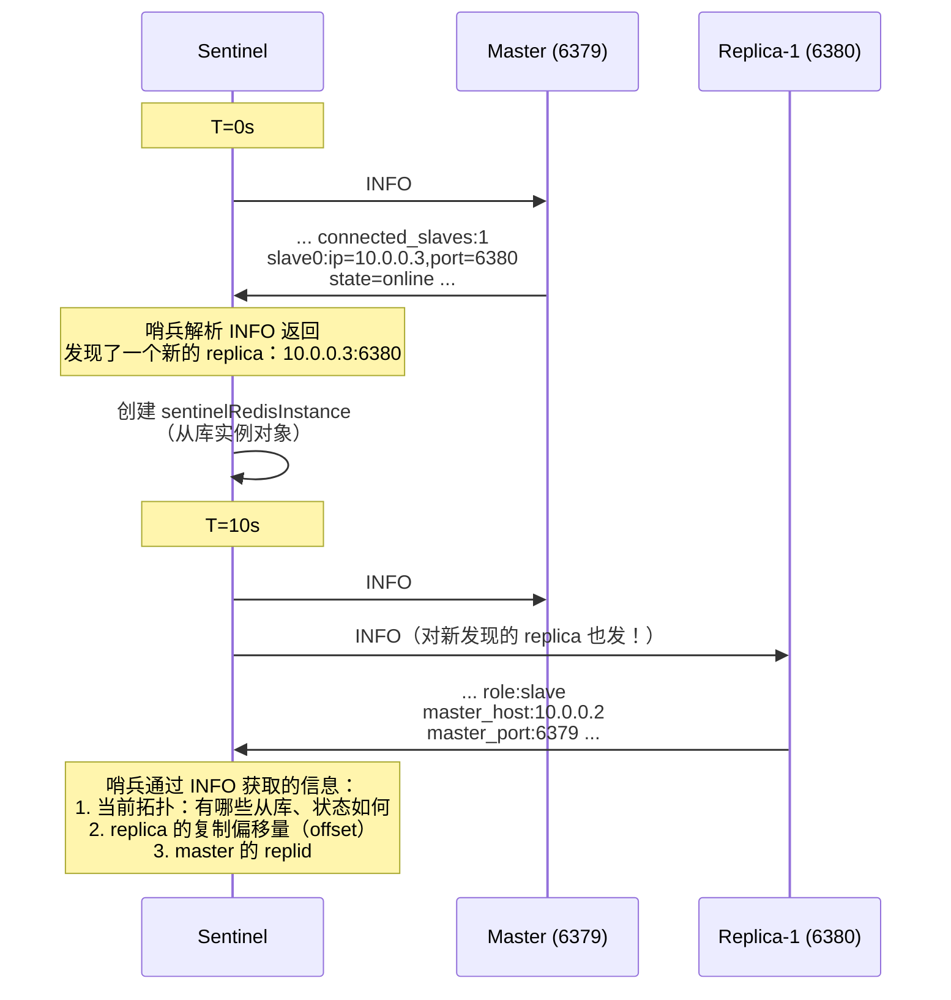
```mermaid
sequenceDiagram
    participant S as Sentinel
    participant M as Master (6379)
    participant R as Replica-1 (6380)

    Note over S: T=0s
    S->>M: INFO
    M->>S: ... connected_slaves:1<br/>slave0:ip=10.0.0.3,port=6380<br/>state=online ...

    Note over S: 哨兵解析 INFO 返回<br/>发现了一个新的 replica：10.0.0.3:6380
    S->>S: 创建 sentinelRedisInstance<br/>（从库实例对象）

    Note over S: T=10s
    S->>M: INFO
    S->>R: INFO（对新发现的 replica 也发！）
    R->>S: ... role:slave<br/>master_host:10.0.0.2<br/>master_port:6379 ...

    Note over S: 哨兵通过 INFO 获取的信息：<br/>1. 当前拓扑：有哪些从库、状态如何<br/>2. replica 的复制偏移量（offset）<br/>3. master 的 replid
```

**通过 INFO 实现的自动发现：**:rocket::rocket::rocket::rocket:

```
一个哨兵只需要配置一个 IP：主库的 IP
然后自动发现：
  ├── 主库 INFO → 发现所有从库
  ├── 从库 INFO → 确认主从关系 + offset
  └── Pub/Sub → 发现其他哨兵（见任务3）

这就是「零配置自动发现」——你不需要在 sentinel.conf 里写 replica 地址。
```

---

#### 任务2：每 1s 一次 PING 命令（存活检测）:rocket:

```
PING 的完整判断链路：

Sentinel 发送 PING
    │
    ├── 收到 PONG（或 +LOADING / +MASTERDOWN）→ 节点正常 ✅
    │
    └── 没收到回复 → 开始计时
              │
              ├── < down-after-milliseconds → 继续等
              │
              └── ≥ down-after-milliseconds → 标记 SDOWN（主观下线）
```

**源码逻辑（`sentinel.c` → `sentinelCheckSubjectivelyDown()`）：**

```c
void sentinelCheckSubjectivelyDown(sentinelRedisInstance *ri) {
    mstime_t elapsed = mstime() - ri->last_avail_time;

    // 距离最后一次收到有效回复的时间 > down-after-milliseconds
    if (elapsed > ri->down_after_period) {
        // 标记为主观下线
        if (ri->flags & SRI_MASTER) {
            sentinelEvent(LL_WARNING, "+sdown", ri, "@ %s", ri->name);
        }
        ri->flags |= SRI_S_DOWN;  // SDOWN 标志位
    } else {
        // 恢复
        if (ri->flags & SRI_S_DOWN) {
            sentinelEvent(LL_WARNING, "-sdown", ri, "@ %s", ri->name);
        }
        ri->flags &= ~SRI_S_DOWN;
    }
}
```

**面试追问：PING 一下没回就是挂了？**

> 不是。`down-after-milliseconds` 是一个时间阈值，不是说 PING 一次超时就判定 SDOWN。哨兵每秒 PING 一次，如果**连续**超过 `down-after-milliseconds` 时间（默认 30000ms = 30s）没收到有效回复，才判定 SDOWN。
>
> 所以默认配置下：
> - 约 30 秒连续 PING 不通 → SDOWN
> - 哨兵不会因为一次网络抖动就判定节点挂了
> - 把这个值调到 5 秒，那就约 5 秒判定

---

#### 任务3：每 1s 一次 PUBLISH 到 `__sentinel__:hello`（哨兵间发现）

Redis Sentinel 中的哨兵节点之间互相发现，**并不是让主节点充当“转发员”交换信息，而是把主节点当作一个“公告板（Pub/Sub 频道）”**，各个哨兵通过这个公告板广播自己的存在，同时侦听其他哨兵的广播。:rocket:

---

### 核心机制：`__sentinel__:hello` 频道:rocket:

每个被哨兵监控的 **主节点**（以及它的从节点）都提供了一个特殊的 Pub/Sub 频道：

```
__sentinel__:hello
```

哨兵节点会做两件事：
- **发布**：定期把自己的信息（IP、端口、runid 等）发布到这个频道。
- **订阅**：订阅同一个频道，接收其他哨兵发布的信息。

因此，哨兵之间第一次知道彼此，就是通过这个 Redis 主节点的 Pub/Sub 完成的。

---

### 发现过程（触发方式）

1. **哨兵启动**后，会加载配置中要监控的主节点列表，并和每个主节点建立命令连接。
2. 对每个主节点，哨兵同时：
   - 创建一个 **订阅连接**，订阅 `__sentinel__:hello` 频道。
   - 默认每 **2 秒**（`sentinel hello-interval` 可调）通过该频道发布一条 hello 消息，内容包括：
     - 自己的 IP
     - 自己的端口
     - 自己的 runid
     - 当前监控的主节点名称
     - 主节点的 IP、端口、配置纪元等。
3. 当另一个哨兵订阅该频道时，就会收到这条 hello 消息，从而发现对方的存在。
4. 发现新的哨兵后，**双方会立即建立一条专门的命令连接**（用于后续发送 `PING`、询问主节点状态等），而不再通过 Pub/Sub 通信。

> **触发时机**：
> - 每个哨兵自己定期（每 2 秒）发布，触发其他哨兵发现自己。
> - 新哨兵加入时，第一次发布后立即被现有哨兵感知。
> - 因为订阅是持续监听，所以**实时性很高，无需额外触发**。

---

###  为什么用主节点的 Pub/Sub 而不是直接互联？

| 设计选择                      | 好处                                                         |
| ----------------------------- | ------------------------------------------------------------ |
| **通过主节点交换信息**        | 哨兵不需要提前知道其他哨兵的地址，只需知道主节点，极大地简化了网络配置。 |
| **利用 Redis 本身的 Pub/Sub** | 可靠性高，复用 Redis 连接，无需引入额外的服务发现组件（如 Zookeeper）。 |
| **主节点宕机也能用从节点**    | 哨兵也会监控从节点，并在从节点的相同频道上发布/订阅；即使主节点挂掉，哨兵之间依然可以通过从节点的 Pub/Sub 保持联系。 |

所以准确的模型是：**主节点（或从节点）提供了一个共同的“会议室”（频道），哨兵们在里面自报家门、互认兄弟，之后私聊（建立直连）进行正式沟通。**这是一个典型的**发布-订阅式服务发现**模式，简单且健壮——不需要额外的服务注册中心。

---

### 完整流程总结

```
哨兵A                    主节点（__sentinel__:hello）           哨兵B
  │                           │                              │
  │────订阅频道───────────────▶│◀─────────订阅频道─────────────│
  │                           │                              │
  │────发布 hello (每2秒)────▶│                              │
  │                           │────转发给订阅者──────────────▶│ (哨兵B发现A)
  │                           │                              │
  │                           │◀───发布 hello (每2秒)─────────│ (哨兵A也发现B)
  │                           │                              │
  │◀────────────────────────建立直接命令连接──────────────────▶│
```

- **发现**：通过 `__sentinel__:hello` 频道，自动、定期触发。
- **后续通信**：建立直连 TCP 连接，不经过主节点。

这就回答了你的问题：**哨兵间发现是通过主节点的 Pub/Sub “公告板”触发的，而不是主节点主动转发信息。**

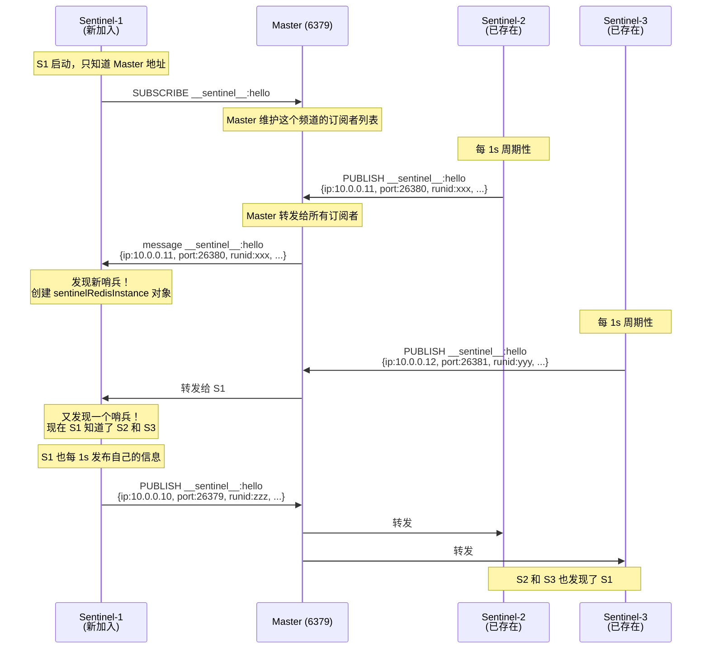
```mermaid
sequenceDiagram
    participant S1 as Sentinel-1<br/>(新加入)
    participant M as Master (6379)
    participant S2 as Sentinel-2<br/>(已存在)
    participant S3 as Sentinel-3<br/>(已存在)

    Note over S1: S1 启动，只知道 Master 地址

    S1->>M: SUBSCRIBE __sentinel__:hello
    Note over M: Master 维护这个频道的订阅者列表

    Note over S2: 每 1s 周期性
    S2->>M: PUBLISH __sentinel__:hello<br/>{ip:10.0.0.11, port:26380, runid:xxx, ...}

    Note over M: Master 转发给所有订阅者
    M->>S1: message __sentinel__:hello<br/>{ip:10.0.0.11, port:26380, runid:xxx, ...}

    Note over S1: 发现新哨兵！<br/>创建 sentinelRedisInstance 对象

    Note over S3: 每 1s 周期性
    S3->>M: PUBLISH __sentinel__:hello<br/>{ip:10.0.0.12, port:26381, runid:yyy, ...}
    M->>S1: 转发给 S1

    Note over S1: 又发现一个哨兵！<br/>现在 S1 知道了 S2 和 S3

    Note over S1: S1 也每 1s 发布自己的信息
    S1->>M: PUBLISH __sentinel__:hello<br/>{ip:10.0.0.10, port:26379, runid:zzz, ...}
    M->>S2: 转发
    M->>S3: 转发
    Note over S2,S3: S2 和 S3 也发现了 S1
```


**消息格式（源码 `sentinel.c` → `sentinelSendHello()`）：**

```
<哨兵IP> <哨兵端口> <哨兵runid> <current_epoch> <master_name> <master_ip> <master_port> <master_config_epoch>

示例：
10.0.0.10 26379 a1b2c3d4e5f6... 0 mymaster 10.0.0.2 6379 0
```

---

### 3.2 主观下线（SDOWN）vs 客观下线（ODOWN）:rocket::rocket::rocket::rocket:

#### 3.2.1 概念辨析

```
          SDOWN（主观下线）                  ODOWN（客观下线）
          ────────────                     ────────────

判定者：  单个哨兵自己判定                   多个哨兵投票判定

判定条件：down-after-milliseconds           ≥ quorum 个哨兵都认为 SDOWN
          时间内没有有效回复

适用对象：所有节点                          仅针对主库
         （主库/从库/哨兵）                 （从库只有 SDOWN）

触发效果：只是一个标记                       触发故障转移流程
                                           （还需要 Leader 选举）

通俗理解：「我觉得你挂了」                      「大家投票同意你挂了」
```

**为什么从库不需要 ODOWN？**:rocket::rocket:

> 因为从库挂了不需要做「故障转移」——从库只是读请求的承载者，挂了就直接摘掉。而主库挂了需要「找一个从库升级为新主」——这是一个不可逆的重大操作，必须多个哨兵共同确认，防止误判。

#### 3.2.2 SDOWN → ODOWN 完整判断流程

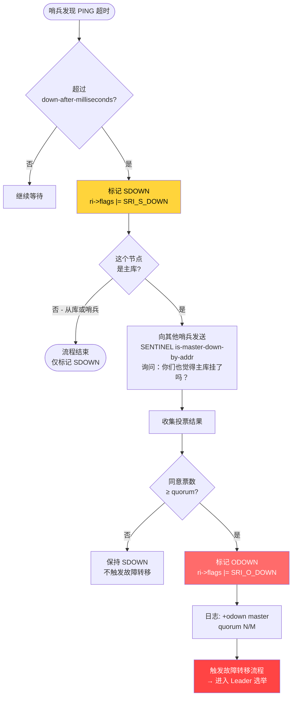
```mermaid
flowchart TD
    START([哨兵发现 PING 超时]) --> SDOWN_CHECK{超过<br/>down-after-milliseconds?}
    SDOWN_CHECK -->|否| CONTINUE[继续等待]
    SDOWN_CHECK -->|是| MARK_SDOWN["标记 SDOWN<br/>ri->flags |= SRI_S_DOWN"]

    MARK_SDOWN --> IS_MASTER{这个节点<br/>是主库?}
    IS_MASTER -->|否 - 从库或哨兵| END1([流程结束<br/>仅标记 SDOWN])
    IS_MASTER -->|是| ASK_OTHERS["向其他哨兵发送<br/>SENTINEL is-master-down-by-addr<br/>询问：你们也觉得主库挂了吗？"]

    ASK_OTHERS --> COLLECT_VOTES[收集投票结果]

    COLLECT_VOTES --> QUORUM_CHECK{同意票数<br/>≥ quorum?}
    QUORUM_CHECK -->|否| SDOWN_ONLY[保持 SDOWN<br/>不触发故障转移]
    QUORUM_CHECK -->|是| MARK_ODOWN["标记 ODOWN<br/>ri->flags |= SRI_O_DOWN"]

    MARK_ODOWN --> LOG[日志: +odown master<br/>quorum N/M]
    LOG --> TRIGGER_FAILOVER[触发故障转移流程<br/>→ 进入 Leader 选举]

    style MARK_SDOWN fill:#ffd43b,color:#000
    style MARK_ODOWN fill:#ff6b6b,color:#fff
    style TRIGGER_FAILOVER fill:#ff4444,color:#fff
```

**源码中的 ODOWN 判断（`sentinel.c` → `sentinelCheckObjectivelyDown()`）：**

```c
void sentinelCheckObjectivelyDown(sentinelRedisInstance *master) {
    dictIterator *di;
    dictEntry *de;
    int quorum = 0, odown = 0;

    // 首先，自己也要投票
    if (master->flags & SRI_S_DOWN) quorum++;

    // 遍历所有其他哨兵
    di = dictGetIterator(master->sentinels);
    while ((de = dictNext(di)) != NULL) {
        sentinelRedisInstance *ri = dictGetVal(de);

        // 如果其他哨兵也认为该主库 SDOWN
        if (ri->flags & SRI_MASTER_DOWN) quorum++;
    }
    dictReleaseIterator(di);

    if (quorum >= master->quorum) {
        // 达到 quorum → 客观下线！
        if (!(master->flags & SRI_O_DOWN)) {
            sentinelEvent(LL_WARNING, "+odown", master,
                "%s #quorum %d/%d", master->name, quorum, master->quorum);
        }
        master->flags |= SRI_O_DOWN;
        odown = 1;  // 触发故障转移
    } else {
        // 不够 quorum → 可能是假阳性，恢复
        if (master->flags & SRI_O_DOWN) {
            sentinelEvent(LL_WARNING, "-odown", master, "%s", master->name);
        }
        master->flags &= ~SRI_O_DOWN;
    }
}
```

**面试追问：ODOWN 真的是"客观"的吗？**

> 不是真正的客观。**ODOWN 只是一个分布式共识结果，不代表事实。**
>
> 反例：如果 quorum 个哨兵恰好都和主库发生了网络不通（但主库本身运行正常），那这些哨兵都会把主库标记为 SDOWN，然后投票通过 ODOWN，接着执行故障转移。
>
> 结果：主库明明活着，哨兵却选了新主——**脑裂（Split-Brain）**。所以 ODOWN 只能说是"quorum 个哨兵观察到主库不可达"，不能等同于"主库真的挂了"。

---

#### 3.2.3 SDOWN 误判窗口

```
问题：PING 和 INFO 是间隔执行的，如果主库在这两个检查点之间挂了，
      哨兵要等到下一次检查才能发现。

时间线示例（默认 down-after-milliseconds = 30000）：

  0s    主库挂了（哨兵不知道）
  1s    哨兵 PING → 超时（开始计时，但还不到判定时间）
  ...   每秒 PING 持续超时
  30s   累计超时 ≥ 30000ms → 判定 SDOWN
  30s+  向其他哨兵发起投票 → ODOWN → Leader 选举 → 执行故障转移

实际故障切换时间 ≈ down-after-milliseconds + 选举时间 + 故障转移时间
                 ≈ 30s + 几秒 + 几秒 ≈ 35~40 秒
```

**`down-after-milliseconds` 调优取舍：**

| 设置 | 优点 | 缺点 | 适用 |
|------|------|------|------|
| **5000ms（激进）** | 故障检测快，故障转移快 | 网络抖动就误切:rocket::rocket:;rocket: | 内网:rocket:低延迟、高可靠网络 |
| **30000ms（默认）** | 容忍短暂网络波动 | 故障恢复慢 | 一般生产环境 |
| **60000ms（保守）** | 几乎不会误判 | 故障后 1 分钟才发现:rocket: | 对可用性要求不高 |

**面试金句：** 「这是一个经典的分布式系统中的 trade-off：故障检测速度 vs 误判率。调小 down-after-milliseconds 可以减少故障恢复时间（MTTR），但会增加误切风险。内网环境建议 5000~10000ms。」

---

### 3.3 哨兵领导者选举（Leader Election）

#### 3.3.1 选举流程

当主库被标记为 ODOWN 后，不是所有哨兵一拥而上去执行故障转移，而是**先选 Leader，Leader 来执行**:rocket::rocket::rocket::rocket::rocket:避免多个哨兵同时操作造成混乱。

###  选举机制：基于 Raft 的投票模型

Sentinel 采用了类似 Raft 共识算法的**单个候选者拉票**机制，使用 **配置纪元（current_epoch）** 来保证每轮选举的票数不会跨轮混淆。

核心规则：
- **一个哨兵在每个纪元（epoch）只能投一票**（投给先到且自己还没投过的候选者:rocket::rocket::rocket::rocket::rocket:）。
- **候选者必须获得多数票（≥ 哨兵总数 / 2 + 1）**，并且票数 ≥ `quorum`（配置的法定人数）才能当选。
- **先到先得**：如果两个候选者同时拉票，哨兵会给最先请求投票的那个。
- 如果有一个 Leader 被选出来，它一定拿到了超过半数的票。
- 同一时刻另一个分区想选出另一个 Leader，它也必须拿到超过半数的票。
- 但总节点数就那么多，两个超过半数的集合必然有交集，而交集中的节点只能投一票给一个候选者，所以矛盾:rocket::rocket:。
- 因此不可能同时存在两个合法 Leader。

### 要求多数票 = 安全共识

Sentinel 的选举要求 **票数 ≥ 哨兵总数/2+1**，这是分布式系统的经典安全规则：

> **任何两轮成功的选举，它们的投票集合必然有交集。**
> 这样就保证了**不可能同时有两个 Leader 都拿到多数票**（因为一个哨兵在一个纪元只能投一票）。

这意味着：

- 即使网络分区，只有**包含多数哨兵的那个分区**才能选出 Leader。
- 少数派分区里的哨兵再怎么“快”，也凑不够多数票，永远当不了 Leader，**故障转移根本不会在少数派分区里发生**。

这就是**Raft 共识算法的精髓**：:rofl::rofl::rofl::rofl::rofl::rofl:用多数派保证每一次决策的唯一性，杜绝脑裂。

### 为什么要有一个“纪元”？

想象没有纪元：

- 哨兵 A 第一次发投票请求：“选我当 Leader 来处理主库宕机”。
- 哨兵 B 网络卡了一下，过了一会才收到，但这期间 B 自己又发起了一轮新的选举。
- B 收到 A 的延迟消息后，如果不加区分，可能会错误地把票投给上一轮的 A，导致旧轮次的结果干扰新轮次。

**纪元就是解决这个问题的：给每次选举打上一个递增的轮次号，哨兵只接受当前轮次（或更新轮次）的投票请求，拒绝过期消息。**

- **一次一票**：每个哨兵在每个纪元里**只能给一个候选者投一票**。
- **单调递增**：纪元只增不减。
- **全局传播**：当一个哨兵发现别人的请求里纪元比自己的大，就会更新自己的 `current_epoch`（跟上最新时间线）。

### 选举流程（6 步）

**步骤 1：自增纪元，成为候选者**  
哨兵检测到 ODOWN 后，立即把自己的 `current_epoch` 加 1，并且**将自己设为候选者**，向其他所有哨兵发送 `SENTINEL is-master-down-by-addr` 命令，请求投票。

这个命令里会带上自己的 `run_id`、请求投票的 `epoch` 等。

**步骤 2：其他哨兵收到投票请求**  :rocket::rocket:
被请求的哨兵会做如下判断：

- 如果请求中 `epoch` < 自己的 `current_epoch`：  
  拒绝（这是老纪元的无效请求）。
- 如果请求中 `epoch` > 自己的 `current_epoch`：  
  更新自己的 `current_epoch`，并且**本轮还未投票**，则投给请求者。
- 如果 `epoch` 相等：  
  检查自己是否已经在这个纪元投过票。  
  - 没投过 → 投给这个候选者（先到先得）。
  - 已经投过 → 拒绝（一纪元一票）。

**步骤 3：候选者收集选票**  
候选者会统计自己得到的票数。  
当选条件（两个必须同时满足）：

1. 票数 ≥ **哨兵总节点的多数**（例如 5 个哨兵，需要至少 3 票）；
2. 票数 ≥ **配置的 `quorum`**（这个 quorum 和判断 ODOWN 时是同一个参数）。**保证足够多的人认为主库真的挂了。**

**步骤 4：选举成功**  
如果满足条件，该哨兵当选为 **Leader**，并启动故障转移流程：

- 从当前存活的从节点里选出新主:rocket:（按优先级、偏移量等规则）。
- 向新主发送 `SLAVEOF NO ONE`。
- 通知其他从节点复制新主。
- 更新哨兵的监控配置。

**步骤 5：选举失败**  
如果因为选票被瓜分，没有任何哨兵达到多数，则本轮选举失败。  
所有候选者会等待一个随机时间（通常几百毫秒），然后**纪元 +1**，重新发起投票，直到选出 Leader。

**步骤 6：故障转移由 Leader 执行**  
选举产生的 Leader 哨兵会负责整个故障转移，其他哨兵则“服从”它的指挥，更新各自的状态。

---

### 5. 举例说明

假设 3 个哨兵：A、B、C，监控主库 M，`quorum=2`。

- 主库 M 出现 ODOWN，A、B、C 同时触发选举。
- A 把自己的 epoch 增加为 10，向 B 和 C 拉票。
- B 也增加 epoch 为 10，向 A 和 C 拉票。
- C 在 epoch 10 先收到 A 的请求，于是**投票给 A**；随后收到 B 的请求，因为已经投过了，拒绝 B。
- B 收到 A 的拉票请求，B 自己也是候选者，但 B 可以选择投给自己或投给先请求的人。根据实现，通常 Sentinel 会优先投给自己？实际上 Sentinel 规则：当自己是候选者时，先给自己投票（如果还没有投给别人）。如果 B 先给自己投了，那么 A 的请求会被 B 拒绝。然后 A 从 C 获得一票，自己一票，共 2 票；B 自己一票，A 拒绝 B，C 拒绝 B，B 只有 1 票。2 票 ≥ majority (3/2+1=2) 且 2 ≥ quorum(2)，A 当选。
- 如果 A 和 B 同时彼此拉票，可能 A 得到自己+C 的票，B 得到自己的票，A 胜出。

如果 3 个哨兵中某个哨兵与别人网络隔离，可能选举不出多数，从而失败，进入下一轮纪元。并不是说有两个在同一个分区就能保证一定有一个有两票的:rocket:

#### :rocket:两个哨兵互通，但票数被“平分”

- 假设 A 和 B 互通，C 隔离。
- A 和 B **同时** 成为候选者（epoch 相同）。
- A 投自己，并向 B 拉票；B 投自己，并向 A 拉票。

**对称僵局**。如果没有任何随机因素，偶数节点很容易每次纪元都平票，永远选不出来。

但 Sentinel 有一个设计来**打破对称性**：**随机退避（Random Delay）**。

------

### 僵局是怎么产生的？

以 3 哨兵为例，A 和 B 互通，C 隔离：

- A 纪元自增为 N，投自己，向 B 拉票。
- B 纪元自增为 N（因为同时检测到 ODOWN），投自己，向 A 拉票。
- 两个候选者都**先给自己投票**，然后拒绝对方的拉票。
- 结果：A 1 票，B 1 票，都没超过半数（2 票），选举失败。

如果它们**马上**同时把纪元 +1，再来一次，又同时拉票，又平局……就会陷入**活锁**。

### 破局关键：随机不等时:rocket::rocket::rocket::rocket::rocket:

Sentinel 在每次选举失败后，不会立刻重新发起下一轮，而是**随机等待一段时间**（通常 0~几百毫秒）。这个等待时间每个哨兵是**独立随机**的。

- A 可能随机等到 50ms 超时，然后纪元+1 发起投票。
- B 可能随机等到 200ms 超时，此时 A 已经完成了投票（A 在 50ms 时已经发起，B 还没动）。
- B 在 200ms 醒来时，可能发现 A 的投票请求已经到了，并且 A 的纪元更新，B 更新自己的纪元后，还没给自己投票，于是**把票投给 A**。
- A 拿到 2 票，当选。

**随机延迟打破了“同时行动”的对称性**，让某一个哨兵有大概率率先发起投票，成为唯一的候选者。


**在特定网络分区下，哨兵无法 100% 根除脑裂。**:rocket::rocket::rocket::rocket::rocket::典型场景就是哨兵中多数哨兵与主节点不在同一个网络分区而网络超时判断主节点挂了，这个时候在他们自己的分区里将选出一个主节点，这样将有两个主节点。:rocket::rocket::rocket::rocket::rocket::rocket::rocket:

### 为什么哨兵无法根除脑裂？

这是 **CAP 原理** 的直接体现：

- 发生网络分区（Partition）时，必须在 **一致性（C）** 和 **可用性（A）** 之间取舍。
- Sentinel 选择了 **可用性**：尽快选新主，恢复服务，宁可冒脑裂风险。
- 要完全避免脑裂，就需要 **同步复制**（等所有从节点确认才返回成功），那样可用性会大幅降低（一个节点卡住就全停）。这是 CP 系统（如 ZooKeeper）的做法。

所以 Sentinel 作为 AP 系统，**无法根除脑裂，只能缓解和减小影响**。


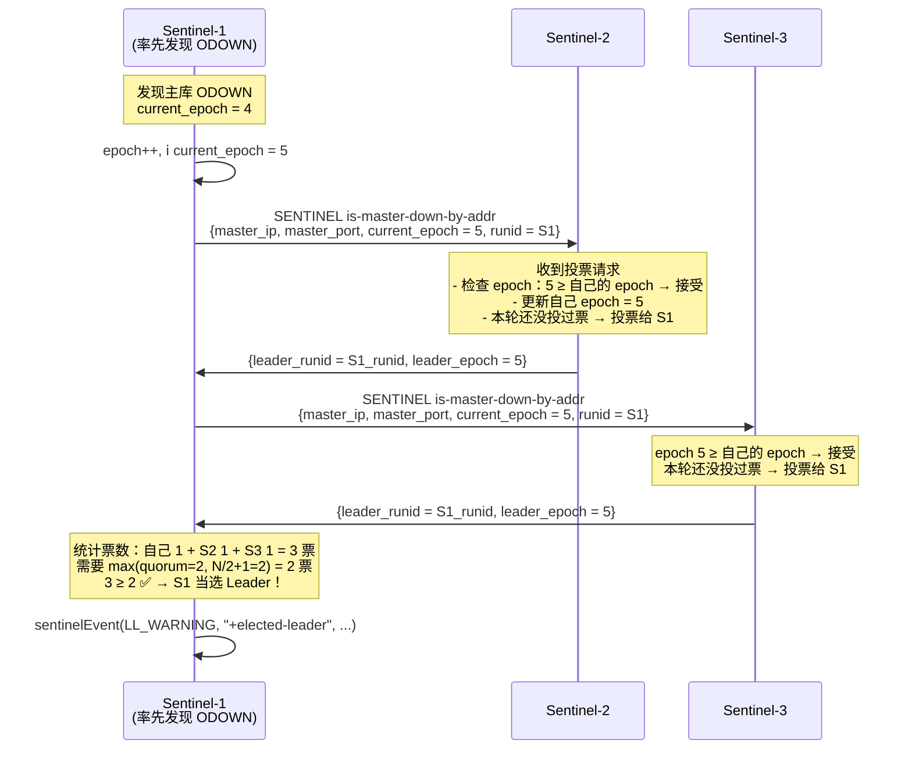
```mermaid
sequenceDiagram
    participant S1 as Sentinel-1<br/>(率先发现 ODOWN)
    participant S2 as Sentinel-2
    participant S3 as Sentinel-3

    Note over S1: 发现主库 ODOWN<br/>current_epoch = 4

    S1->>S1: epoch++, ℹ️ current_epoch = 5

    S1->>S2: SENTINEL is-master-down-by-addr<br/>{master_ip, master_port, current_epoch = 5, runid = S1}
    Note over S2: 收到投票请求<br/>- 检查 epoch：5 ≥ 自己的 epoch → 接受<br/>- 更新自己 epoch = 5<br/>- 本轮还没投过票 → 投票给 S1
    S2->>S1: {leader_runid = S1_runid, leader_epoch = 5}

    S1->>S3: SENTINEL is-master-down-by-addr<br/>{master_ip, master_port, current_epoch = 5, runid = S1}
    Note over S3: epoch 5 ≥ 自己的 epoch → 接受<br/>本轮还没投过票 → 投票给 S1
    S3->>S1: {leader_runid = S1_runid, leader_epoch = 5}

    Note over S1: 统计票数：自己 1 + S2 1 + S3 1 = 3 票<br/>需要 max(quorum=2, N/2+1=2) = 2 票<br/>3 ≥ 2 ✅ → S1 当选 Leader！
    S1->>S1: sentinelEvent(LL_WARNING, "+elected-leader", ...)
```

**投票规则（源码 `sentinel.c` → `sentinelVoteLeader()`）：**

```c
// 哨兵投票逻辑（简化）
int sentinelVoteLeader(sentinelRedisInstance *master,
                       uint64_t req_epoch,
                       char *req_runid,
                       uint64_t *leader_epoch,
                       char **leader_runid)
{
    // ① epoch 校验：只接受 >= 自己当前 epoch 的请求
    if (req_epoch > sentinel.current_epoch) {
        sentinel.current_epoch = req_epoch;
        sentinel.leader_epoch = 0;
        sentinel.leader = NULL;
    }

    // ② 一 epoch 一票：这个 epoch 还没投过 → 可以投
    if (req_epoch == sentinel.current_epoch &&
        sentinel.leader_epoch != req_epoch)
    {
        sentinel.leader_epoch = req_epoch;      // 记录投票的 epoch
        sentinel.leader = sdsnew(req_runid);     // 记录投给了谁
        *leader_epoch = req_epoch;
        *leader_runid = req_runid;
        return 1;  // 投票！
    }

    // ③ 已经投过了 → 返回之前投的结果（不会改投）
    *leader_epoch = sentinel.leader_epoch;
    *leader_runid = sentinel.leader;
    return 0;
}
```

**核心规则：**
1. **先到先得**：每个 epoch 中，哨兵只能投一票，投给第一个请求投票的候选者
2. **epoch 单调递增**：类似 Raft 的 term，防止旧 epoch 的过期投票干扰
3. **胜出条件**：得票 ≥ `max(quorum, N/2+1)`

#### 3.3.2 为什么是 `max(quorum, N/2+1)`？

```
场景推演：

假设 N=5 个哨兵，quorum=2：
  - quorum = 2
  - N/2+1 = 3

  max(2, 3) = 3 票

  如果只看 quorum（2 票就能赢）：
    哨兵 1 和 2 选 S1 为 Leader → 2 票 → S1 当选
    哨兵 3 和 4 选 S3 为 Leader → 2 票 → S3 当选
    → 两个 Leader！脑裂！

  加上 N/2+1：
    必须 ≥ 3 票 → 不可能有两个候选人同时获得 3 票 → 只有一个 Leader ✅

假设 N=5，quorum=4：
  - quorum = 4
  - N/2+1 = 3

  max(4, 3) = 4 票

  quorum 本来就 > 多数派，天然避免了脑裂
  但代价：需要 4 个哨兵同意才能故障转移，容忍度降低
```

#### 3.3.3 epoch（配置纪元）的作用

```
epoch = 哨兵集群的「逻辑时钟」

作用 1：防止过期投票干扰
  epoch = 3 时，S1 发起了投票但没有当选
  epoch 已经推进到 4，S1 的 epoch=3 请求到达 S2
  S2 检查：req_epoch(3) < current_epoch(4) → 拒绝！✅

作用 2：判断配置新旧
  故障转移后，新主库的 config_epoch 会更新
  旧主库恢复后，哨兵对比 config_epoch：
    旧主的 config_epoch < 自己的 config_epoch → 旧主被降级 ✅

作用 3：类似 Raft 的 Term—单调递增，全局唯一，同一 epoch 最多一个 Leader
```

#### 3.3.4 quorum 设成 1 的脑裂演示

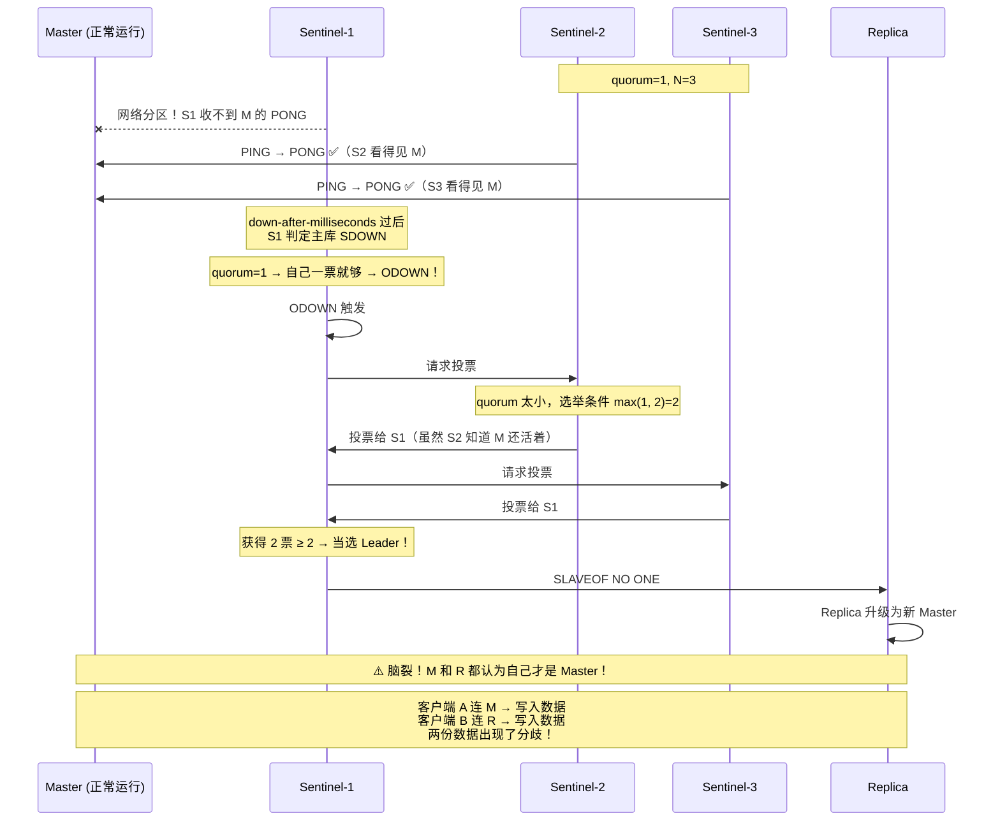
```mermaid
sequenceDiagram
    participant M as Master (正常运行)
    participant S1 as Sentinel-1
    participant S2 as Sentinel-2
    participant S3 as Sentinel-3
    participant R as Replica

    Note over S2,S3: quorum=1, N=3

    S1--xM: 网络分区！S1 收不到 M 的 PONG
    S2->>M: PING → PONG ✅（S2 看得见 M）
    S3->>M: PING → PONG ✅（S3 看得见 M）

    Note over S1: down-after-milliseconds 过后<br/>S1 判定主库 SDOWN
    Note over S1: quorum=1 → 自己一票就够 → ODOWN！

    S1->>S1: ODOWN 触发
    S1->>S2: 请求投票
    Note over S2: quorum 太小，选举条件 max(1, 2)=2
    S2->>S1: 投票给 S1（虽然 S2 知道 M 还活着）

    S1->>S3: 请求投票
    S3->>S1: 投票给 S1

    Note over S1: 获得 2 票 ≥ 2 → 当选 Leader！

    S1->>R: SLAVEOF NO ONE
    R->>R: Replica 升级为新 Master

    Note over M,R: ⚠️ 脑裂！M 和 R 都认为自己才是 Master！
    Note over M,R: 客户端 A 连 M → 写入数据<br/>客户端 B 连 R → 写入数据<br/>两份数据出现了分歧！
```

**结论：quorum 太小 = 脑裂风险极大。生产环境 quorum 至少设为:rocket::rocket: `N/2 + 1`。**

---

### 3.4 故障转移执行（Failover Execution）

#### 3.4.1 完整执行流程

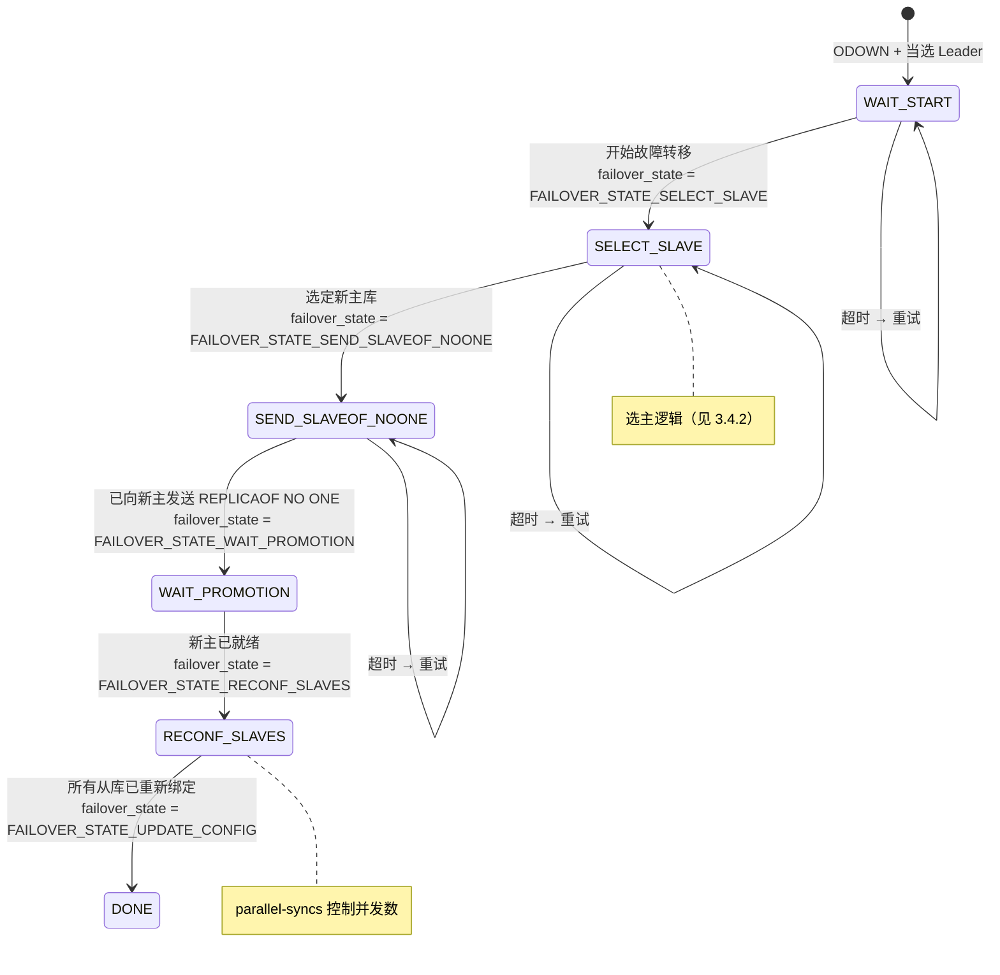
```mermaid
stateDiagram-v2
    [*] --> WAIT_START: ODOWN + 当选 Leader
    WAIT_START --> SELECT_SLAVE: 开始故障转移<br/>failover_state = FAILOVER_STATE_SELECT_SLAVE
    SELECT_SLAVE --> SEND_SLAVEOF_NOONE: 选定新主库<br/>failover_state = FAILOVER_STATE_SEND_SLAVEOF_NOONE
    SEND_SLAVEOF_NOONE --> WAIT_PROMOTION: 已向新主发送 REPLICAOF NO ONE<br/>failover_state = FAILOVER_STATE_WAIT_PROMOTION
    WAIT_PROMOTION --> RECONF_SLAVES: 新主已就绪<br/>failover_state = FAILOVER_STATE_RECONF_SLAVES
    RECONF_SLAVES --> DONE: 所有从库已重新绑定<br/>failover_state = FAILOVER_STATE_UPDATE_CONFIG

    WAIT_START --> WAIT_START: 超时 → 重试
    SELECT_SLAVE --> SELECT_SLAVE: 超时 → 重试
    SEND_SLAVEOF_NOONE --> SEND_SLAVEOF_NOONE: 超时 → 重试

    note right of SELECT_SLAVE: 选主逻辑（见 3.4.2）
    note right of RECONF_SLAVES: parallel-syncs 控制并发数
```

#### 3.4.2 选主逻辑——哪个从库会被提升？:rocket::rocket::rocket:

```
筛选规则（优先级从高到低地淘汰，源码 sentinelSelectSlave）：

候选池 = 所有在线且健康的从库（非 SDOWN/ODOWN）

  ↓ 第1轮淘汰：不健康的
  排除标记为 SDOWN 的
  排除与主库断连超过 down-after-milliseconds × 10 的
  （说明这个从库长期失联，数据可能太旧）

  ↓ 第2轮淘汰：不可提升的
  排除 slave-priority = 0 的（显式标记「永不提升」）

  ↓ 第3轮排序：选最合适的
  ① slave-priority 升序（数字越小越优先）
  ② replication offset 降序（数据越新越优先）
  ③ runid 字典序（兜底，保证确定性）

  ↓ 最终胜出者 → 新 Master
```

**源码核心逻辑（`sentinel.c` → `sentinelSelectSlave()`）：**

```c
sentinelRedisInstance *sentinelSelectSlave(sentinelRedisInstance *master) {
    sentinelRedisInstance *best = NULL;
    dictIterator *di;
    dictEntry *de;

    di = dictGetIterator(master->slaves);
    while ((de = dictNext(di)) != NULL) {
        sentinelRedisInstance *slave = dictGetVal(de);

        // ① 跳过不健康的
        if (slave->flags & (SRI_S_DOWN | SRI_O_DOWN)) continue;

        // ② 跳过断连太久的（down-after-milliseconds * 10）
        mstime_t down_time = mstime() - slave->last_avail_time;
        if (down_time > master->down_after_period * 10) continue;

        // ③ 跳过 slave-priority = 0（永不提升）
        if (slave->slave_priority == 0) continue;

        // ④ 比较优先级选出最优
        if (best == NULL) {
            best = slave;
        } else {
            // priority 小 > priority 大
            if (slave->slave_priority < best->slave_priority) {
                best = slave;
            } else if (slave->slave_priority == best->slave_priority) {
                // offset 大 > offset 小（数据更新）
                if (slave->slave_repl_offset > best->slave_repl_offset) {
                    best = slave;
                } else if (slave->slave_repl_offset == best->slave_repl_offset) {
                    // runid 字典序（确定性兜底）
                    if (strcasecmp(slave->runid, best->runid) < 0) {
                        best = slave;
                    }
                }
            }
        }
    }
    dictReleaseIterator(di);
    return best;
}
```

**面试追问：如果一个从库数据比主库旧很多，被选为主库后会丢失数据吗？**:rocket::rocket:

> **会丢失。** 因为复制是异步的，master 上最新的写入可能还没有传播到 replica。
>
> 选主逻辑中的 offset 排序只是「在所有从库中选数据最新的那个」，但这个最新不等于主库的全部数据。Redis 无法做到零数据丢失——这是异步复制的本质决定的。
>
> 减轻手段：
> - `min-replicas-to-write` + `min-replicas-max-lag`：减少写入只在主库而没到从库的情况
> - 客户端使用 `WAIT` 命令：等待 N 个从库确认后才返回

---

#### 3.4.3 时序图：完整故障转移

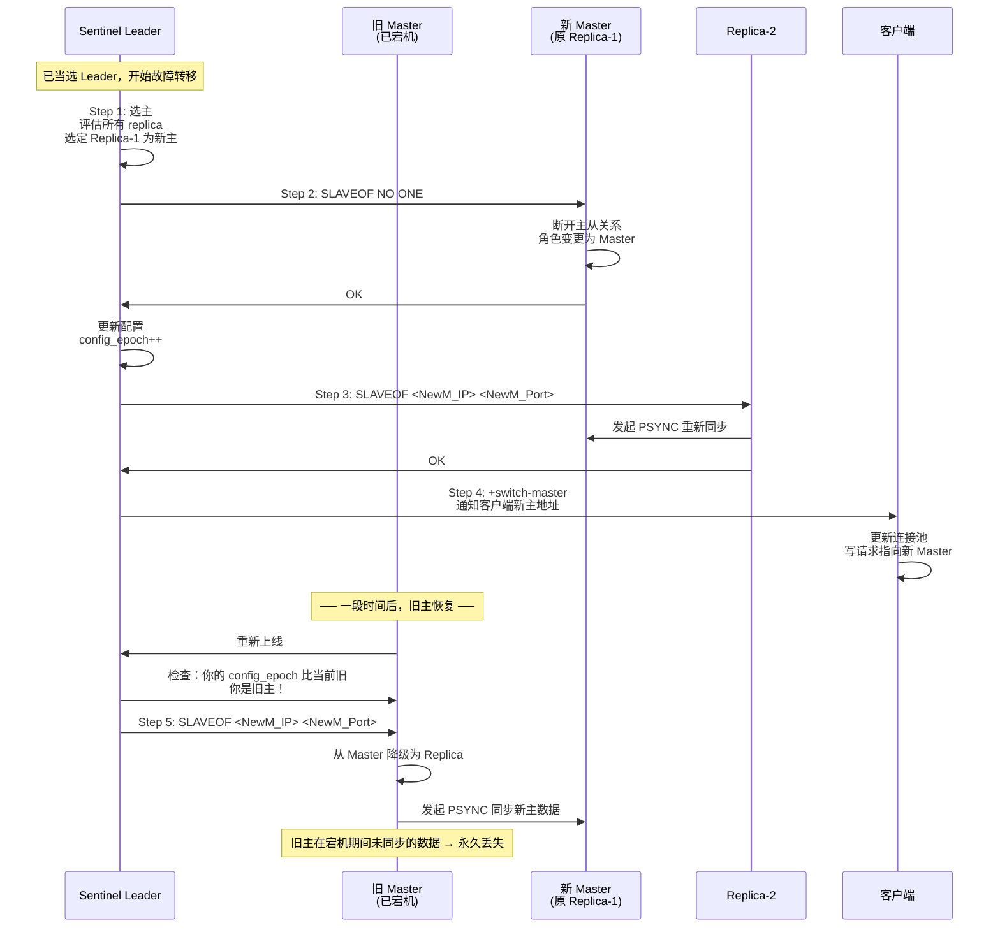
```mermaid
sequenceDiagram
    participant S_Leader as Sentinel Leader
    participant OldM as 旧 Master<br/>(已宕机)
    participant NewM as 新 Master<br/>(原 Replica-1)
    participant Replica2 as Replica-2
    participant Client as 客户端

    Note over S_Leader: 已当选 Leader，开始故障转移

    S_Leader->>S_Leader: Step 1: 选主<br/>评估所有 replica<br/>选定 Replica-1 为新主

    S_Leader->>NewM: Step 2: SLAVEOF NO ONE
    NewM->>NewM: 断开主从关系<br/>角色变更为 Master
    NewM->>S_Leader: OK

    S_Leader->>S_Leader: 更新配置<br/>config_epoch++

    S_Leader->>Replica2: Step 3: SLAVEOF <NewM_IP> <NewM_Port>
    Replica2->>NewM: 发起 PSYNC 重新同步
    Replica2->>S_Leader: OK

    S_Leader->>Client: Step 4: +switch-master<br/>通知客户端新主地址
    Client->>Client: 更新连接池<br/>写请求指向新 Master

    Note over OldM: ── 一段时间后，旧主恢复 ──

    OldM->>S_Leader: 重新上线
    S_Leader->>OldM: 检查：你的 config_epoch 比当前旧<br/>你是旧主！
    S_Leader->>OldM: Step 5: SLAVEOF <NewM_IP> <NewM_Port>
    OldM->>OldM: 从 Master 降级为 Replica
    OldM->>NewM: 发起 PSYNC 同步新主数据
    Note over OldM: 旧主在宕机期间未同步的数据 → 永久丢失
```

---

### 3.5 脑裂——哨兵:rocket:无法根除:rocket:的分布式难题

#### 3.5.1 脑裂发生机制

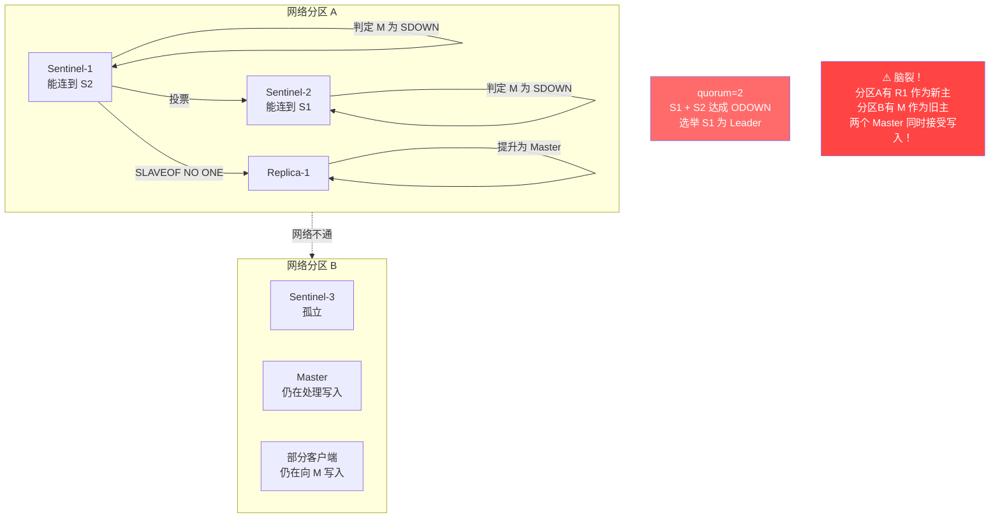
```mermaid
graph TB
    subgraph Partition_A[网络分区 A]
        S1[Sentinel-1<br/>能连到 S2]
        S2[Sentinel-2<br/>能连到 S1]
        R1[Replica-1]
    end

    subgraph Partition_B[网络分区 B]
        S3[Sentinel-3<br/>孤立]
        M[Master<br/>仍在处理写入]
        ClientB[部分客户端<br/>仍在向 M 写入]
    end

    Partition_A -.->|网络不通| Partition_B

    S1 -->|"判定 M 为 SDOWN"| S1
    S2 -->|"判定 M 为 SDOWN"| S2
    S1 -->|投票| S2
    Note1[quorum=2<br/>S1 + S2 达成 ODOWN<br/>选举 S1 为 Leader]

    S1 -->|SLAVEOF NO ONE| R1
    R1 -->|提升为 Master| R1

    Note2[⚠️ 脑裂！<br/>分区A有 R1 作为新主<br/>分区B有 M 作为旧主<br/>两个 Master 同时接受写入！]

    style Note2 fill:#ff4444,color:#fff
    style Note1 fill:#ff6b6b,color:#fff
```

#### 3.5.2 减轻脑裂损失的配置:rocket::rocket::rocket::rocket:

```
min-replicas-to-write 1
min-replicas-max-lag 10

工作原理：
  在脑裂发生之前，如果主库发现自己没有足够的健康从库，
  就主动拒绝写入，从而减少脑裂期间的「脏数据」量。

时间线推演：
  T0: M 正常运行，R1 在线，lag=1s → 满足条件，接受写入
  T1: 网络分区发生，M 看不到 R1 了
  T2: 10 秒后，M 发现 R1 的 lag > 10s → 不满足 min-replicas 条件
  T3: M 开始拒绝所有写入！
  T4: A 分区哨兵判定 ODOWN → 选举 R1 为新主
  T5: R1 开始接受写入

  脏数据时间窗口 ≈ T1 ~ T3 ≈ 10 秒
  （比不配置这个参数的无限窗口好太多）

注意：这只能减少丢失量，不能完全消除。
      如果客户端没有使用 WAIT 命令，
      T0~T1 之间的写入本质上就是没保障的。
```

---

### 如何缓解脑裂？

Redis 提供了两个配置来降低脑裂的危害（不能完全避免）：

- **`min-replicas-to-write`**：主库发现健康从库数量不足时，拒绝写入。
  脑裂时老主 M 会发现从库都失联了，如果配置了这个，它就不再接受写入，这样旧主即使活着也不会产生新的冲突数据。:rocket::rocket::rocket:
- **`client-output-buffer-limit slave`**：防止主从复制缓冲区膨胀，间接影响从库健康状态。

这些都是在脑裂发生后**减少破坏**的手段，但无法完全防止脑裂发生。

## 第四章：哨兵与客户端的交互

### 4.1 客户端发现主库的完整流程

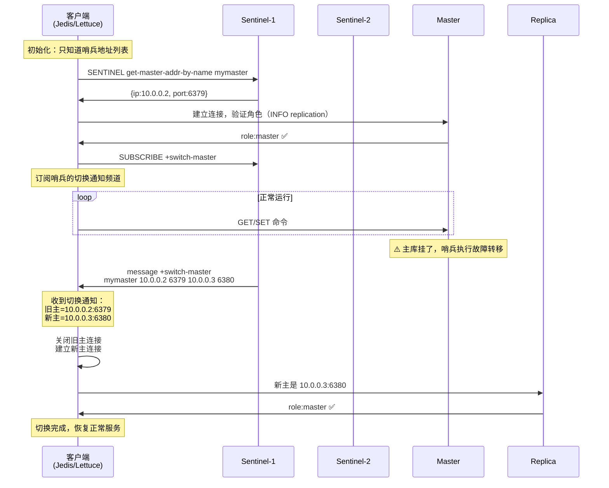
```mermaid
sequenceDiagram
    participant Client as 客户端<br/>(Jedis/Lettuce)
    participant S1 as Sentinel-1
    participant S2 as Sentinel-2
    participant M as Master
    participant R as Replica

    Note over Client: 初始化：只知道哨兵地址列表

    Client->>S1: SENTINEL get-master-addr-by-name mymaster
    S1->>Client: {ip:10.0.0.2, port:6379}

    Client->>M: 建立连接，验证角色（INFO replication）
    M->>Client: role:master ✅

    Client->>S1: SUBSCRIBE +switch-master
    Note over Client: 订阅哨兵的切换通知频道

    loop 正常运行
        Client->>M: GET/SET 命令
    end

    Note over M: ⚠️ 主库挂了，哨兵执行故障转移

    S1->>Client: message +switch-master<br/>mymaster 10.0.0.2 6379 10.0.0.3 6380
    Note over Client: 收到切换通知：<br/>旧主=10.0.0.2:6379<br/>新主=10.0.0.3:6380

    Client->>Client: 关闭旧主连接<br/>建立新主连接
    Client->>R: 新主是 10.0.0.3:6380
    R->>Client: role:master ✅

    Note over Client: 切换完成，恢复正常服务
```

**各大客户端库的哨兵模式：**

| 客户端 | 哨兵接入方式 | 自动切换 |
|--------|------------|---------|
| **Jedis** | `JedisSentinelPool` | Redis 2.8+: subscribe `+switch-master` |
| **Lettuce** | `RedisClient.connectSentinel()` | 内置拓扑刷新 + 事件监听 |
| **Redisson** | `Config.useSentinelServers()` | 自动发现拓扑 + 故障转移 |

**面试追问：客户端在收到切换通知之前，发往旧主的写请求怎么处理？**

> 这段窗口内（故障检测 + 选举 + 切换 ≈ 30~60 秒），写请求会失败。客户端的典型处理：
>
> 1. **重试机制**：Jedis/Lettuce 内置重试，抛出异常后重新从哨兵获取主库地址
> 2. **写请求缓冲**（高级）：客户端暂时缓冲写请求，等新主就绪后重放——但这带来一致性问题（重放的请求可能重复执行）
> 3. **直接拒绝**（保守）：返回错误给上游，让业务层决定如何处理（推荐方式，因为业务知道是否幂等）

---

## 第五章：关键配置参数深度解析

| 参数 | 默认值 | 含义 | 调优建议 |
|------|--------|------|----------|
| `sentinel monitor mymaster 127.0.0.1 6379 2` | — | 监控主库，最后一位是 quorum | quorum = N/2+1（取整），如 3 哨兵设 2 |
| `sentinel down-after-milliseconds mymaster 30000` | 30000ms | SDOWN 判定阈值 | 内网 5000~10000ms；跨机房 30000ms |
| `sentinel parallel-syncs mymaster 1` | 1 | 故障转移后并行同步的 replica 数 | 从库多时可调至 2~3，但注意 fork 压力 |
| `sentinel failover-timeout mymaster 180000` | 3min | 故障转移总超时（分段使用） | 大内存实例适当调大（5~10min） |
| `sentinel auth-pass mymaster <pass>` | — | 主库密码 | 生产必须设；如果主库有密码而哨兵没配，监控会失败 |
| `sentinel notification-script mymaster /path/to/script` | — | 故障告警脚本 | 接入钉钉/企微/飞书/PagerDuty |
| `sentinel client-reconfig-script mymaster /path/to/script` | — | 客户端重配置脚本 | 更新 LB/Nginx 配置指向新主库 |

### `sentinel failover-timeout` 的分段机制

```
failover-timeout = 180000ms（默认 3 分钟），被分为多个阶段使用：

阶段1 - 等待新主就绪：
  SLAVEOF NO ONE 发出后，等待 replica 变成 master，超时 = failover-timeout

阶段2 - 等待从库同步：
  SLAVEOF 新主发出后，等待 replica 完成与新主的同步，超时 = failover-timeout

阶段3 - 等待旧主降级：
  旧主恢复后向它发送 SLAVEOF 新主，超时 = failover-timeout

阶段4 - 整体超时：
  整个故障转移过程超过 failover-timeout，重新选举 Leader 重新执行
```

### `sentinel parallel-syncs` 为什么默认是 1

```
parallel-syncs = 1（串行）：
  故障转移后，从库逐个与新主同步
  优点：新主磁盘 I/O、CPU、网络压力小
  缺点：最后一个从库可能要等很久才能完成同步

parallel-syncs = 5（并行）：
  5 个从库同时向新主发起全量同步
  优点：恢复快
  缺点：
    - 新主同时 fork 多个子进程写 RDB → CPU 爆满
    - 5 个 RDB 同时传输 → 新主出口带宽打满
    - 新主的 client-output-buffer 被每个从库占用

推荐：生产环境保持 1~3，如果从库超过 10 个，考虑级联复制
```

---

## 第六章：哨兵配置的自动重写

```
哨兵在运行过程中会自动修改 sentinel.conf！

自动写入的内容包括：
  # 发现的从库（动态添加）
  sentinel known-replica mymaster 10.0.0.3 6379
  sentinel known-replica mymaster 10.0.0.4 6379

  # 发现的其他哨兵（动态添加）
  sentinel known-sentinel mymaster 10.0.0.11 26379 a1b2c3d4...
  sentinel known-sentinel mymaster 10.0.0.12 26379 e5f6g7h8...

  # 当前 epoch（故障转移后 +1）
  sentinel current-epoch 5

  # 故障转移后更新 config-epoch
  sentinel config-epoch mymaster 5
```

**面试追问：为什么不建议手动编辑运行中的 sentinel.conf？**

> 1. **会被自动重写覆盖**——你手动改的内容，下次哨兵重写配置文件时就没了
> 2. 正确的在线变更方式是使用哨兵命令：
>
> ```bash
> # 添加监控
> redis-cli -p 26379 SENTINEL MONITOR mymaster 10.0.0.10 6379 2
>
> # 修改配置
> redis-cli -p 26379 SENTINEL SET mymaster down-after-milliseconds 5000
>
> # 移除监控
> redis-cli -p 26379 SENTINEL REMOVE mymaster
> ```
>
> 停服修改的正确流程：停止哨兵 → 手动编辑 sentinel.conf → 启动哨兵

---

## 第七章：常见故障场景演练

### 场景1：主库进程崩溃 → 自动切换

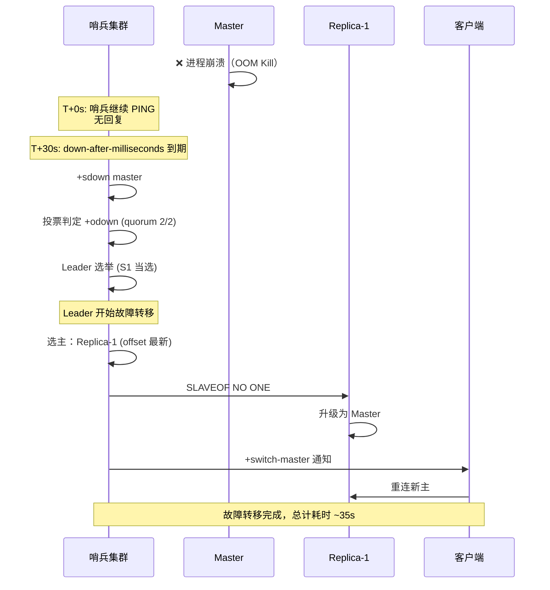
```mermaid
sequenceDiagram
    participant S as 哨兵集群
    participant M as Master
    participant R1 as Replica-1
    participant C as 客户端

    M->>M: ❌ 进程崩溃（OOM Kill）
    Note over S: T+0s: 哨兵继续 PING<br/>无回复

    Note over S: T+30s: down-after-milliseconds 到期
    S->>S: +sdown master
    S->>S: 投票判定 +odown (quorum 2/2)
    S->>S: Leader 选举 (S1 当选)

    Note over S: Leader 开始故障转移
    S->>S: 选主：Replica-1 (offset 最新)
    S->>R1: SLAVEOF NO ONE
    R1->>R1: 升级为 Master

    S->>C: +switch-master 通知
    C->>R1: 重连新主

    Note over S,C: 故障转移完成，总计耗时 ~35s
```

### 场景2：旧主恢复后回归

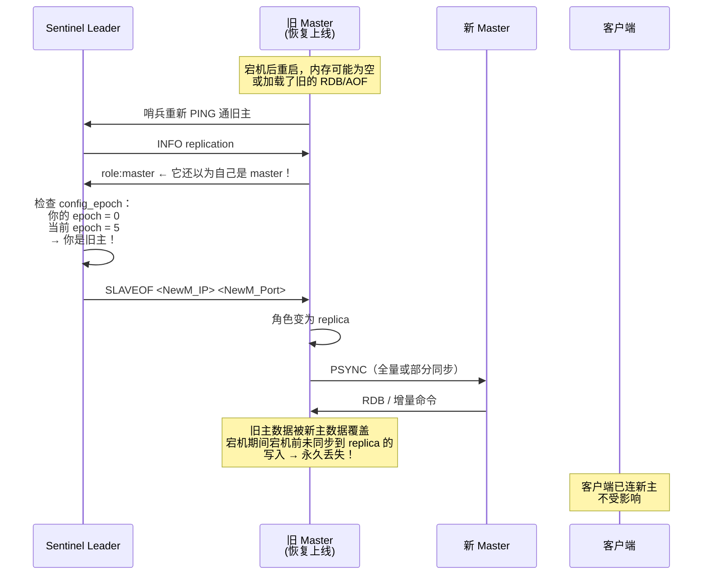
```mermaid
sequenceDiagram
    participant S as Sentinel Leader
    participant OldM as 旧 Master<br/>(恢复上线)
    participant NewM as 新 Master
    participant Client as 客户端

    Note over OldM: 宕机后重启，内存可能为空<br/>或加载了旧的 RDB/AOF

    OldM->>S: 哨兵重新 PING 通旧主
    S->>OldM: INFO replication
    OldM->>S: role:master ← 它还以为自己是 master！

    S->>S: 检查 config_epoch：<br/>你的 epoch = 0<br/>当前 epoch = 5<br/>→ 你是旧主！

    S->>OldM: SLAVEOF <NewM_IP> <NewM_Port>
    OldM->>OldM: 角色变为 replica
    OldM->>NewM: PSYNC（全量或部分同步）
    NewM->>OldM: RDB / 增量命令

    Note over OldM: 旧主数据被新主数据覆盖<br/>宕机期间宕机前未同步到 replica 的<br/>写入 → 永久丢失！

    Note over Client: 客户端已连新主<br/>不受影响
```

### 场景3：哨兵集群自身故障

```
┌──────────────────────────────────────────────────────────────┐
│  3 哨兵，quorum = 2                                          │
│                                                              │
│  挂了 1 个：                                                  │
│    剩余 2 个 → 仍可投票（2 ≥ quorum=2）→ 故障转移正常 ✅     │
│                                                              │
│  挂了 2 个：                                                  │
│    剩余 1 个 → 无法投票（1 < quorum=2）→ 故障转移不会执行 ❌  │
│    此时主库真的挂了呢？→ 需要人工介入！（SSH 上去手动切）       │
│                                                              │
│  挂了 3 个：                                                  │
│    哨兵全挂了 → Redis 退化为纯手动运维模式                     │
│    好消息：Redis 数据节点不受影响                                │
│    坏消息：主库再挂就没人切了                                    │
└──────────────────────────────────────────────────────────────┘
```

**面试追问：哨兵集群挂了会影响 Redis 数据吗？**

> **不影响。** 哨兵只做监控和协调，不在数据路径上。Redis 数据节点独立运行，哨兵全挂后：
> - 主从复制继续进行（不受哨兵控制）
> - 客户端可以继续读写（如果直连 Redis 而非通过哨兵发现）
> - 唯一的风险是主库再挂时没人做故障转移了

### 场景4：网络分区（脑裂）完整推演

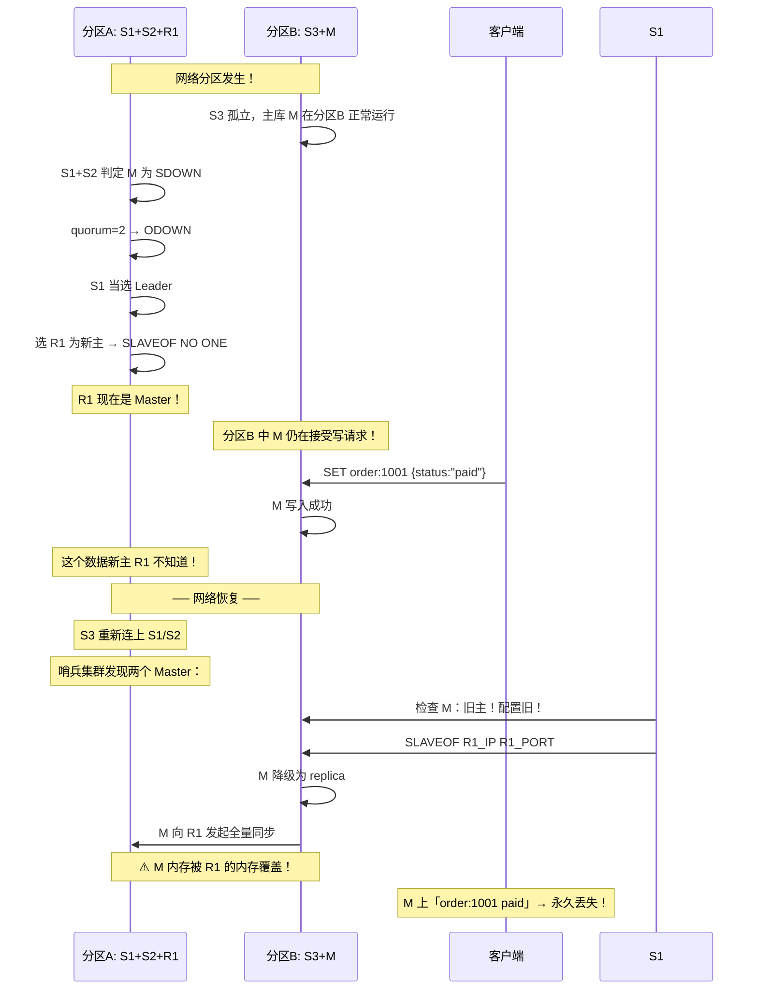
```mermaid
sequenceDiagram
    participant MA as 分区A: S1+S2+R1
    participant MB as 分区B: S3+M
    participant Client as 客户端

    Note over MA,MB: 网络分区发生！
    MB->>MB: S3 孤立，主库 M 在分区B 正常运行

    MA->>MA: S1+S2 判定 M 为 SDOWN
    MA->>MA: quorum=2 → ODOWN
    MA->>MA: S1 当选 Leader

    MA->>MA: 选 R1 为新主 → SLAVEOF NO ONE
    Note over MA: R1 现在是 Master！

    Note over MB: 分区B 中 M 仍在接受写请求！
    Client->>MB: SET order:1001 {status:"paid"}
    MB->>MB: M 写入成功
    Note over MA: 这个数据新主 R1 不知道！

    Note over MA,MB: ── 网络恢复 ──

    Note over MA: S3 重新连上 S1/S2
    Note over MA: 哨兵集群发现两个 Master：
    S1->>MB: 检查 M：旧主！配置旧！
    S1->>MB: SLAVEOF R1_IP R1_PORT
    MB->>MB: M 降级为 replica
    MB->>MA: M 向 R1 发起全量同步

    Note over MA,MB: ⚠️ M 内存被 R1 的内存覆盖！
    Note over Client: M 上「order:1001 paid」→ 永久丢失！
```

**数据丢失量总结：**

```
脑裂场景丢失的数据量 =

  分区发生时刻 T_partition
  ~ 到 ~
  旧主检测到 min-replicas 不满足 / 旧主被强制降级

  这段时间内「只写到了旧主、没写到新主」的所有数据

如果配置了 min-replicas-to-write：
  丢失窗口 = min-replicas-max-lag ≈ 10~30 秒
如果没配置：
  丢失窗口 = 分区持续时间（可能无限长！）
```

---

## 第八章：哨兵日志解读与运维技巧

### 8.1 正常故障转移日志

```
# 一条完整的故障转移日志时间线

# --- 第 1 步：发现主库失联 ---
1522 +sdown master mymaster 10.0.0.2 6379
      ↑ 哨兵判定主观下线

# --- 第 2 步：投票确认客观下线 ---
1522 +odown master mymaster 10.0.0.2 6379 #quorum 3/2
      ↑ 3 个哨兵都同意，quorum 只有 2 → 客观下线！

# --- 第 3 步：发起故障转移 ---
1522 +try-failover master mymaster 10.0.0.2 6379
      ↑ 当前哨兵尝试执行故障转移

# --- 第 4 步：Leader 选举 ---
1522 +vote-for-leader a1b2c3d4... e2d3817... 5
      ↑ 向其他哨兵请求投票（epoch=5）

1522 +elected-leader master mymaster 10.0.0.2 6379
      ↑ 获得多数票，当选 Leader！

# --- 第 5 步：选新主 ---
1523 +failover-state-select-slave master mymaster 10.0.0.2 6379
      ↑ 开始筛选新的主库

1523 +selected-slave slave 10.0.0.3:6380 10.0.0.3 6380 @ mymaster
      ↑ 选定 10.0.0.3:6380 作为新主库

# --- 第 6 步：提升新主 ---
1523 +failover-state-send-slaveof-noone slave 10.0.0.3:6380
      ↑ 向 replica 发送 SLAVEOF NO ONE

1524 +failover-state-wait-promotion slave 10.0.0.3:6380
      ↑ 等待 replica 升级完成

# --- 第 7 步：重新绑定其他从库 ---
1525 +failover-state-reconf-slaves slave 10.0.0.4:6381
      ↑ 让其他 replica 指向新主

# --- 第 8 步：完成 ---
1526 +failover-end master mymaster
      ↑ 故障转移完成

1526 +switch-master mymaster 10.0.0.2 6379 10.0.0.3 6380
      ↑ 通知所有订阅者：主库已切换

# --- 第 9 步：旧主恢复后 ---
1800 -sdown slave 10.0.0.2:6379 10.0.0.2 6379 @ mymaster
      ↑ 旧主重新上线，SDOWN 解除

1802 +convert-to-slave slave 10.0.0.2:6379
      ↑ 旧主被强制降级为 replica
```

### 8.2 哨兵 API（快速运维）

```bash
# 查看所有监控的 master
redis-cli -p 26379 SENTINEL MASTERS

# 查看某个 master 的详细信息
redis-cli -p 26379 SENTINEL MASTER mymaster

# 查看某个 master 的所有 replica
redis-cli -p 26379 SENTINEL SLAVES mymaster

# 查看某个 master 的所有哨兵
redis-cli -p 26379 SENTINEL SENTINELS mymaster

# 获取当前 master 地址
redis-cli -p 26379 SENTINEL GET-MASTER-ADDR-BY-NAME mymaster

# 手动故障转移（强制切换，即使 master 正常）
redis-cli -p 26379 SENTINEL FAILOVER mymaster

# 重置哨兵状态（清除所有信息，重新发现）
redis-cli -p 26379 SENTINEL RESET mymaster

# 检查 master 状态（SDOWN/ODOWN）
redis-cli -p 26379 SENTINEL IS-MASTER-DOWN-BY-ADDR 10.0.0.2 6379
```

---

## 第九章：面试模拟——12 个高频追问（满分答案）

### Q1：哨兵的工作原理是什么？完整描述从监控到故障转移的全流程。

> **满分回答**：
>
> 「哨兵的核心工作流分五个阶段：
>
> **① 定时监控**：每个哨兵通过三个并行定时任务监控集群——每 10s 一次 INFO 获取拓扑变化、每 1s 向所有节点发送 PING 检测存活、每 1s 向 `__sentinel__:hello` 频道 PUBLISH 自己的存在信息以发现其他哨兵。
>
> **② SDOWN 判定**：哨兵在 `down-after-milliseconds` 时间内未收到某节点的有效 PING 回复，就将该节点标记为主观下线（SDOWN）。这是单点判定的。
>
> **③ ODOWN 判定**：如果是主库，哨兵会向其他哨兵发起 `SENTINEL is-master-down-by-addr` 询问。当 ≥ quorum 个哨兵都认为这个主库 SDOWN → 标记为客观下线（ODOWN）。从库和哨兵没有 ODOWN。
>
> **④ Leader 选举**：ODOWN 后，哨兵之间用类似 Raft 的投票机制选举一个 Leader。每个 epoch 每个哨兵只能投一票。得票 ≥ max(quorum, N/2+1) 者成为 Leader——这里 `max()` 保证了既满足 quorum 要求又满足多数派原则。
>
> **⑤ 故障转移**：Leader 哨兵按照 slave-priority → offset → runid 的顺序从在线从库中选出新主，发送 `SLAVEOF NO ONE` 提升为新主，然后让其余从库指向新主，最后通过 `+switch-master` 通知客户端。整个过程是状态机驱动的，每个阶段有独立的超时和重试。
>
> 这套设计的精妙之处在于：**用最少的组件（哨兵本身也是 Redis 进程）构建了一个完整的分布式监控与自愈系统，零外部依赖。**」

---

### Q2：什么是主观下线（SDOWN）和客观下线（ODOWN）？区别是什么？

> **满分回答**：
>
> 「**SDOWN（Subjective Down）** 是单个哨兵基于自己的 PING 检测结果得出「这个节点挂了」的判断，是局部视角。触发条件是 `down-after-milliseconds` 持续收不到有效回复。所有节点（主库、从库、其他哨兵）都有 SDOWN。
>
> **ODOWN（Objective Down）** 是哨兵集群基于投票得出的共识判断，是全局视角。只有主库才有 ODOWN。触发条件是 ≥ quorum 个哨兵都认为该主库 SDOWN。ODOWN 是故障转移的触发条件。
>
> 本质区别：
> - SDOWN = 「我觉得它挂了」（个人意见）
> - ODOWN = 「大家投票认为它挂了」（集体决议）
>
> 需要特别注意：ODOWN 只是 quorum 个哨兵的共识，不代表物理事实。如果 quorum 个哨兵和主库之间恰好网络分区了，主库本身正常，ODOWN 依然会成立并触发故障转移——这就是脑裂的根源。」

---

### Q3：哨兵选主的逻辑是什么？哪个从库会被提升为主库？

> **满分回答**：
>
> 「选主逻辑是一个多级筛选，源码 `sentinelSelectSlave()` 中实现：
>
> **第一轮：排除不健康的**
> - SDOWN/ODOWN 的直接排除
> - 与主库断连超过 `down-after-milliseconds × 10` 的排除（长期失联，数据太旧）
>
> **第二轮：排除不可提升的**
> - `slave-priority = 0` 的排除（显式标记永不提升）
>
> **第三轮：多维度排序选出最优**
> 1. **slave-priority 升序**：数字越小优先级越高，优先提升。比如给一个 SSD 机器的 replica 设 priority=10，给机械盘的设 priority=50
> 2. **replication offset 降序**：数据越新越优先。这是减少数据丢失的关键——选数据最新的那个
> 3. **runid 字典序**：前面都相同时，用 runid 做确定性兜底，保证结果可复现
>
> 这个排序的妙处在于：用户可以通过 slave-priority 做定制化（例如让机器性能好的优先），同时保底用 offset 选数据最新的。」

---

### Q4：哨兵之间是如何通信的？哨兵如何发现其他哨兵？

> **满分回答**：
>
> 「哨兵之间**不直连**，而是通过 master 的 `__sentinel__:hello` 频道（Pub/Sub）互相发现和通信。
>
> 具体流程：
> 1. 每个哨兵启动后只需要知道 master 的 IP
> 2. 哨兵连接 master，执行 `SUBSCRIBE __sentinel__:hello`
> 3. 同时每 1 秒向该频道 `PUBLISH` 自己的信息：`<ip> <port> <runid> <epoch> <master_name> ...`
> 4. 当哨兵 A 发布消息时，master 推送给所有订阅者（包括哨兵 B、C）
> 5. 哨兵 B 收到消息后，发现一个未知的哨兵 → 创建 sentinelRedisInstance 对象 → 建立连接
>
> 这个设计非常优雅：使用了 Redis 自身的 Pub/Sub 能力，零配置、自动发现。不需要像 ZooKeeper 那样引入额外的服务注册中心。
>
> 发现彼此之后，哨兵之间的通信是通过直连 TCP 发送 `SENTINEL` 系列命令进行的（如投票时间），Pub/Sub 只负责发现。」

---

### Q5：哨兵集群的 quorum 和 majority 有什么区别？分别影响什么？

> **满分回答**：
>
> 「这是两个非常容易混淆的概念：
>
> **Quorum（投票数）**：
> - 在 `SENTINEL MONITOR mymaster 127.0.0.1 6379 2` 中配置
> - 决定「多少个哨兵认为主库挂了」才满足 ODOWN 条件
> - **影响的是故障检测的灵敏度和可靠性**
>
> **Majority（多数派）**：
> - 固定公式 = `N/2 + 1`
> - 决定选 Leader 时的最低票数要求
> - **影响的是 Leader 选举的唯一性保证**
>
> 源码中的实际胜出条件是 `max(quorum, N/2+1)`。这里取 max 的精妙之处：
> - 如果 quorum < N/2+1，用 majority 兜底——防止两个候选人都满足 quorum 导致双 Leader
> - 如果 quorum > N/2+1，用 quorum——用户显式要求的高门槛
>
> 举个例子，N=5, quorum=2：
> - ODOWN 只需要 2 票
> - 但 Leader 选举需要 max(2, 3) = 3 票
> - 如果 quorum=2 也能当 Leader，可能出现 S1 拿 2 票、S2 也拿 2 票的脑裂
> - 用 3 票兜底，最多只有一个候选人获得 ≥3 票」

---

### Q6：quorum 设成 1 可以吗？会有什么问题？

> **满分回答**：
>
> 「**绝对不可以用于生产。** quorum=1 意味着只要 1 个哨兵认为主库挂了，就可以触发故障转移。
>
> 致命问题：
>
> **1. 脑裂风险极高**：哨兵和主库之间网络抖动一下，哨兵的 PING 超时 → SDOWN → ODOWN（自己一票就够了）→ 故障转移。但主库其实还在正常运行！结果两个 Master。
>
> **2. 哨兵成为单点**：你引入哨兵集群本来是为了可靠，但 quorum=1 让整个集群的可靠性退化到等同于 1 个哨兵。
>
> **3. 哨兵自身故障会误切**：哨兵进程假死（GC 停顿、CPU 打满），错过了主库的 PONG 回复 → 判定主库挂了 → 执行故障转移 → 假故障成了真故障。
>
> 结论：quorum 至少设为 N/2+1（取整），3 哨兵设 2，5 哨兵设 3。这确保了 ODOWN 需要多数哨兵同意。」

---

### Q7：哨兵集群至少需要几个节点？为什么？

> **满分回答**：
>
> 「**至少 3 个。** 三个原因：
>
> **1. 多数派要求**：故障转移需要选举 Leader，胜出需要 ≥ max(quorum, N/2+1) 票。如果 N=2，N/2+1=2 → 挂掉一个后剩 1 个，1 < 2，无法选举 Leader，集群进入僵死状态。N=3 时，挂 1 个剩 2 个，2 ≥ 2 胜出条件，仍可正常工作。
>
> **2. 容忍单点故障**：公式 `可容忍故障数 = (N-1)/2`。N=3 可容忍 1 个宕机，这是生产的最低要求。
>
> **3. 奇数避免平票**：3/5/7 等奇数避免在选举中形成两派平票的僵局。
>
> 总结公式：
> ```
> N=3 → 容忍 1 个故障，最小生产可用
> N=5 → 容忍 2 个故障，更高保障
> N=7 → 容忍 3 个故障，极端高可用
> ```
> 不建议超过 7 个——哨兵多了投票和通信开销增大，但边际收益递减。」

---

### Q8：哨兵在故障转移时，客户端如何感知到主库变了？

> **满分回答**：
>
> 「客户端通过两种方式感知主库变化：
>
> **方式 1——Pub/Sub 推送（主动）**：客户端订阅哨兵的 `+switch-master` 频道。故障转移完成后，哨兵向该频道推送切换消息：`+switch-master mymaster <old_ip> <old_port> <new_ip> <new_port>`。客户端收到后，断开旧主的连接池，重新连接新主。
>
> **方式 2——哨兵轮询（被动）**：客户端定期向哨兵发送 `SENTINEL get-master-addr-by-name` 查询当前主库地址。如果返回的地址和当前连接的不一样，就重建连接。
>
> 主流客户端（Jedis/Lettuce/Redisson）两种方式都支持。Pub/Sub 方式延迟低（几乎是实时），但需要维持长连接；轮询方式简单但有轮询间隔内的不可用窗口。
>
> 补充：收到切换通知前，发往旧主的写请求必然会失败。客户端通常向上抛出异常，由业务代码决定重试或放弃。」

---

### Q9：哨兵本身的故障怎么办？哨兵集群挂了会影响 Redis 数据吗？

> **满分回答**：
>
> 「分三层来回答：
>
> **哨兵部分故障（如 3 挂 1）**：剩余哨兵继续工作，故障转移能力不受影响。保证奇数节点数的意义就在这里。
>
> **哨兵多数故障（如 3 挂 2）**：剩 1 个哨兵，无法构成多数派——故障转移不会执行。此时 Redis 数据节点之间仍然在正常运行、主从复制继续进行。客户端如果通过哨兵获取主库地址，最后一个哨兵仍然能返回正确的 master 地址（只是不会再更新了）。
>
> **哨兵全部故障**：Redis 数据节点完全不受影响，主从继续复制、读写继续。但主库一旦挂了就没人切了——退化为纯主从架构的状态。
>
> **关键结论：哨兵不在数据路径上，它只是控制面。** 这和 ZooKeeper/etcd 不同——Redis 哨兵挂了，数据流不受影响，只是丧失了自动故障转移能力。这也是哨兵架构的一个设计优化：控制面和数据面分离。」

---

### Q10：脑裂是怎么发生的？哨兵能完全避免脑裂吗？

> **满分回答**：
>
> 「**哨兵无法完全避免脑裂**，这是 CAP 定理的必然约束——当网络分区发生时，你必须在可用性和一致性之间做选择。哨兵选择了可用性（AP），所以脑裂是可能发生的。
>
> 脑裂的发生条件：
> 1. 网络分区，哨兵集群与主库之间不通
> 2. ≥ quorum 个哨兵在分区的一侧，判定主库 ODOWN
> 3. 哨兵在另一侧选一个新主→ 两个主库同时存在
>
> 减轻手段：
> 1. `min-replicas-to-write` + `min-replicas-max-lag`：让旧主在无法联系到足够从库时主动拒绝写入，减少脏数据窗口
> 2. 客户端使用 `WAIT` 命令：要求至少 N 个从库确认才算写成功
> 3. 合理设置 quorum：把多数哨兵部署在更可靠的一侧
> 4. 使用 Redis Cluster 代替哨兵（Cluster 中数据分片，单个分片的主从还在哨兵级别，但跨分片有更大的容错空间）
>
> 如果业务真的不能容忍任何数据丢失，那 Redis 主从+哨兵不是你该选的架构——应该用 etcd/ZooKeeper 这类 CP 系统，或者至少使用 Redis Cluster + WAIT 命令的组合。」

---

### Q11：请比较哨兵集群和 Cluster 集群的区别，各自的适用场景是什么？

> **满分回答**：

| 维度 | Sentinel（哨兵） | Cluster（集群） |
|------|-----------------|----------------|
| **数据分布** | 不分片，全量数据 | 分片（16384 个 slot），数据分散在多节点 |
| **容量上限** | 单机内存上限（如 64GB） | 理论上可水平扩展到 1000 节点 |
| **故障转移** | 哨兵自动切换主从 | 集群内置故障转移（gossip 协议） |
| **客户端** | 可任意读写（通过哨兵发现 master） | 需要 smart client 支持 MOVED/ASK 重定向 |
| **复杂度** | 部署简单（3 哨兵 + N 数据节点） | 部署和运维复杂（至少 6 节点） |
| **多 Key 操作** | 支持（MGET/MSET/事务/Lua 跨 key） | 受 hash tag 限制，跨 slot 操作受限 |
| **适用数据量** | < 50GB | > 100GB 或需要水平扩展 |
| **适用场景** | 缓存、会话存储、排行榜 | 海量数据、高吞吐、需要水平扩展 |

> 「一句话总结：数据量 < 单机内存、操作简单（多用 string/hash/list）→ 哨兵足够。数据量大、需要水平扩展、业务能接受 hash tag 限制 → Cluster。」

---

### Q12：哨兵切换过程中，如果有客户端持续向旧主写入数据，这部分数据会丢失吗？如何尽量降低丢失量？

> **满分回答**：

> 「**会丢失。** 这是异步复制的必然代价。
>
> 丢失的数据 = 从「旧主最后一条成功复制到新主」到「旧主停止接受写入」之间的所有写入。
>
> 丢失时间窗口取决于：
> - PING 检测间隔（1s）
> - `down-after-milliseconds` 判定时间（默认 30s）
> - Leader 选举时间（~1s）
> - 从库升级为新主的时间（~1s）
>
> 降低丢失量的手段（按效果排序）：
>
> **1. `min-replicas-to-write 1` + `min-replicas-max-lag 10`**（效果最好）
> 旧主在发现自己没有健康的从库时，10 秒后就开始拒绝写入。丢失窗口从潜在无限制缩短到约 10 秒。
>
> **2. 减小 `down-after-milliseconds`**（内网设为 5000ms）
> 加速故障检测，减少窗口。
>
> **3. 客户端使用 `WAIT` 命令**（最严格但性能损耗最大）
> 每次写操作后调用 WAIT N 0（等待至少 N 个从库确认），把异步复制变成近似同步。但 QPS 会显著下降。
>
> **4. Redis 7.0+ 的 Shared Replication Buffer**
> 减少复制延迟，间接缩小丢失窗口。
>
> **诚实地说**：如果你需要零数据丢失的故障转移，Redis 不是正确答案。正确选择是 etcd、ZooKeeper、或者至少是开启了同步复制的 PostgreSQL。」

---

## 第十章：生产实战配置模板

### 10.1 完整的 `sentinel.conf`

```ini
# =============================================================
# Redis Sentinel 生产配置模板（3 哨兵 + 1 主 2 从）
# 适用：内网低延迟环境，数据量 < 20GB
# =============================================================

# --- 基础配置 ---
# 哨兵监听端口（默认 26379，三个哨兵统一用这个端口）
port 26379

# 哨兵日志
logfile "/var/log/redis/sentinel.log"

# 哨兵工作目录
dir "/var/lib/redis/sentinel"

# 守护进程模式（生产用 systemd 更好）
daemonize no

# --- 监控主库 ---
# 格式: sentinel monitor <master-name> <ip> <port> <quorum>
# quorum = 2 意味着至少 2 个哨兵同意才能 ODOWN
# 3 哨兵集群设 2，5 哨兵设 3
sentinel monitor mymaster 10.0.1.10 6379 2

# --- 认证 ---
# 如果主库设置了 requirepass，必须配置
sentinel auth-pass mymaster YourSecurePassword123
# 哨兵自身的密码（可选）
# requirepass SentinelPassword456

# --- 故障检测 ---
# 5 秒无有效回复 → SDOWN（内网推荐 5000~10000ms）
# 如果你需要更快的切换速度，这里可以改为 3000ms
sentinel down-after-milliseconds mymaster 5000

# --- 故障转移 ---
# 同时与新主同步的从库数（默认 1，从库多时调至 2~3）
# 注意：数越大，故障恢复越快，但新主压力也越大
sentinel parallel-syncs mymaster 1

# 故障转移总超时（毫秒）
# 如果你的数据量大（20GB+），RDB 传输时间长，至少要 5min
sentinel failover-timeout mymaster 180000

# --- 拒绝写入（防脑裂）---
# 在主库上配置（redis.conf），不在 sentinel.conf
# min-replicas-to-write 1
# min-replicas-max-lag 10

# --- 告警脚本 ---
# 故障转移时触发（可发送钉钉/企微/飞书）
# 脚本接收参数：<master_name> <role> <state> <from_ip> <from_port> <to_ip> <to_port>
# sentinel notification-script mymaster /etc/redis/scripts/notify.sh

# 客户端重配置脚本（如更新 Nginx upstream 指向新主库）
# sentinel client-reconfig-script mymaster /etc/redis/scripts/client-reconfig.sh

# --- Redis 7.0+ 新参数 ---
# 哨兵选举超时
# sentinel election-timeout mymaster 10000

# 主从切换保护模式（防误触）
# sentinel master-retry-period mymaster 30000
```

### 10.2 对应的主库 `redis.conf`（与哨兵配合部分）

```ini
# --- 主库基础配置 ---
port 6379
requirepass YourSecurePassword123
masterauth YourSecurePassword123  # 主库也可能被降级为从库，需要这个密码连新主

# --- 持久化（主从都开！）---
save 900 1
save 300 10
save 60 10000
appendonly yes
appendfsync everysec

# --- 从库配置（防脑裂）---
min-replicas-to-write 1
min-replicas-max-lag 10

# --- 复制积压缓冲区（支持部分复制）---
repl-backlog-size 256mb
repl-backlog-ttl 3600
```

---

## 第十一章：哨兵全景架构总结

### 11.1 全景架构图

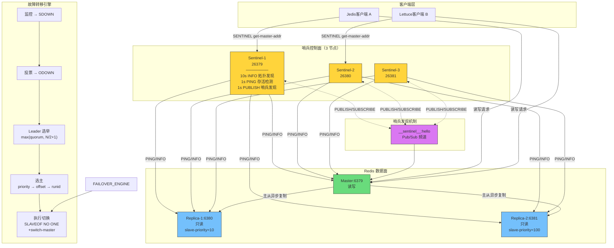
```mermaid
graph TB
    subgraph Clients["客户端层"]
        C1[Jedis客户端 A]
        C2[Lettuce客户端 B]
    end

    subgraph Sentinel_Layer["哨兵控制面（3 节点）"]
        S1["Sentinel-1<br/>26379<br/>────────<br/>10s INFO 拓扑发现<br/>1s PING 存活检测<br/>1s PUBLISH 哨兵发现"]
        S2["Sentinel-2<br/>26380"]
        S3["Sentinel-3<br/>26381"]
    end

    subgraph Redis_Data["Redis 数据面"]
        M["Master:6379<br/>读写"]
        R1["Replica-1:6380<br/>只读<br/>slave-priority=10"]
        R2["Replica-2:6381<br/>只读<br/>slave-priority=100"]
    end

    subgraph PubSub["哨兵发现机制"]
        CHANNEL["__sentinel__:hello<br/>Pub/Sub 频道"]
    end

    subgraph Failover_Engine["故障转移引擎"]
        FE_MONITOR[监控 → SDOWN]
        FE_VOTE[投票 → ODOWN]
        FE_LEADER["Leader 选举<br/>max(quorum, N/2+1)"]
        FE_SELECT["选主<br/>priority → offset → runid"]
        FE_EXEC["执行切换<br/>SLAVEOF NO ONE<br/>+switch-master"]
        FE_MONITOR --> FE_VOTE
        FE_VOTE --> FE_LEADER
        FE_LEADER --> FE_SELECT
        FE_SELECT --> FE_EXEC
    end

    S1 -->|PING/INFO| M
    S1 -->|PING/INFO| R1
    S1 -->|PING/INFO| R2

    S2 -->|PING/INFO| M
    S2 -->|PING/INFO| R1
    S2 -->|PING/INFO| R2

    S3 -->|PING/INFO| M
    S3 -->|PING/INFO| R1
    S3 -->|PING/INFO| R2

    S1 <-.->|PUBLISH/SUBSCRIBE| CHANNEL
    S2 <-.->|PUBLISH/SUBSCRIBE| CHANNEL
    S3 <-.->|PUBLISH/SUBSCRIBE| CHANNEL
    CHANNEL --> M

    M -->|主从异步复制| R1
    M -->|主从异步复制| R2

    C1 -->|SENTINEL get-master-addr| S1
    C1 -->|读写请求| M
    C2 -->|SENTINEL get-master-addr| S2
    C2 -->|读写请求| M

    FAILOVER_ENGINE --> FE_EXEC

    style S1 fill:#ffd43b,stroke:#333
    style S2 fill:#ffd43b,stroke:#333
    style S3 fill:#ffd43b,stroke:#333
    style M fill:#69db7c,stroke:#333
    style R1 fill:#74c0fc,stroke:#333
    style R2 fill:#74c0fc,stroke:#333
    style CHANNEL fill:#da77f2,stroke:#333
```

### 11.2 一页纸速查表（面试前 5 分钟复习）

```
┌─────────────────────────────────────────────────────────────────────────────────────┐
│                          Redis Sentinel 核心要点 速查表                               │
├─────────────────────────────────────────────────────────────────────────────────────┤
│                                                                                     │
│  【本质】哨兵 = 特殊模式的 Redis 进程，负责监控、通知、故障转移、配置提供                  │
│                                                                                     │
│  【三大定时任务】                                                                     │
│    10s INFO  → 发现拓扑变化（新 replica/哨兵）                                          │
│    1s PING   → 存活检测（→ SDOWN 判定）                                                │
│    1s PUBLISH → __sentinel__:hello（哨兵间自动发现）                                    │
│                                                                                     │
│  【SDOWN vs ODOWN】                                                                 │
│    SDOWN = 单个哨兵判定（down-after-milliseconds 无回复）                               │
│    ODOWN = 集群投票 ≥ quorum（仅主库有），触发故障转移                                    │
│                                                                                     │
│  【Leader 选举】                                                                     │
│    - 类似 Raft：每 epoch 每哨兵一票，先到先得                                            │
│    - 胜出需 ≥ max(quorum, N/2+1)                                                     │
│    - epoch 单调递增，防止过期投票                                                       │
│                                                                                     │
│  【选主逻辑（优先级降序）】                                                               │
│    ① slave-priority 升序（越小越优先，0=永不提升）                                       │
│    ② replication offset 降序（数据越新越优先）                                           │
│    ③ runid 字典序（确定性兜底）                                                          │
│                                                                                     │
│  【故障转移五步】                                                                     │
│    1. ODOWN 触发                                                                     │
│    2. Leader 选举                                                                    │
│    3. 选新主 → SLAVEOF NO ONE                                                        │
│    4. 重新绑定从库 → SLAVEOF 新主                                                       │
│    5. +switch-master 通知客户端 → 旧主恢复后降级为从库                                    │
│                                                                                     │
│  【脑裂】                                                                             │
│    - 哨兵无法根除脑裂（AP 系统必然）                                                      │
│    - 减轻：min-replicas-to-write + min-replicas-max-lag                             │
│    - 零数据丢失 → 用 CP 系统（etcd/ZK），不是 Redis                                      │
│                                                                                     │
│  【部署铁律】                                                                         │
│    - 至少 3 个哨兵，奇数个                                                              │
│    - quorum ≥ N/2+1（不可用 1）                                                        │
│    - 哨兵部署在不同物理机/可用区                                                         │
│    - 主从都开持久化                                                                     │
│    - 哨兵不处理数据，挂了不影响数据流                                                      │
│                                                                                     │
│  【必背命令】                                                                         │
│    SENTINEL GET-MASTER-ADDR-BY-NAME mymaster          # 查主库地址                    │
│    SENTINEL FAILOVER mymaster                         # 手动切换                      │
│    SENTINEL RESET mymaster                            # 重置监听                      │
│    INFO replication                                   # 查复制状态                    │
│    SENTINEL MASTERS / SLAVES / SENTINELS mymaster     # 查拓扑                       │
│                                                                                     │
└─────────────────────────────────────────────────────────────────────────────────────┘
```

---

## 附录：速查命令汇总

```bash
# =================== 哨兵运维命令 ===================

# 查看哨兵监控的所有 master
redis-cli -p 26379 SENTINEL MASTERS

# 查看某个 master 的详细信息（当前主库、从库数、哨兵数、Epoch 等）
redis-cli -p 26379 SENTINEL MASTER mymaster

# 查看某个 master 的所有 replica
redis-cli -p 26379 SENTINEL SLAVES mymaster

# 查看某个 master 的所有哨兵
redis-cli -p 26379 SENTINEL SENTINELS mymaster

# 获取当前 master 地址（客户端最常用）
redis-cli -p 26379 SENTINEL GET-MASTER-ADDR-BY-NAME mymaster

# 手动执行故障转移（主库正常时也能执行）
redis-cli -p 26379 SENTINEL FAILOVER mymaster

# 强制故障转移（跳过 ODOWN 检查）
redis-cli -p 26379 SENTINEL FAILOVER mymaster FORCE

# 重置所有状态信息（相当于重新发现拓扑）
redis-cli -p 26379 SENTINEL RESET mymaster

# 动态调整配置
redis-cli -p 26379 SENTINEL SET mymaster down-after-milliseconds 5000
redis-cli -p 26379 SENTINEL SET mymaster quorum 2

# 移除监控
redis-cli -p 26379 SENTINEL REMOVE mymaster

# 检查指定主库是否被判定为下线
redis-cli -p 26379 SENTINEL IS-MASTER-DOWN-BY-ADDR 10.0.0.2 6379

# 哨兵信息
redis-cli -p 26379 INFO Sentinel

# =================== 数据节点运维命令 ===================

# 查看复制状态
redis-cli -p 6379 INFO replication

# 查看主从延迟（master）
redis-cli -p 6379 INFO replication | grep -E "lag|offset"

# 模拟故障：手动下线 master
redis-cli -p 6379 DEBUG SLEEP 60   # 让 master 睡 60 秒，触发哨兵判定 SDOWN

# 查看哨兵日志中的关键事件
grep -E "sdown|odown|failover|switch-master|elected-leader" /var/log/redis/sentinel.log
```
