# Redis 分片集群（Cluster）—— 深入源码级的全景剖解

---

## 核心论点（先读我）

> Redis Cluster 的本质是：**将数据按哈希槽分片到多台 Redis 节点上，每台节点只负责一部分数据，节点间通过 Gossip 协议通信，内置故障检测和自动转移。** 它是「去中心化 + 水平扩展 + 高可用」三位一体的方案。

本文从三个层面展开：
1. **What**：每个阶段都在干什么
2. **Why**：为什么这样设计（源码级设计决策 + 分布式系统权衡）
3. **How**：怎么搭建、怎么扩容、怎么排查故障

---

## 第一章：为什么需要分片集群

### 1.1 架构演进线

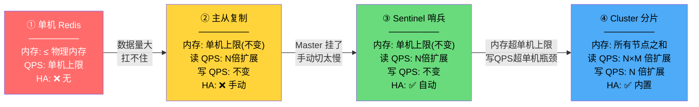

**每层架构解决了什么 + 解决不了什么：**

| 架构 | 解决了什么 | 解决不了什么 |
|------|-----------|-------------|
| **主从** | 读写分离 + 数据冗余 | 单机内存上限（如 64GB）、写性能瓶颈、手动故障转移 |
| **哨兵** | 自动故障转移 | 单机内存上限、写 QPS 线性增长:rocket::rocket::rocket::rocket::rocket::rocket: |
| **Cluster** | 数据分片 + 水平扩展 + 内置高可用 | 运维复杂度、跨槽事务受限、多 Key 操作需 Hash Tag |

**面试金句：** 「主从解决的是『数据不丢』的问题，哨兵解决的是『挂了自动切』的问题，集群解决的是『一台机器放不下』的问题:rocket:。三者是递进关系，不是替代关系。」

### 1.2 什么时候需要上集群？:rocket::rocket::rocket::rocket::rocket:

```
不是看日活，是看三个硬指标：

指标 1 —— 内存使用量：
  单机内存 > 32GB → 建议分片
  原因：RDB fork 时间随内存线性增长，32GB fork 耗时可达 200~500ms
        内存越大，故障恢复越慢，全量复制代价越高

指标 2 —— 写 QPS：
  单机写 QPS > 5w → 建议分片
  原因：Redis 单线程处理命令，写操作 + 持久化 I/O 让单核成为瓶颈
        分片后每个节点独立处理，写 QPS 线性叠加

指标 3 —— 网络带宽：
  单机出带宽 > 1Gbps → 建议分片
  原因：大量 client 连接 + replica 复制流 + RDB 传输 打满网卡

一个亿级日活的系统，如果只是简单缓存（key-value），单机 32GB 可能够了。
但如果涉及复杂数据结构（hash/zset/list 累计几千万条），100GB 也需要上集群。
```

---

## 第二章：数据分片——哈希槽（Hash Slot）

### 2.1 为什么是 16384 个槽

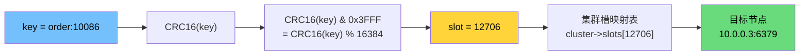

**源码路径（`cluster.c`）：**

```c
// 计算 key 所属的槽位
unsigned int keyHashSlot(char *key, int keylen) {
    int s, e; // s = 第一个 '{'，e = 第一个 '}'（Hash Tag 处理）

    for (s = 0; s < keylen; s++)
        if (key[s] == '{') break;

    // 没有 '{' → 整个 key 参与哈希
    if (s == keylen) return crc16(key, keylen) & 0x3FFF;

    // 有 '{' → 查找 '}'
    for (e = s+1; e < keylen; e++)
        if (key[e] == '}') break;

    // 没有 '}' 或 {} 之间为空 → 整个 key 参与哈希
    if (e == keylen || e == s+1) return crc16(key, keylen) & 0x3FFF;

    // 用 {} 之间的内容参与哈希（Hash Tag）
    return crc16(key+s+1, e-s-1) & 0x3FFF;
    //              ↑                   ↑
    //         { } 之间的内容          & 0x3FFF = % 16384
}
```

**面试追问：为什么是 16384，不是 65535？**

> CRC16 生成的是 16 位值，范围是 0~65535。Redis 只用了 16384（2¹⁴），这是精心设计的 trade-off：
>
> **原因 1——心跳消息体大小（核心原因）**:rocket::rocket::rocket::rocket:,太大了心跳包信息很大。
> 集群节点间通过 Gossip 协议交换信息，PING/PONG 消息需要携带一个 **槽位 bitmap**（每个 bit 代表一个槽是否由该节点负责）。
>
> ```
> 16384 个槽 → bitmap = 16384 / 8 = 2048 字节 = 2KB
> 65535 个槽 → bitmap = 65535 / 8 = 8192 字节 ≈ 8KB
> ```
>
> Gossip 消息中每个节点都会携带附近多个节点的信息。如果 bitmap 是 8KB，加上携带 1/10 节点的信息（比如 100 个节点），一次 PING 消息体可能达到 几十 KB。在 1000 个节点规模下，消息开销不可接受。
>
> **原因 2——节点数上限**
> Redis 官方推荐节点数不超过 1000。16384 个槽均匀分配给 1000 个节点，每个节点约 16 个槽。如果节点再增加，槽会过于碎片化。
>
> **原因 3——代码写死**
> `#define CLUSTER_SLOTS 16384` 是编译期常量。如果要改，需要重新编译 Redis 且整个集群内所有节点必须统一。如果你真的需要更多槽，说明你该做的是拆集群而不是改槽数。

### 2.2 槽与节点的映射

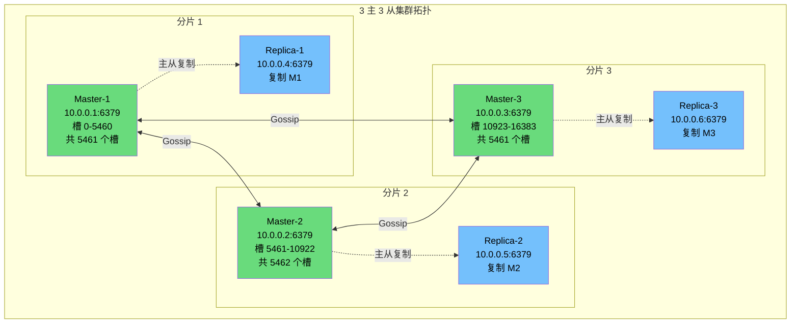

**源码中的槽-节点映射（`cluster.h` / `cluster.c`）：**

```c
// 每个集群节点维护的槽映射表
typedef struct clusterState {
    // ...
    clusterNode *slots[CLUSTER_SLOTS];  // 16384 个指针，指向负责该槽的节点
    // slots[i] == NULL  → 槽 i 没有节点负责（cluster state = fail）
    // slots[i] == myself → 本节点负责槽 i
    // slots[i] == nodeX  → 节点 X 负责槽 i

    zskiplist *slots_to_keys;  // 跳跃表：槽 → 槽内 key 列表（迁移时用）
    // ...
} clusterState;

// 判断一个 key 是否应该由本节点处理
int isKeyInMySlot(char *key, int keylen) {
    int slot = keyHashSlot(key, keylen);
    return server.cluster->slots[slot] == server.cluster->myself;
}
```

### 2.3 Hash Tag 机制

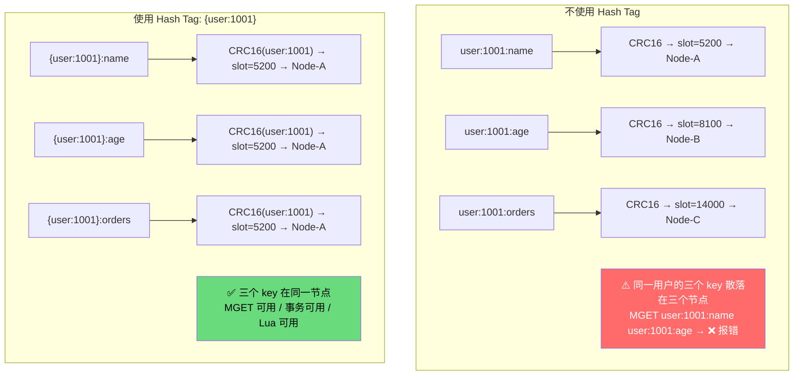

**Hash Tag 的源码处理（已在 2.1 中展示）：**

```c
// 核心逻辑：'{' 和 '}' 之间的内容参与 CRC16
// key = "{user:1001}:age"
// s = 0 (第一个 '{' 的位置)
// e = 11 (第一个 '}' 的位置)
// 哈希内容 = key[1..10] = "user:1001"
return crc16(key+s+1, e-s-1) & 0x3FFF;
```

**面试追问：Hash Tag 会带来什么问题？**

> **数据倾斜（热 key 问题）。**:rocket::rocket::rocket::rocket::rocket::rocket:
>
> 如果把所有跟「用户」有关的数据都放在 `{user:xxx}` 中，热门用户的数据全部集中在同一个槽 → 同一个节点上 → 这个节点的 QPS / 内存远超其他节点 → 集群的水平扩展优势被抵消。
>
> 解决方法：
> 1. 避免对热点实体用 Hash Tag:o::o::o::o::o::o::o::o::o::o::o::o::o::o::o::o::o::o::o::o::o::o::o::o::o::o::o::o::o::o:
> 2. 如果必须用，对热 key 做拆分：`{user:1001}:field1` → `{user:1001_sub1}:field1`
> 3. 客户端侧做二级缓存

### 2.4 为什么不选一致性哈希？:rocket::rocket::rocket::rocket::rocket::rocket::rocket::rocket::rocket:主要还是难以迁移

```
一致性哈希（Consistent Hashing）的方案：
  - 所有 key 映射到一个哈希环上
  - 每个节点负责哈希环上的一段区间
  - 加节点/删节点时，只影响相邻两个节点之间的数据

Redis Cluster 为什么不选一致性哈希？

原因 1——槽迁移的灵活性：
  一致性哈希里加一个节点，从哪个节点迁数据过来由哈希环的位置决定，不可控。
  Redis 的槽机制可以从任意节点迁任意槽，管理员可以精确控制迁移策略。

原因 2——数据分布的均匀性：
  一致性哈希要达到均匀分布，需要引入虚拟节点（VNODE），增加了复杂度。
  CRC16 % 16384 + 槽分配，数据分布天然均匀（只要槽数均匀分配）。

原因 3——运维的可控性：
  管理员可以说「把槽 5000~6000 从节点A迁到节点B」，
  但很难说「把哈希环上 15°~30° 的数据迁过去」。
  槽是一等公民，迁移粒度清晰。
```

---

| 对比维度         | **一致性哈希**                                               | **插槽哈希 (Hash Slot)**                                     |
| :--------------- | :----------------------------------------------------------- | :----------------------------------------------------------- |
| **映射方式**     | 哈希环，key 顺时针找节点                                     | key 先映射到固定槽 (slot)，再查表找节点                      |
| **元数据依赖**   | 客户端自行维护环映射（或通过代理）                           | 集群内通过 Gossip 同步槽-节点表，客户端可缓存                |
| **数据迁移粒度** | **单个 key**（虚拟节点迁移可导致一批 key 移动）              | **整个槽**（槽可以包含任意多的 key，迁移可控）               |
| **增减节点时**   | 只影响相邻节点的一小部分 key                                 | 需要显式在线迁移槽，可平滑进行                               |
| **负载均衡**     | 依赖虚拟节点的设置，自动均衡                                 | 需要手动调整槽分布（Redis 命令），可灵活但需运维介入         |
| **中心化程度**   | **完全去中心**，节点间彼此对等，无特殊管理节点               | **逻辑上中心化**：槽映射表是全局一致的，通过 Gossip 去中心传播 |
| **故障转移**     | 节点挂掉后，key 自动顺时针跑到下一个节点，但可能导致“数据丢失”或“脏读”（取决于实现） | 需要有 Slave 节点提供副本，通过哨兵或集群自动提升 Slave，保证高可用 |
| **实现复杂度**   | 客户端或代理端实现，服务端简单                               | 服务端和客户端都需要支持，协议复杂                           |
| **典型场景**     | 无中心的 key-value 缓存、分布式数据库节点发现                | Redis 专属，兼顾高性能分片与自动故障转移                     |

## 第三章：集群通信——Gossip 协议

### 3.1 节点间通信体系

```
每个 Redis Cluster 节点维护两类 TCP 端口：

端口 = 6379（业务端口）
  ├── 接收客户端连接
  ├── 处理数据命令（GET/SET/...）
  └── 接收其他节点的 CLUSTER 命令

端口 = 16379（集群总线端口 = 业务端口 + 10000）
  ├── 节点间 Gossip 协议通信
  ├── PING/PONG/MEET/FAIL/PUBLISH 消息
  └── 节点间数据包的二进制协议（比 RESP 更紧凑）
```

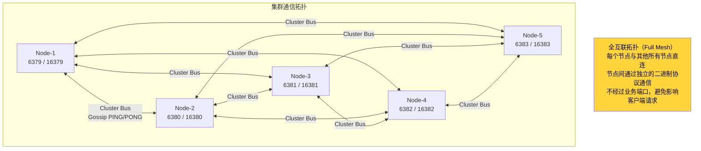

**面试追问：为什么不用集中式元数据存储（ZooKeeper/etcd）:rocket::rocket::rocket::rocket::rocket::rocket:？**

> 这是 Redis Cluster 最核心的设计哲学——**去中心化**。
>
> 如果引入 ZK/etcd：
> - ✅ 元数据强一致性（不用担心槽信息不一致）
> - ❌ 额外依赖 → 部署复杂度翻倍、故障域扩大（ZK 自己也会挂）
> - ❌ ZK 成为性能瓶颈 → 每次槽变更都要走 ZK
> - ❌ 客户端也需要访问 ZK → 多一跳延迟
>
> Redis 选择的路径：**用最终一致性换自主可控。** Gossip 协议虽然有收敛延迟（毫秒级），但对于「槽在哪个节点」这种慢变化的信息来说，毫秒级收敛足够。对于「节点挂了」这种事件，通过 FAIL 消息加速传播。

### 3.2 Gossip 协议的 5 种消息

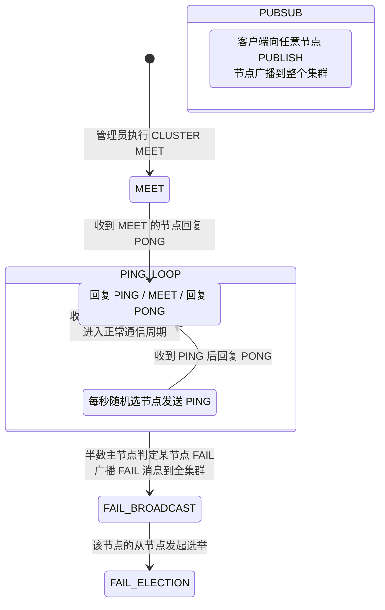

**五种消息的源码定义（`cluster.h`）：**

```c
typedef enum {
    CLUSTERMSG_TYPE_PING = 0,      // 心跳 + 元数据交换
    CLUSTERMSG_TYPE_PONG = 1,      // PING/MEET 的回复
    CLUSTERMSG_TYPE_MEET = 2,      // 邀请新节点加入
    CLUSTERMSG_TYPE_FAIL = 3,      // 通知某节点被标记为 FAIL
    CLUSTERMSG_TYPE_PUBLISH = 4,   // Pub/Sub 消息广播
    CLUSTERMSG_TYPE_FAILOVER_AUTH_REQUEST = 5,   // 从节点请求投票
    CLUSTERMSG_TYPE_FAILOVER_AUTH_ACK = 6,       // 投票回复
    CLUSTERMSG_TYPE_UPDATE = 7,    // 槽配置更新
    CLUSTERMSG_TYPE_MFSTART = 8,   // 手动故障转移
} clusterMsgType;
```

**PING 消息里携带了什么？**:rocket:

```c
// 简化版 PING 消息体结构
typedef struct {
    char sig[4];                    // 协议幻数 "RCmb"
    uint32_t totlen;                // 消息总长度
    uint16_t type;                  // 消息类型 (PING=0)
    uint16_t count;                 // 携带的 Gossip 节点数
    uint64_t currentEpoch;          // 发送者的 currentEpoch
    uint64_t configEpoch;           // 发送者的 configEpoch
    uint64_t offset;                // 主从复制偏移量
    char sender[40];                // 发送者 runid
    unsigned char myslots[CLUSTER_SLOTS/8];  // 发送者负责的槽位 bitmap（2048 字节）
    char slaveof[40];               // 发送者 master 的 runid（从节点时有值）
    uint16_t cport;                 // 集群总线端口
    uint16_t flags;                 // 节点标识位（master/slave/pfail/fail/...）
    unsigned char state;            // 集群状态（ok/fail）
    // 后面跟着 count 个 Gossip 条目（关于其他节点的信息）
    // gossip_entry {
    //     char name[40];       // 节点 runid
    //     char ip[46];         // 节点地址
    //     uint16_t port;       // 业务端口
    //     uint16_t cport;      // 集群总线端口
    //     uint16_t flags;      // 节点状态标识
    //     uint32_t pings;      // 最近一次收到 PING 的时间戳
    //     uint32_t pongs;      // 最近一次收到 PONG 的时间戳
    // }
} clusterMsg;
```

**为什么 PING 只携带部分节点信息（Gossip 条目）？**

> 控制消息体大小。如果 100 个节点的集群，每个 PING 都携带全部 99 个其他节点的信息，一次 PING 消息 > 50KB。每秒随机选几个节点发 PING，带宽消耗爆炸。
>
> 实际策略：每个 PING 携带 `count = 当前集群节点数的 1/10`（源码 `cluster.c` 中 `wanted` 计算），最少 3 个。通过多轮 Gossip 传播，元数据逐渐收敛到所有节点。

### 3.3 Gossip 的传染机制

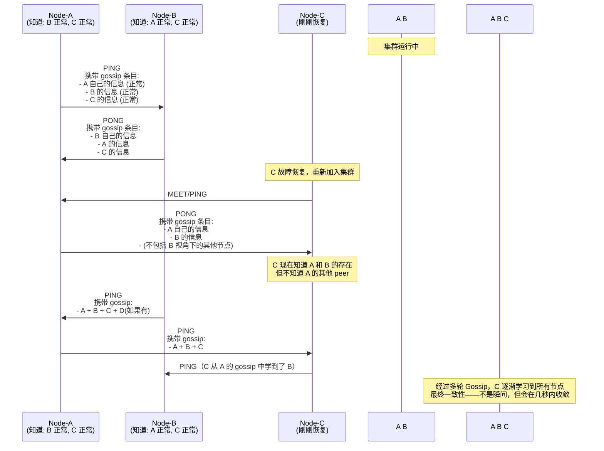

看起来有点绕，是因为 Gossip 不是一次性广播，而是**随机、分批、接力式**的聊天。我们按时间线一步步拆解。

------

### 第 1 步：集群正常运行，A 和 B 互相聊

- A 和 B 都知道对方正常，也知道 C 的存在（此时 C 还没挂，或挂之前的状态被记住了）。
- A 向 B 发 **PING**，顺带聊聊八卦：“我很好，B 也好，C 也好。”
- B 回复 **PONG**，也说：“B 很好，A 很好，C 很好。”

这是日常心跳，没什么特别。

------

### 第 2 步：C 恢复，主动敲门

- C 重启后，可能只记得 A 的地址（配置了初始节点），于是向 A 发一个 **MEET 或 PING**，意思是：“我回来了，拉我进群。”
- A 收到后，回一个 **PONG**，并捎带上它知道的部分八卦：“A 很好，B 很好。”（注意，A 不一定会一股脑把它知道的全部节点都告诉 C，只是随机选几个）。

此时，C 知道了 A 和 B 的存在，但还不知道集群里是否还有 D、E、F 等节点。

------

### 第 3 步：八卦接力，C 逐渐学全

- **B 继续和 A 聊**：B 发 PING 给 A，这次它可能带上了更多节点信息，比如“A、B、C、D（如果集群里还有个 D）”。A 知道了 D，自己的信息也更丰富了。
- **A 主动和 C 聊**：A 下一次 PING C 时，会把刚学到的八卦告诉 C：“A 很好，B 很好，C 很好。”（如果 A 知道 D，也可能加上 D）。
- **C 主动去认识 B**：C 从 A 的八卦里听到了 B，于是直接向 B 发 PING。B 回复，C 和 B 正式建立连接。之后 B 也会把 C 加入自己的八卦话题。

就这样，**经过几轮随机的 PING/PONG，C 最终会从不同节点口中听到所有其他节点，一一认识，全集群信息达成最终一致。**

------

### 为什么不用“通知所有人”？

Gossip 这样设计，是为了**去中心化和容错**。没有中心节点负责广播，万一某个节点挂掉或网络抖一下，八卦也能从其他路径绕过去，最终让整个集群都获知信息。代价只是**几秒钟的收敛时间**，对于分布式集群完全可接受。

**面试追问：Gossip 的最终一致性会带来什么问题？**

> **问题 1——槽信息不一致 → MOVED 重定向**
> 节点 A 刚接管了槽 5000，但节点 B 还没从 Gossip 学到这个消息:rocket::rocket::rocket:。客户端请求到节点 B，节点 B 还以为槽 5000 在 A 的旧主上 → 给客户端一条过期信息。客户端请求旧主 → 旧主返回 `MOVED 5000 node-A` → 客户端追到正确节点 → 更新本地槽缓存。
>
> **问题 2——故障判定不一致 → 短暂的双主**
> 网络分区期间，不同节点对「谁挂了」有不同认知。分区一侧以为主节点死了（触发选举），另一侧主节点还在正常运行。不过这种窗口很短（几秒），且 epoch 机制保证了最终只有一个主获胜。

### 3.4 节点数量与消息量——O(n²) 的关系

```
Gossip 消息量分析：

假设 N 个节点的集群：
- 每个节点每秒向 1/10 的节点发送 PING（最少 3 个，最多 N-1 个）
- 每个节点每秒收到约 N/10 条 PING + 回复 N/10 条 PONG
- 每个节点每秒处理约 N/5 条 Gossip 消息

N=10:   每秒 ~2 条消息/节点，总计 ~20 条/秒 → 轻松
N=100:  每秒 ~20 条消息/节点，总计 ~2000 条/秒 → 还行
N=500:  每秒 ~100 条消息/节点，总计 ~50000 条/秒 → 压力较大
N=1000: 每秒 ~200 条消息/节点，总计 ~200000 条/秒 → 官方上限！

这也是为什么 Redis Cluster 官方推荐 ≤ 1000 个节点。
超过 1000 个节点：
  1. Gossip 消息量 O(n²) 爆炸
  2. 槽分配碎片化（16384/1000 ≈ 16 槽/节点）
  3. 客户端槽缓存过大（1000 个映射条目）
```

---

## 第四章：客户端重定向——MOVED 与 ASK:rocket::

### 4.1 MOVED 重定向（永久性,下次就记住了:rocket::rocket:）

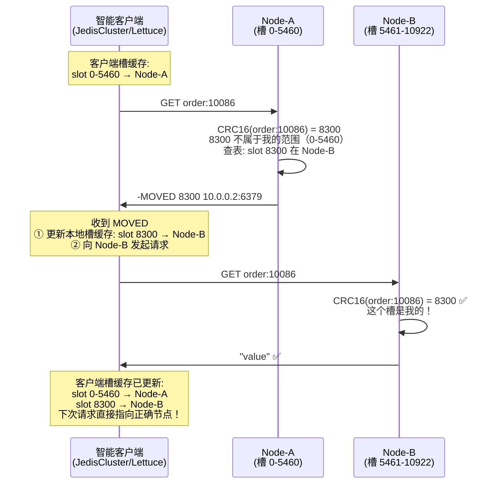

**MOVED 源码路径（`cluster.c` → `processCommand()` 触发）：**

```c
// 如果是集群模式，每个命令执行前都会经过这个检查
int processCommand(client *c) {
    // ...
    if (server.cluster_enabled) {
        int hashslot = keyHashSlot(c->argv[1]->ptr, sdslen(c->argv[1]->ptr));
        clusterNode *node = server.cluster->slots[hashslot];

        // 槽不属于本节点，且该槽有负责节点（非 NULL）
        if (node != server.cluster->myself) {
            if (node != NULL) {
                // 返回 MOVED → 客户端重定向
                addReplySds(c, sdscatprintf(sdsempty(),
                    "-MOVED %d %s:%d\r\n",
                    hashslot,
                    node->ip,
                    node->port));
            } else {
                // 槽没有节点负责 → CLUSTERDOWN
                addReplyError(c, "CLUSTERDOWN Hash slot not served");
            }
            return C_OK;
        }
    }
    // ...
}
```

**面试追问：为什么客户端要缓存槽映射？**:o::o::o::o::o::o::o::o::o::o::o:

> 避免每次请求都多一次 MOVED 网络往返。
>
> 如果客户端不缓存：
> ```
> 每次请求：
>   1. 客户端 → 任意节点（假设命中率 1/N）
>   2. 节点 → MOVED → 客户端
>   3. 客户端 → 正确节点
>   4. 正确节点 → 客户端
> 
> 额外增加 1 个 RTT（网络往返时间），P99 延迟翻倍。
> ```
>
> 智能客户端（JedisCluster、Lettuce）启动时通过 `CLUSTER SLOTS` 拉取全量槽映射，运行时 MOVED 增量更新。这样 99% 的请求都是直连正确节点。

### 4.2 ASK 重定向（临时性）

**场景：槽正在迁移中。**

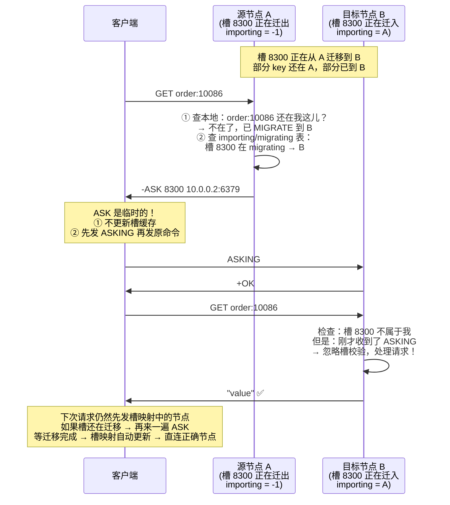

**MOVED vs ASK 对比：**

| 维度 | MOVED | ASK |
|------|-------|-----|
| **槽状态** | 槽已永久迁移 | 槽正在迁移中 |
| **含义** | 「这个槽以后都归 B 了」 | 「这个 key 碰巧在 B 上」 |
| **客户端行为** | **更新**槽映射缓存:rocket: | **不更新**槽映射缓存:rocket: |
| **前置命令** | 无需 | 必须先发 `ASKING`:o::o: |
| **下次请求** | 直连新节点 | 仍走旧节点 → 可能的再次 ASK |
| **正确节点校验** | 目标节点正常校验槽 | 目标节点跳过槽校验（本次） |

**`ASKING` 命令为什么必须发？**

> 目标节点的集群校验逻辑：收到一条命令 → 计算 key 的槽 → 检查这个槽是否在本节点 → 如果不是 → 拒绝命令返回 MOVED。
>
> 槽迁移期间，目标节点虽然有这个 key，但槽的所有权还没转移。如果不跳过校验，目标节点会拒绝处理。`ASKING` 命令设置一个标志位 `CLIENT_ASKING`，告诉目标节点：「下一条命令跳过槽校验，强制执行」。
>
> 这个标志位**只对下一条命令有效**，执行完自动清除。防止客户端绕过槽校验发出安全性问题。

```c
// 源码中 ASKING 的标志位处理（command.c）
void askingCommand(client *c) {
    if (server.cluster_enabled) {
        // 仅对集群模式有效
        c->flags |= CLIENT_ASKING;  // 设置标志位，下一条命令跳过槽校验
        addReply(c, shared.ok);
    }
}
```

---

## 第五章：集群故障检测与自动转移

### 5.1 故障检测——PFail → Fail 两段式判定

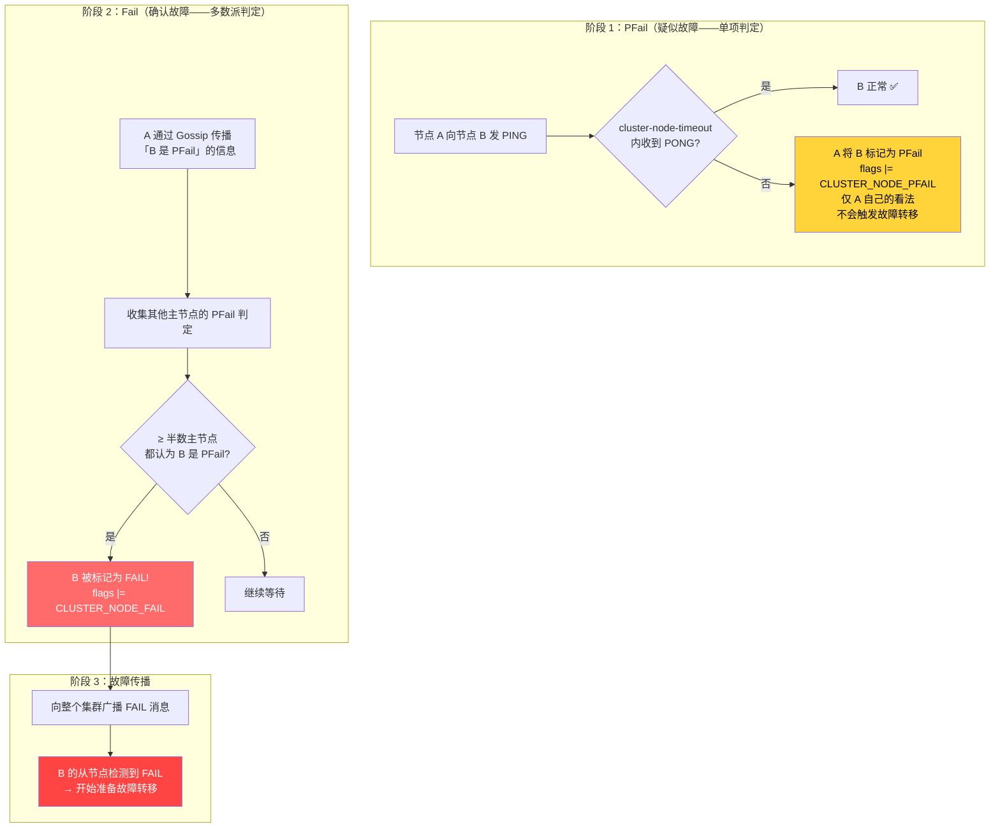

**源码中的 PFail → Fail 逻辑（`cluster.c`）：**

```c
// ① 超时检测 → 标记 PFail
void clusterCron(void) {
    // ...
    mstime_t now = mstime();
    mstime_t delay;

    dictIterator *di = dictGetSafeIterator(server.cluster->nodes);
    while ((de = dictNext(di)) != NULL) {
        clusterNode *node = dictGetVal(de);

        // 计算距离收到对方最后一次 PONG 的时间
        delay = now - node->pong_received;

        if (delay > server.cluster_node_timeout) {
            // 超过 cluster-node-timeout → 标记 PFail
            if (!(node->flags & CLUSTER_NODE_PFAIL)) {
                node->flags |= CLUSTER_NODE_PFAIL;
                // 广播这个 PFail 信息（通过 PING 的 gossip 条目）
            }
        } else {
            // 恢复正常，清除 PFail（如果之前有）
            if (node->flags & CLUSTER_NODE_PFAIL) {
                node->flags &= ~CLUSTER_NODE_PFAIL;
            }
        }
    }
    dictReleaseIterator(di);
}

// ② 检查是否满足 Fail 条件
void clusterNodeCronUpdateClusterNodeMissedReports(clusterNode *node) {
    int needed_quorum = (server.cluster->stats_slots_assigned / 2) + 1;
    // 如果已分配的槽有 16384 个，needed_quorum = 16384/2 + 1 = 8193 个主节点的一半以上
    // 实际上就是「半数以上主节点」

    if (node->pfail_reports >= needed_quorum) {
        // 达到多数派 → 标记为 FAIL
        node->flags |= CLUSTER_NODE_FAIL;
        // 广播 FAIL 消息
        clusterSendFail(node);
    }
}
```

**面试追问：这里和哨兵的 SDOWN/ODOWN 有什么异同？**

| 维度 | 哨兵 SDOWN → ODOWN | 集群 PFail → Fail |
|------|-------------------|------------------|
| **判定者** | 独立哨兵进程组 | 集群主节点间互相判定:rocket::o::o::o::o::o::o: |
| **投票方** | 哨兵节点 | 半数以上主节点 |
| **判定参数** | `down-after-milliseconds` + `quorum` | `cluster-node-timeout` + 半数以上 |
| **去中心化** | 哨兵是独立服务 | 完全去中心化，无独立组件:rocket::o::o::o::o::o: |
| **传播方式** | 哨兵间 Pub/Sub + 投票 | Gossip 传染（最终一致性） |

### 5.2 故障转移流程

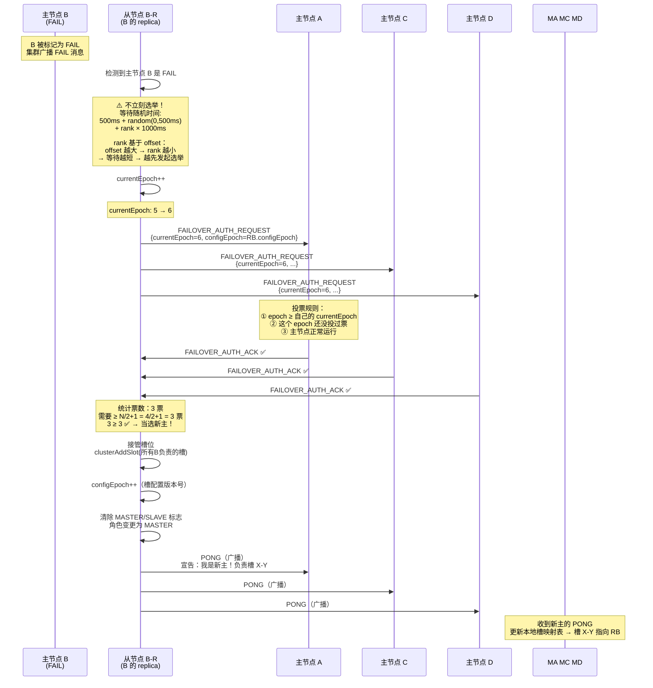

**源码中的选举延迟计算（`cluster.c` → `clusterGetSlaveRank()`）：**

```c
// 从节点的选举排名：offset 越大 → rank 越小（数据越新 → 优先级越高）
int clusterGetSlaveRank(void) {
    long long myoffset = replicationGetSlaveOffset();
    int rank = 0;

    dictIterator *di = dictGetSafeIterator(server.cluster->nodes);
    dictEntry *de;
    while ((de = dictNext(di)) != NULL) {
        clusterNode *node = dictGetVal(de);
        if (nodeIsSlave(node) &&
            node->slaveof == server.cluster->myself->slaveof)
        {
            // 同一个 master 下的其他从节点
            if (node->repl_offset > myoffset) rank++;
            // offset 比我大的 → 我的 rank 增加（延后）
        }
    }
    dictReleaseIterator(di);
    return rank;
}

// 选举等待时间
mstime_t clusterGetSlaveElectionTimeout(void) {
    int rank = clusterGetSlaveRank();
    // 基础延迟 500ms + rank × 1000ms
    // rank=0（数据最新）→ 500ms 后发起选举
    // rank=1 → 1500ms 后发起选举
    // rank=2 → 2500ms 后发起选举
    return 500 + rank * 1000;
}
```

**面试追问：为什么从节点要随机等待一段时间才发起选举？**

> **错峰选举 + 数据优先。**
>
> 1. **错峰**：如果主节点下面有 3 个从节点，它们同时检测到主 FAIL。如果不等待，3 个从节点同时发起选举 → 票数分散 → 谁也凑不够 N/2+1 → 选举失败 → 下一轮再同时发 → 死循环。
>
> 2. **数据优先**：等待时间 = 500ms + rank × 1000ms。rank 由 offset 决定——数据越新，等待越短，越早发起选举，越可能当选。这就自然保证了「数据最新的从节点最有可能成为新主」。

### 5.3 Epoch 机制:rocket:

```
Redis Cluster 维护两种 Epoch，各司其职：

① currentEpoch（全局逻辑时钟）：
  - 整个集群范围使用的逻辑时钟
  - 每次选举时递增（类似 Raft 的 Term）
  - 用途：给每次选举一个唯一的「轮次号」，防止过期投票干扰
  - 存储在 clusterState->currentEpoch

② configEpoch（槽配置版本）：
  - 每个节点有自己的 configEpoch
  - 当节点获得新的槽所有权时递增
  - 用途：解决「同一个槽被多个节点宣称主权」的冲突
  - 规则：configEpoch 大的胜出
  - 存储在 clusterNode->configEpoch

冲突解决示例：
  网络分区后，节点A（configEpoch=5）和节点B（configEpoch=6）
  都宣称拥有槽 5000

  当网络恢复后，Gossip 传播了不同节点的槽信息
  → 集群发现冲突 → 比较 configEpoch → B 的 configEpoch 更大
  → 槽 5000 归 B → A 放弃槽 5000
```

**与哨兵 epoch 的对比：**

| 维度 | 哨兵 epoch | 集群 epoch |
|------|-----------|-----------|
| 本质 | 哨兵集群的配置纪元 | 两种：currentEpoch(选举轮次) + configEpoch(槽配置版本) |
| 递增时机 | 每次故障转移 | currentEpoch：每次选举；configEpoch：槽所有权变更 |
| 用途 | 防止过期故障转移 | currentEpoch：选举；configEpoch：槽所有权仲裁 |
| 冲突解决 | Leader 选举 | 槽主权冲突 |

- **Sentinel Epoch**：选举 **"哪个哨兵"** 来执行故障转移，是 **"人的共识"**（选指挥官）。
- **Cluster Epoch**：确定 **"哪个主节点配置版本"** 是最新、最权威的，是 **"配置的共识"**（选真地图）。

------

### Redis Cluster 中的两种 Epoch

Cluster 里其实有两个 Epoch，需要先区分清楚：

#### 2.1 `currentEpoch`

- 范围：**整个集群级别**，每个节点自己维护一个。
- 作用：**帮助选出新的主节点**:每个分片的:rocket:主节点（类似 Sentinel 的纪元，用于拉票）:rocket:。
- 当你上一个流程图里，从节点 `RB` 执行 `currentEpoch++` 并向其他主节点拉票时，用的就是这个。它和 Sentinel 的 `current_epoch` 作用完全一致：让投票者区分不同轮次的选举，保证一个纪元只投一次票。

#### 2.2 `configEpoch`

- 范围：**槽位配置级别**，每个主节点一个:rocket::rocket::rocket:。

- 作用：**解决槽位归属冲突**，确定"谁负责哪些槽"的**配置版本号**。

- 这是 Redis Cluster 独有的，也是你这次问的重点。`configEpoch` 的本质：槽位配置的"版本号"

  Redis Cluster 的元数据核心就是**槽位映射表**：哪个主节点负责哪些槽。
  每个主节点在负责某段槽位时，会把自己的这段映射打上一个版本戳——`configEpoch`。

  - 如果同一个槽被两个节点声称负责，**所有节点通过比较 `configEpoch` 的大小来决定听谁的**。:o::o::o::o::o::o::o::o::o:
  - **规则**：`configEpoch` **更大** 的节点，其槽位声明**更新、更权威**，旧声明被丢弃。

  这就是 `configEpoch` 的核心作用：**作为槽配置的分布式版本号，统一全集群对槽归属的认知。**

## 第六章：集群扩容与缩容——数据迁移

### 6.1 槽迁移的完整流程

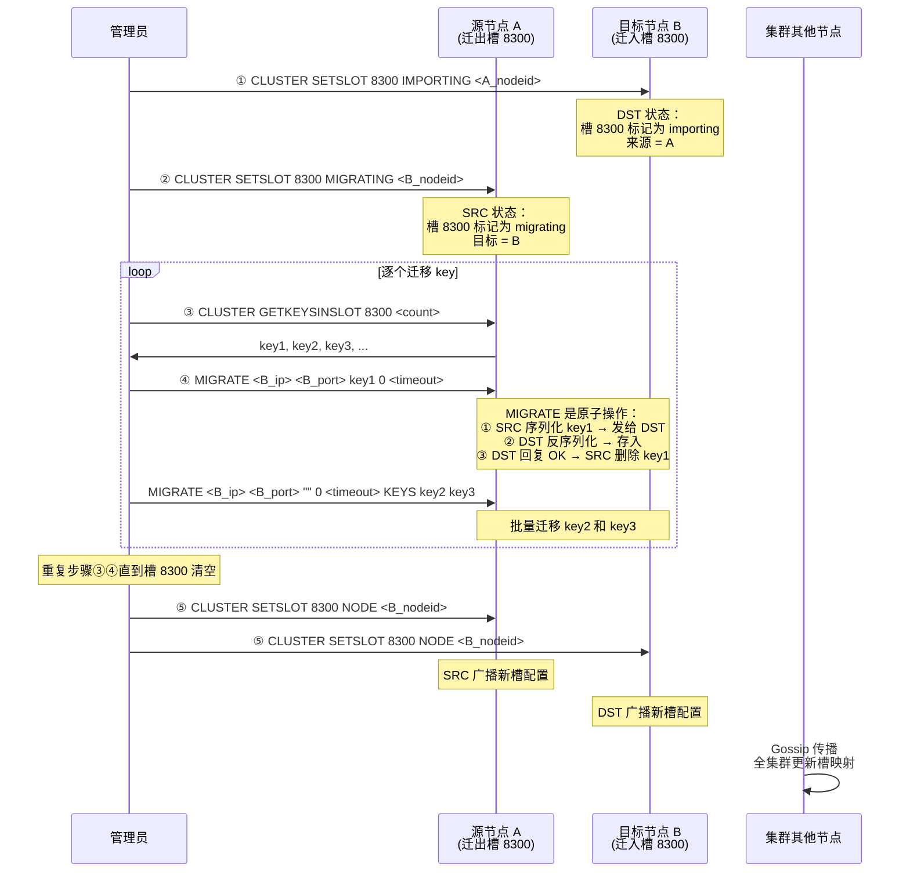

**面试追问：`MIGRATE` 是怎么保证原子性的？迁移期间有客户端请求该 key 怎么办？**

> **MIGRATE 原子性保证：**
> ```
> 源节点流程（简化）：
>   1. dumpKey(key) → 序列化 key 的值
>   2. 发送序列化数据 + RESTORE 命令给目标节点
>   3. 等待目标节点回复 OK
>   4. 收到 OK → dbAsyncDelete(key) 或 dbSyncDelete(key) 删除本地 key
>   5. 如果目标节点回复错误 → 不删除，迁移失败
> ```
>
> 问题：步骤 4 如果在「目标已保存 + 源已删除」之间宕机 → 目标有 key，源也还有 key（原子性依赖 TCP 连接）。实际上 MIGRATE 命令是在同一个连接上阻塞执行，失败会返回错误，由 `redis-cli --cluster reshard` 负责重试。
>
> **迁移期间的客户端请求处理：**
> - 请求到达源节点 → 源节点查本地：key 如果还在 → 直接返回（没被迁走的数据仍然正常服务）
> - 请求到达源节点 → 源节点查本地：key 已经被 MIGRATE 到目标节点 → 返回 `-ASK 8300 <DST_ip>:<DST_port>`
> - 请求到达目标节点 → 目标节点查 importing 状态 + 收到 ASKING 前缀 → 强制执行

### 6.2 在线扩容步骤

```bash
# ========= 在线扩容：加一个新主节点 =========

# Step 1: 启动新 Redis 实例（cluster-enabled yes）
redis-server /etc/redis/6385.conf

# Step 2: 新节点加入集群
redis-cli --cluster add-node 10.0.0.7:6385 10.0.0.1:6379
#                                   ↑ 新节点       ↑ 集群中任意已有节点

# Step 3: 迁移槽到新节点（交互式）
redis-cli --cluster reshard 10.0.0.1:6379
# How many slots do you want to move? 4096
# What is the receiving node ID? <new_node_id>
# Source node? all  (或逐个填源节点 ID)
# Do you want to proceed? yes

# Step 4: 为新主添加从节点
redis-cli --cluster add-node 10.0.0.8:6386 10.0.0.1:6379 \
  --cluster-slave --cluster-master-id <new_master_id>

# Step 5: 验证
redis-cli -p 6379 CLUSTER NODES
redis-cli -p 6379 CLUSTER INFO
redis-cli --cluster check 10.0.0.1:6379
```

### 6.3 在线缩容——下掉一个主节点


```bash
# Step 1: 迁移所有槽（将待下线节点的槽迁到其他节点）
redis-cli --cluster reshard 10.0.0.1:6379 \
  --cluster-from <offline_node_id> \
  --cluster-to <target_node_id> \
  --cluster-slots <slot_count>

# 重复该步骤直到待下线节点的槽数为 0

# Step 2: 验证槽已清空
redis-cli -p 6379 CLUSTER NODES | grep <offline_node_id>

# Step 3: 在所有节点上 FORGET（或使用 --cluster del-node）
redis-cli --cluster del-node 10.0.0.1:6379 <offline_node_id>

# 或者手动在每个节点上：
redis-cli -p 6379 CLUSTER FORGET <offline_node_id>
redis-cli -p 6380 CLUSTER FORGET <offline_node_id>
# ... 所有存活节点
```

**面试追问：为什么需要在所有节点上执行 `CLUSTER FORGET`？**

> 因为 Gossip 协议的**传染性**。如果你只在节点 A 上执行 FORGET，A 忘记了目标节点。但节点 B 的 PING 消息中的 gossip 条目仍然包含目标节点，A 收到后又会「重新发现」它。
>
> 两种做法：
> 1. `redis-cli --cluster del-node` —— 自动在所有节点上执行 FORGET
> 2. 手动在每个节点上 `CLUSTER FORGET`

---

## 第七章：集群的限制

| 限制 | 说明 | 替代方案 |
|------|------|---------|
| **多 key 跨槽操作** | MGET/MSET/DEL 多个 key 必须属于同一个槽 | Hash Tag `{user:1}:name` `{user:1}:age` |
| **跨节点事务** | MULTI/EXEC/WATCH 只能操作同一节点的 key | Hash Tag 或业务层引入 TCC/SAGA |
| **Lua 脚本** | 脚本中所有 key 必须在同一节点 | Hash Tag + `redis.replicate_commands()` |
| **Pub/Sub** | 消息广播到全集群所有节点 | 小集群 OK，大集群慎用或用 Stream 代替 |
| **Pipeline** | 跨节点 pipeline 不保证原子性 | 按槽分组发送 pipeline |
| **FLUSHALL/FLUSHDB** | 只在当前节点生效，不是全集群 | 需要在所有 master 上执行 |
| **KEYS/SCAN** | KEYS 只查本节点 | SCAN 也只在本节点范围；用 `redis-cli --cluster call` |
| **WAIT 命令** | 只等本节点的从节点 ACK | 等待的是当前分片的从节点，不是全集群 |
| **SORT** | SORT 的结果集可能跨节点 | 用 Hash Tag 确保 SORT 的 key 在同一节点 |

**面试追问：如果业务强依赖跨 key 的事务，用什么方案？**

> 三条路：
>
> 1. **Hash Tag 把相关 key 锁在同一个槽**（推荐用于 1~10 个 key 的场景）：`{order:1001}:status`、`{order:1001}:amount` 落在同一节点，可以事务操作。但注意热 key 倾斜风险。
>
> 2. **业务层分布式事务（TCC / SAGA）**：如果涉及多个聚合根且数据量大，用分布式事务框架（Seata / 自研）。复杂度高，但灵活。
>
> 3. **换架构**：如果用 SQL 数据库能更好地满足事务需求，就不要硬用 Redis。或者用 Codis/Twemproxy（代理层集中路由，但代理本身也是瓶颈）。
>
> **核心原则：Redis 是 AP 系统，不要强行用它做 CP 的事。**

---

## 第八章：集群配置深度解析

### 8.1 关键配置参数

| 参数 | 默认值 | 含义 | 调优建议 |
|------|--------|------|----------|
| `cluster-enabled yes` | no | 开启集群模式 | — |
| `cluster-config-file nodes.conf` | — | 节点拓扑持久化文件，重启后自动恢复集群关系 | **不要手动编辑** |
| `cluster-node-timeout 15000` | 15000ms | 节点超时时间，影响 PFail 判定速度和故障转移速度 | 内网调至 5000ms；跨机房 15000~30000ms |
| `cluster-slave-validity-factor 10` | 10 | 从节点有效因子：从节点失联 `timeout × factor` 后，认为数据太旧不可被选为主 | 大内存实例调大（因子 × 15s），避免数据太旧的从节点当选 |
| `cluster-migration-barrier 1` | 1 | 从节点迁移屏障：主节点至少要保持 N 个从节点后才放行多余的从节点去其他地方 | 高可用场景设 ≥ 2 |
| `cluster-require-full-coverage yes` | yes | 所有 16384 个槽都有节点负责时，集群才接受请求 | **生产保持 yes**；no 意味着部分数据不可用时仍接受请求 |
| `cluster-replica-no-failover no` | no | 禁止该从节点参与自动故障转移选举 | 用于专用的延迟复制从库或分析型从库 |
| `cluster-allow-reads-when-down no` | no | 集群状态 fail 时是否允许读请求 | 生产保持 no（有槽未覆盖时返回错误比返回部分数据更安全） |
| `cluster-announce-ip` | — | 在 NAT/Docker 环境下宣告自己的 IP | 容器/K8s 环境必设 |
| `cluster-announce-port` | — | 在 NAT 环境下宣告端口 | 同上 |
| `cluster-announce-bus-port` | — | 在 NAT 环境下宣告集群总线端口 | 同上 |

### 8.2 深度追问解析

**追问 1：`cluster-node-timeout` 设多少合适？**

> ```
> 设太小（如 1000ms）：
>   - 一次 GC 停顿或网络毛刺 → PFail → Fail → 选举 → 误切
>   - 频繁选举导致集群不稳定（flapping）
>
> 设太大（如 60000ms）：
>   - 主节点真的挂了 → 60 秒后才能开始故障转移
>   - 故障恢复窗口过长 → 可用性降低
>
> 内网推荐 5000ms，可以兼顾检测速度和稳定性。
> 跨机房推荐 15000~30000ms。
> ```

**追问 2：`cluster-migration-barrier` 的工作原理**

```
场景：
  Master-A 有 2 个从节点（S1, S2）
  Master-B 有 1 个从节点（S3）
  Master-C 没有从节点

如果 cluster-migration-barrier = 1：
  Master-A 有 2 个从节点 ≥ barrier(1) → 「多余的」S2 可迁移
  → S2 自动迁移到 Master-C（没有从节点的主）

如果 cluster-migration-barrier = 2：
  Master-A 有 2 个从节点 ≥ barrier(2) → 没有多余从节点
  → S2 不会被迁移走
  → Master-C 仍然没有从节点（运维需要手动加）

为什么这个机制有用？
  主节点挂了 + 从节点接管 = 那个分片仍然正常。
  如果主节点挂了 + 没有从节点 = 那个分片的所有槽不可用 → 集群 CLUSTERDOWN。
  从节点自动迁移确保了「每个主节点至少有一个从节点」，最大化高可用性。
```

**追问 3：`cluster-slave-validity-factor` 的作用**

```
场景：
  Master 宕机，其从节点 S1 与 Master 断开连接已经很久了
  cluster-node-timeout = 15s
  cluster-slave-validity-factor = 10

  判定逻辑：
    从节点失联时间 > timeout × factor
                   > 150s

  如果 S1 失联 > 150s：
    → S1 的数据太旧了（比 Master 少了 2.5 分钟的写入）
    → S1 被排除出选举候选池
    → 宁愿没有从节点接管，也不要一个数据很旧的节点成为新主

  注意：如果在 150s 窗口内没有其他从节点可用，S1 仍然会被强制选中
       （Redis 4.0+ 不会因为 validity 而拒绝所有候选者）
```

### 8.3 `nodes.conf` 文件解析

```
# nodes.conf 文件格式示例：

a1b2c3d4... 10.0.0.1:6379@16379 master - 0 1620000000000 5 connected 0-5460
e5f6g7h8... 10.0.0.2:6379@16379 master - 0 1620000000000 2 connected 5461-10922
i9j0k1l2... 10.0.0.3:6379@16379 master - 0 1620000000000 3 connected 10923-16383
m3n4o5p6... 10.0.0.4:6379@16379 slave a1b2c3d4... 0 1620000000000 5 connected
q7r8s9t0... 10.0.0.5:6379@16379 slave e5f6g7h8... 0 1620000000000 2 connected
u1v2w3x4... 10.0.0.6:6379@16379 slave i9j0k1l2... 0 1620000000000 3 connected

字段解析（空格分隔）：
  字段1: node_id（40 位 hex）
  字段2: ip:port@cport（业务端口@集群总线端口）
  字段3: flags（master/slave/myself/pfail/fail/noflags）
  字段4: master_id（从节点时填写其主节点的 node_id，主节点是 "-"）
  字段5: ping_sent（最后一条 PING 的发送时间戳，0 表示未发）
  字段6: pong_received（最后一条 PONG 的接收时间戳）
  字段7: config_epoch（槽配置版本号）
  字段8: link_state（connected/disconnected）
  字段9+: 槽位范围（如 0-5460，连续范围用 '-'，不连续用空格分隔多个范围）
```

**追问：为什么 `nodes.conf` 不要手动编辑？**

> 1. **运行时自动覆盖**：节点每秒都会更新 ping_sent/pong_received 等时间戳，任何手动修改在下一秒就会被覆盖
> 2. **一致性风险**：手动改错一个 node_id 或槽范围 → 节点对集群拓朴的认知错乱 → MOVED 重定向死循环
> 3. **所有变更通过 `CLUSTER` 命令完成**：CLUSTER MEET / FORGET / SETSLOT / REPLICATE 等命令既修改内存又持久化到 nodes.conf

---

## 第九章：常见故障场景与排查

### 9.1 集群状态 FAIL（CLUSTERDOWN）

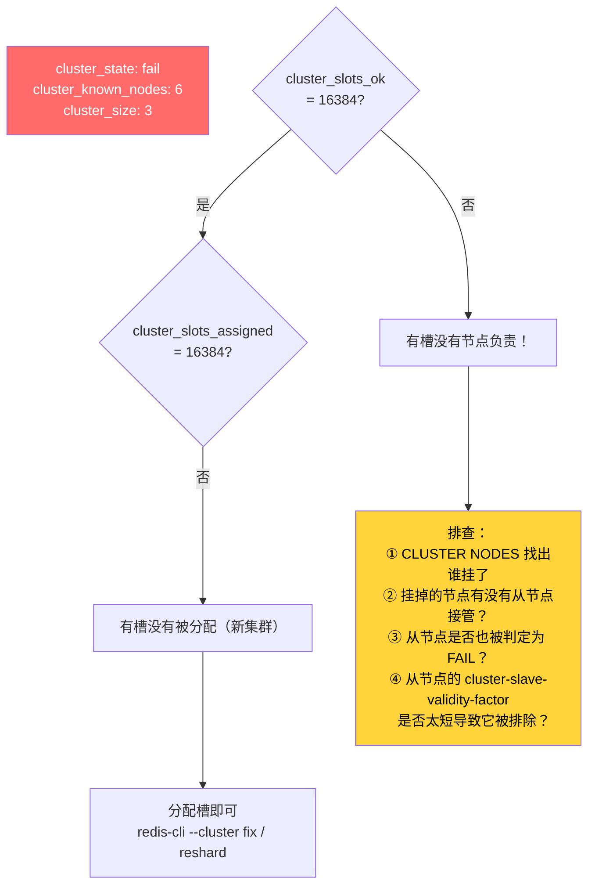

```bash
# 排查命令
redis-cli -p 6379 CLUSTER INFO
# cluster_state: fail
# cluster_slots_ok: 16000  ← 少了 384 个槽！
# cluster_slots_fail: 384

redis-cli -p 6379 CLUSTER NODES
# 找到 FAIL 标记的节点，确认哪些槽没被覆盖

# 如果是从节点没接管 → 手动故障转移
redis-cli -p <replica_port> CLUSTER FAILOVER
```

### 9.2 脑裂（Split Brain）

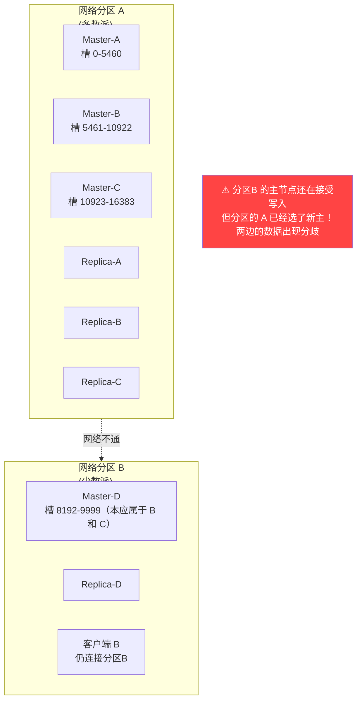

**集群脑裂减轻方案：**

```bash
# 1. 每个主节点至少要有 1 个从节点确认写入（redis.conf）
min-replicas-to-write 1
min-replicas-max-lag 10

# 2. 客户端使用 WAIT 命令（应用层每条写入后）
SET key value
WAIT 1 1000    # 等待至少 1 个从节点确认，超时 1000ms

# 3. 合理设置 cluster-node-timeout（不要太激进）
cluster-node-timeout 5000
```

### 9.3 数据倾斜

**三大原因 + 排查 + 解决：**

| 原因 | 现象 | 排查 | 解决 |
|------|------|------|------|
| **Hash Tag 滥用** | 某个槽的 key 数量远超其他 | `CLUSTER COUNTKEYSINSLOT <slot>` | 去掉不必要的 Hash Tag、拆分热 key |
| **业务 key 分布不均** | 某类业务 key 天然偏多 | `redis-cli --bigkeys` | 拆分热 key（加随机后缀）|
| **槽分配不均衡** | 各节点槽数差异大 | `CLUSTER NODES` 数槽数 | `CLUSTER SETSLOT` 或 reshard 重新均衡 |

```bash
# 排查脚本：检查各节点的 key 数量
for port in 6379 6380 6381; do
  echo "Node $port: $(redis-cli -p $port DBSIZE)"
done

# 排查脚本：检查各槽的 key 数量（找出热点槽）
for slot in $(seq 0 100); do
  count=$(redis-cli -p 6379 CLUSTER COUNTKEYSINSLOT $slot)
  if [ "$count" -gt 1000 ]; then
    echo "Slot $slot: $count keys ⚠️"
  fi
done

# 排查大 key
redis-cli -p 6379 --bigkeys
```

### 9.4 节点反复上下线（Flapping）

```
根因：cluster-node-timeout 太小 + 网络抖动

现象日志：
  10:00:01 Node B PFail ← 网络抖动，PING 延时 spike
  10:00:16 Node B Fail   ← 累积到半数主节点 PFail
  10:00:17 选举开始
  10:00:18 Replica B-r 当选新主
  10:00:25 旧 Node B 恢复，PONG 到达 ← 网络恢复了！
  10:00:25 Node B 重新加入集群（但已是从节点）
  10:20:00 又一次抖动，循环往复...

解决：
  1. 调大 cluster-node-timeout（5000 → 10000ms）
  2. 排查网络：ping -c 1000 看丢包率、tc qdisc 看队列延迟
  3. 排查宿主：是否 CPU 过载导致 Redis 进程延迟响应 PING
```

---

## 第十章：面试模拟——15 个高频追问（满分答案）

### Q1：Redis Cluster 的数据是如何分片的？讲一下哈希槽的原理。

> **满分回答**：
>
> 「Redis Cluster 将数据分片到 16384 个哈希槽（Hash Slot）中，每个主节点负责一部分槽。数据路由的流程：
>
> ```
> key → CRC16(key) & 0x3FFF → slot（0~16383）→ 查槽映射表 → 目标节点
> ```
>
> 为什么不用 `CRC16(key) % 16384`？因为 `& 0x3FFF` 效率更高（位运算比取模快），且 16384 = 2¹⁴，这种取模简化为位与。
>
> 设计精妙之处：
> 1. 槽是逻辑概念，不绑定节点——槽可以在节点间自由迁移
> 2. 槽数量固定 16384，不随节点数变化——客户端缓存槽映射的开销恒定
> 3. 槽迁移粒度可控——管理员可以精确控制「把槽 5000~6000 从 A 迁到 B」
>
> 与一致性哈希对比：一致性哈希加节点只影响相邻节点，但迁移粒度不可控；Redis 的槽机制迁移粒度可控，但需要手动操作。Redis 选了可控性。」

### Q2：槽的数量为什么是 16384？能不能改成 65535？

> **满分回答**：
>
> 「不能改，`#define CLUSTER_SLOTS 16384` 是编译期常量。改成 65535 需要重新编译 Redis，且集群内所有节点必须统一。
>
> 16384 的选择原因：
>
> **核心原因——控制 Gossip 消息大小**：PING/PONG 消息携带槽位 bitmap，16384 个槽 = 2048 字节 (Bitmap)。如果 65535 个槽 = 8192 字节（4 倍）。在 1000 节点规模下，PING 消息还要携带 100 个 gossip 条目，消息体已经很大了，再大就影响网络性能。
>
> **次要原因——节点数上限**：官方推荐 ≤ 1000 节点，16384 个槽够分。每个节点最少可以只负责 1 个槽。
>
> **补充**：CRC16 理论上可以生成 65535 个值，Redis 通过 `& 0x3FFF` 只取低 14 位。这是刻意为之，不是不专业。」

### Q3：集群节点之间是怎么通信的？Gossip 协议讲一下。

> **满分回答**：
>
> 「Redis Cluster 通过一个独立的总线端口（业务端口 + 10000，如 6379 → 16379）进行节点间通信，协议是自研的二进制 Gossip 协议，非 RESP。
>
> Gossip 协议的核心：
> - **去中心化**：没有元数据服务器，每个节点平等
> - **最终一致性**：元数据（节点拓扑、槽分配、状态）通过多轮 Gossip 逐渐收敛
> - **传染传播**：每轮 PING 中携带随机节点的元数据，像病毒传播一样扩散信息
>
> 每秒一次 PING + 随机选择 1/10 的已知节点（最少 3 个）。PING 消息中包含自己的槽 bitmap 和其他节点的 gossip 条目。收到 PONG 后更新本地视图。
>
> **优点**：无单点、无外部依赖、自动发现新节点。
> **缺点**：O(n²) 消息复杂度、元数据传播有延迟（毫秒~秒级）、不建议超过 1000 个节点。」

### Q4：集群的 Gossip 协议包含了哪些消息？PING 消息里有什么？

> **满分回答**：
>
> 「Redis Cluster 的 Gossip 协议包含 5 种标准消息 + 2 种选举消息：
>
> | 消息 | 用途 |
> |------|------|
> | MEET | 管理员执行 CLUSTER MEET，邀请新节点 |
> | PING | 心跳 + 元数据交换（每秒一次） |
> | PONG | PING/MEET 回复 |
> | FAIL | 某个节点被多数派判定为 FAIL，加速通知 |
> | PUBLISH | Pub/Sub 命令广播到全集群 |
> | FAILOVER_AUTH_REQUEST | 从节点请求主节点投票 |
> | FAILOVER_AUTH_ACK | 投票回复 |
>
> PING 消息携带：
> 1. **发送者信息**：node_id / ip:port / currentEpoch / configEpoch / flags
> 2. **发送者的槽 bitmap**（2048 字节）：标识发送者负责哪些槽
> 3. **Gossip 条目**（约 N/10 条）：每条包含其他节点的 node_id / ip:port / flags / ping_sent / pong_received
> 4. **主从复制信息**：master node_id（从节点才有）/ 复制 offset
>
> 为什么只携带部分 gossip 条目？控制消息大小。1/10 的比例是源码中 `wanted` 变量计算的。」

### Q5：MOVED 和 ASK 重定向有什么区别？客户端分别如何处理？

> **满分回答**：

| 维度 | MOVED | ASK |
|------|-------|-----|
| **语义** | 槽已经永久迁走了 | 槽正在迁移，这个 key 碰巧在目标节点 |
| **客户端处理** | 更新本地槽映射缓存 | 不更新槽映射，下次仍走原路径 |
| **前置条件** | 无 | 必须先发送 ASKING 命令 |
| **触发时机** | 槽所有权已变更 | 槽迁移进行中（migrating/importing） |
| **目标行为** | 正常校验槽所有权 | 跳过槽校验（仅本次） |

> 客户端处理逻辑（简化）：
> ```
> try {
>     execute(node, command)
> } catch (MOVED slot target) {
>     updateSlotCache(slot, target)
>     retry to target
> } catch (ASK slot target) {
>     send ASKING to target
>     send command to target  // 不更新缓存
> }
> ```

### Q6：集群如何判断一个节点挂了？完整描述 PFail → Fail 的过程。

> **满分回答**：
>
> 「集群采用的是**两阶段判定**，去中心化实现：
>
> **阶段 1——PFail（主观疑似故障）**：
> 节点 A 在 `cluster-node-timeout` 时长内未收到节点 B 的有效 PONG 回复 → A 将 B 标记为 PFail（`CLUSTER_NODE_PFAIL`）。此时只是 A 自己的看法，不触发任何动作。但 A 会在后续 Gossip PING 消息中将 B 的状态标记为 PFail。
>
> **阶段 2——Fail（客观确认故障）**：
> B 的 PFail 信息通过 Gossip 传播到其他节点。当**半数以上主节点**都将 B 标记为 PFail → B 被升级为 Fail（`CLUSTER_NODE_FAIL`）。此时：
> 1. 节点广播 FAIL 消息到全集群（加速通知）
> 2. B 的从节点检测到 Fail，准备发起选举
> 3. B 在客户端眼中变为不可用
>
> 这跟哨兵的 SDOWN/ODOWN 本质相同——都是「单点判定 + 多票确认」的两阶段模式。区别在于哨兵用独立进程组投票，集群用节点间 Gossip + 半数判定。」

### Q7：集群的主从切换过程和哨兵有什么不同？

> **满分回答**：
>
> 「最大的不同：**哨兵是由独立的哨兵进程来执行切换，集群是节点自己协调完成切换**。
>
> 具体对比：
>
> | 维度 | 哨兵 | Cluster |
> |------|------|---------|
> | **故障检测** | 哨兵 PING Redis 节点 | 节点间互发 PING |
> | **投票方** | 哨兵节点（独立） | 半数以上主节点 |
> | **选举触发** | Leader 哨兵向 replica 发 SLAVEOF NO ONE | replica 自己向主节点请求投票 |
> | **选主逻辑** | priority → offset → runid | offset（rank）决定等待时间，数据最新的优选举 |
> | **切换执行** | 哨兵发命令 | 新主自己接管 + 广播 |
> | **通知客户端** | +switch-master 推送 | MOVED 重定向（无主动推送） |
>
> 可以理解为：哨兵是「外部监控 + 集中决策」模式，集群是「内部互检 + 去中心化选举」模式。」

### Q8：集群的选举机制是怎样的？为什么从节点要随机等待一段时间才发起选举？

> **满分回答**：
>
> 「选举机制是 Raft-like 的：
> 1. 从节点检测到主节点 Fail
> 2. currentEpoch++ → 向所有主节点发送 FAILOVER_AUTH_REQUEST 请求投票
> 3. 主节点在每个 epoch 中只投一票（先到先得）
> 4. 获得 ≥ N/2+1 票的从节点当选新主
>
> **随机等待的设计（错峰 + 数据优先）：**
>
> ```
> 等待时间 = 500ms + rank × 1000ms
>
> rank 由从节点 offset 决定：
>   offset 越大的从节点 → rank 越小 → 等待越短 → 越早发起选举
> ```
>
> 作用：
> - **错峰**：防止同一 master 下的多个 replica 同时发起选举 → 票数分散 → 谁也达不到 N/2+1
> - **数据优先**：数据最新的从节点自然获得最短等待，最可能当选——减少数据丢失
>
> 同一个 master 下的第一个 replica：500ms 后发起。第二个：1500ms。以此类推，间隔足够主节点处理好第一轮的投票。」

### Q9：Hash Tag 是什么？为什么要用 Hash Tag？带来什么问题？

> **满分回答**：
>
> 「Hash Tag 是 Redis Cluster 提供的一种机制，让 key 中 `{}` 部分参与 CRC16 计算，从而将多个 key 映射到同一个槽。
>
> 语法：`{hashtag}:suffix` → CRC16 只对 `{hashtag}` 内容计算。
>
> **为什么需要**：Redis Cluster 限制多 key 操作必须在同一槽。如果业务需要 `MGET user:1:name user:1:age user:1:orders`，不用 Hash Tag 这三个 key 大概率在三个节点 → 报错。用 `{user:1}:name {user:1}:age {user:1}:orders` → 一定在同一节点。
>
> **带来什么问题**：
> - **数据倾斜**：热门 hashtag → 热点槽 → 热点节点 → 集群优势被削弱
> - **扩容困难**：热点槽迁移成本极高（key 多、数据量大）
> - **单点风险**：热点槽所在节点挂了 → 整个 hashtag 的数据不可用
>
> 解决方案：热点实体拆分（如 `{user:1:1}`, `{user:1:2}`）、业务缓存、本地缓存。」

### Q10：线上扩容和缩容怎么操作？数据如何迁移？

> **满分回答**：
>
> 「扩容三步：加节点 → 迁槽 → 加从节点。
>
> ```bash
> # 1. 新节点加入
> redis-cli --cluster add-node 10.0.0.7:6385 10.0.0.1:6379
> # 2. 迁移槽
> redis-cli --cluster reshard 10.0.0.1:6379
> # 3. 添加从节点
> redis-cli --cluster add-node 10.0.0.8:6386 10.0.0.1:6379 --cluster-slave --cluster-master-id xxx
> ```
>
> 数据迁移核心是 `MIGRATE` 命令：
> - 原子操作：源节点序列化 key → 发给目标节点 → 目标节点 RESTORE → 源节点删除
> - 迁移期间请求：key 还在源节点 → 正常处理；key 已迁走 → ASK 重定向
>
> 缩容是先迁出所有槽再 CLUSTER FORGET。`redis-cli --cluster del-node` 会自动处理 FORGET 操作。如果手动 FORGET，必须在所有存活的节点上执行，否则 Gossip 会重新发现已下线的节点。」

### Q11：集群的 Epoch 机制是什么？有什么用？

> **满分回答**：
>
> 「Redis Cluster 有两种 Epoch：
>
> **currentEpoch（全局选举轮次）**：整个集群级别的逻辑时钟。每次选举时递增，防止过期选票干扰。类似 Raft 的 Term，currentEpoch 大的选票优先级高。
>
> **configEpoch（槽配置版本）**：每个节点独立维护。当节点获得新的槽所有权时递增。用于解决槽主权冲突——当网络分区恢复后，两个节点都宣称同一个槽时，configEpoch 大的获胜。
>
> 举例：网络分区期间，节点 A（configEpoch=5）和节点 B（configEpoch=6）都宣称拥有槽 5000。分区恢复后，B 的 configEpoch 更大 → 槽 5000 归 B → A 放弃。这个机制是 Redis Cluster 在无中心节点的情况下解决槽所有权冲突的关键。」

### Q12：Redis Cluster 有哪些限制？跨槽事务为什么不能做？

> **满分回答**：
>
> 「核心限制源于 **数据分布** 和 **无中心协调者** 两个设计前提。
>
> 不能做跨槽事务的根本原因：事务的 ACID 保证（特别是原子性）需要一个协调者来执行两阶段提交。Redis Cluster 没有全局协调者（去中心化架构），每个节点独立处理事务，无法跨节点协调提交/回滚。
>
> 如果硬要实现跨槽事务：
> 1. 需要引入一个全局事务管理器（像 Seata 的 TC）
> 2. 需要两阶段提交（Prepare → Commit/Rollback）
> 3. 需要在所有参与节点上做 WAL（预写日志）
>
> 这些跟 Redis 的设计哲学（简单、高性能）背道而驰。所以 Redis 选择了「不做跨槽事务」，而不是「做一个慢的跨槽事务」。
>
> 替代方案：Hash Tag（把相关 key 锁在同一槽）、业务层 TCC/SAGA、或者换用支持分布式事务的数据库。」

### Q13：集群脑裂了怎么办？如何尽量减少脑裂的数据丢失？

> **满分回答**：
>
> 「集群脑裂是网络分区导致的，本质上是 CAP 中选了 AP。无法完全避免，只能减轻损失。
>
> **减轻丢失量的三层措施：**
>
> 1. **redis.conf 配置**（全局）：
>    ```
>    min-replicas-to-write 1
>    min-replicas-max-lag 10
>    ```
>    旧主发现从节点不够 → 10 秒后拒绝写入 → 丢失窗口 ≤ 10 秒
>
> 2. **客户端 WAIT 命令**（每次写入）：
>    ```
>    SET key value
>    WAIT 1 0  # 强制等待至少 1 个从节点确认
>    ```
>    把异步复制变为近似同步，但 QPS 显著下降。
>
> 3. **合理部署**：分区发生后，确保「多数派」一侧有所有槽的主节点。通过跨机架/跨可用区部署来降低同时被分区的概率。
>
> **恢复后数据冲突怎么处理？** 网络恢复后，旧主发现自己的 configEpoch 比新主旧 → 自动降级为从节点 → 从新主同步数据 → 旧主上的脏数据被覆盖。这个过程是全自动的。」

### Q14：不用 Redis Cluster，用 Codis / Twemproxy 有什么区别？

> **满分回答**：

| 维度 | Redis Cluster | Codis | Twemproxy |
|------|-------------|-------|-----------|
| **架构** | P2P 无中心 | Proxy + ZK/etcd 中心化 | Proxy 单层（无 HA） |
| **路由** | 客户端智能路由（MOVED） | Proxy 集中路由 | Proxy 一致性哈希 |
| **扩缩容** | 手动迁移槽 | Dashboard 自动迁移 | 手动 / 无迁移能力 |
| **事务/Lua** | 单槽内支持 | 支持（Proxy 聚合） | 不支持跨节点 |
| **高可用** | 内置 | 依赖 Sentinel | 不内置 |
| **运维复杂度** | 中（纯 Redis） | 高（多组件） | 低（Proxy 无状态） |
| **社区活跃度** | 官方维护 | 停更（2020） | 停更（2018） |

> 「选择建议：2026 年了，新项目直接用 Redis Cluster。Codis 已经停更，Twemproxy 功能太弱且不支持动态扩缩容。除非你在维护遗留系统。」

### Q15：讲一下 `cluster-migration-barrier` 和 `cluster-slave-validity-factor` 这两个参数。

> **满分回答**：
>
> **`cluster-migration-barrier`（从节点再平衡）**：
> 控制从节点自动迁移的门槛。设为 N，表示只有 ≥ N 个从节点的主节点才会「贡献」多余的从节点给没有从节点的主节点。
>
> 例如设为 2：
> - Master-A 有 3 个从节点（≥2）→ 多余的 1 个从节点可自动迁移到没有从节点的 Master-B 下
> - Master-A 只有 1 个从节点（<2）→ 不会被迁移走
>
> 生产建议：高可用场景设为 2，确保每个主节点都有至少 1 个固定从节点。
>
> **`cluster-slave-validity-factor`（从节点时效性门禁）**：
> `失联时间 > cluster-node-timeout × factor` 的从节点被排除出选举候选池。
>
> 默认 factor=10, timeout=15s → 阈值=150s。从节点失联超过 150 秒，说明数据比主节点落后太多，不适合当新主。
>
> 大内存实例建议调大（如 20~30），因为 RDB 传输和加载本身就慢，从节点失联窗口天然较大，不要因为这个被排除出候选池。」

---

## 第十一章：集群搭建实战

### 11.1 从零搭建 3 主 3 从集群

```bash
# ========== Step 1: 创建配置文件和目录 ==========
for port in 6379 6380 6381 6382 6383 6384; do
  mkdir -p /data/redis/cluster/${port}
  cat > /data/redis/cluster/${port}/redis.conf <<EOF
port ${port}
cluster-enabled yes
cluster-config-file nodes.conf
cluster-node-timeout 5000
appendonly yes
appendfsync everysec
dir /data/redis/cluster/${port}
logfile /data/redis/cluster/${port}/redis.log
daemonize yes
EOF
done

# ========== Step 2: 启动 6 个 Redis 实例 ==========
for port in 6379 6380 6381 6382 6383 6384; do
  redis-server /data/redis/cluster/${port}/redis.conf
done

# ========== Step 3: 确认全部启动成功 ==========
ps aux | grep redis-server | grep cluster

# ========== Step 4: 创建集群（Redis 5.0+ 内置 redis-cli） ==========
redis-cli --cluster create \
  127.0.0.1:6379 127.0.0.1:6380 127.0.0.1:6381 \
  127.0.0.1:6382 127.0.0.1:6383 127.0.0.1:6384 \
  --cluster-replicas 1
# 参数说明：
# --cluster-replicas 1 = 每个主节点配 1 个从节点
# 6379/6380/6381 = 主节点
# 6382/6383/6384 = 从节点（自动分配）

# ========== Step 5: 验证集群状态 ==========
redis-cli -p 6379 CLUSTER INFO
# cluster_state:ok
# cluster_slots_assigned:16384
# cluster_slots_ok:16384
# cluster_known_nodes:6
# cluster_size:3

redis-cli -p 6379 CLUSTER NODES
# 确认 3 主 3 从，槽分布均匀

# ========== Step 6: 验证数据分片 ==========
redis-cli -c -p 6379 SET key1 "hello"     # -c 启用集群模式
redis-cli -c -p 6379 SET key2 "world"     # 可能被重定向到不同节点
redis-cli -c -p 6379 SET key3 "redis"     # 观察重定向行为

# ========== 扩容：加一个新主节点 ==========
redis-cli --cluster add-node 127.0.0.1:6385 127.0.0.1:6379
# 迁移 4096 个槽到新节点
redis-cli --cluster reshard 127.0.0.1:6379

# ========== 添加从节点 ==========
redis-cli --cluster add-node 127.0.0.1:6386 127.0.0.1:6379 \
  --cluster-slave --cluster-master-id <new_master_node_id>

# ========== 检查集群健康 ==========
redis-cli --cluster check 127.0.0.1:6379
```

---

## 第十二章：总结

### 12.1 集群全景架构

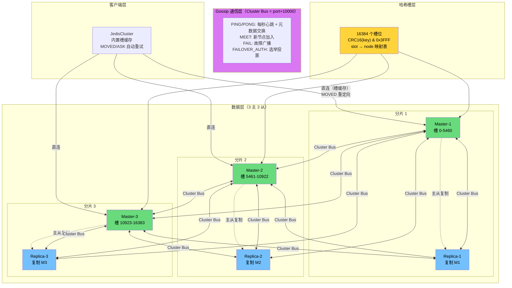

### 12.2 哨兵 vs Cluster 选型决策表

| 维度 | Sentinel（哨兵） | Cluster（集群） |
|------|-----------------|----------------|
| **数据量** | ≤ 单机内存（如 64GB） | = 所有节点内存之和（可扩展） |
| **写 QPS** | ≤ 单机写 QPS（~10w） | ≈ N × 单机写 QPS |
| **读 QPS** | 可扩展（加 replica） | 可扩展（加 replica + shard） |
| **数据分布** | 全量数据每节点一份 | 分片，每节点部分数据 |
| **运维复杂度** | 低（哨兵 + 普通 Redis） | 中（节点多、槽管理、迁移） |
| **客户端要求** | 无特殊要求（哨兵发现） | 需要 Smart Client（slot-aware） |
| **事务/Lua** | 完全支持 | 单槽内支持（需 Hash Tag） |
| **多 Key 操作** | 完全支持 | 需同槽（Hash Tag） |
| **最小节点数** | 3 哨兵 + 2 数据节点 | 3 主 3 从（6 节点） |
| **故障转移** | 哨兵执行（独立组件） | 内置去中心化选举 |
| **适用场景** | 中小规模、多 key 操作多 | 大规模、可接受 Hash Tag 约束 |

### 12.3 一页纸速查卡（面试前 5 分钟复习）

```
┌─────────────────────────────────────────────────────────────────────────────────────┐
│                          Redis Cluster 核心要点 速查表                                 │
├─────────────────────────────────────────────────────────────────────────────────────┤
│                                                                                     │
│  【数据分片】16384 个哈希槽 → CRC16(key) & 0x3FFF → slot → node                       │
│    为什么 16384？→ Gossip 消息 PING bitmap = 2KB（65535 则 8KB，太大）                    │
│                                                                                     │
│  【Hash Tag】{xxx}:suffix → xxx 参与哈希 → 同槽，支持多 key 操作，但可能数据倾斜         │
│                                                                                     │
│  【Gossip 通信】Cluster Bus = 业务端口 + 10000（独立二进制协议）                         │
│    5 种消息：MEET / PING / PONG / FAIL / PUBLISH                                     │
│    PING 携带：自身信息 + 槽 bitmap(2KB) + N/10 条 gossip 条目                         │
│    最终一致性：元数据传播有延迟（毫秒级），通过 MOVED 修正                                    │
│                                                                                     │
│  【重定向】                                                                          │
│    MOVED = 槽永久迁走了 → 更新槽缓存 → 下次直接走新节点                                 │
│    ASK = 槽正在迁移 → 不更新缓存 → 需要 ASKING 前缀命令 → 仅本次生效                    │
│                                                                                     │
│  【故障检测】两阶段：PFail(超时) → Fail(半数以上主节点同意)                              │
│    对比哨兵：SDOWN/ODOWN 相似，但投票方从哨兵进程变为集群主节点                              │
│                                                                                     │
│  【故障转移】从节点检测 FAIL → 等待(500ms+rank×1000ms) → 选举投票 → ≥ N/2+1 当选       │
│    等待延时设计：offset 越大 → rank 越小 → 等待越短 → 数据最新的越早选举                    │
│                                                                                     │
│  【Epoch 双时钟】currentEpoch(选举轮次) + configEpoch(槽所有权版本)                      │
│    configEpoch 仲裁槽冲突：数字大的胜出                                                  │
│                                                                                     │
│  【扩容流程】CLUSTER MEET → 迁槽(MIGRATE) → CLUSTER SETSLOT → 加从节点                  │
│    MIGRATE 是原子操作（序列化→发送→RESTORE→删除源）                                      │
│                                                                                     │
│  【缩容流程】迁出所有槽 → CLUSTER FORGET（所有节点都要执行！）                              │
│                                                                                     │
│  【关键限制】多 key 必须同槽 / 跨节点无事务 / Lua 脚本限于同节点 / Pub/Sub 全集群广播      │
│                                                                                     │
│  【脑裂】无法根除（AP 系统）；减轻：min-replicas-to-write + WAIT 命令                      │
│                                                                                     │
│  【配置必背】cluster-node-timeout: 5000（内网） / cluster-migration-barrier: 2          │
│    cluster-require-full-coverage: yes（生产保持）                                      │
│    cluster-slave-validity-factor: 大实例调大                                           │
│                                                                                     │
│  【选型决策】数据 < 64GB + 多 key 事务 → 哨兵；数据 > 64GB + 可接受 Hash Tag → Cluster   │
│                                                                                     │
└─────────────────────────────────────────────────────────────────────────────────────┘
```

---

## 附录：速查命令汇总

```bash
# =================== 集群状态命令 ===================

# 集群总览
redis-cli -p 6379 CLUSTER INFO

# 集群节点列表（最重要）
redis-cli -p 6379 CLUSTER NODES

# 列出所有槽及其负责节点
redis-cli -p 6379 CLUSTER SLOTS

# 指定槽的 key 数量
redis-cli -p 6379 CLUSTER COUNTKEYSINSLOT 12706

# 获取槽中的 key（最多 count 个）
redis-cli -p 6379 CLUSTER GETKEYSINSLOT 12706 100

# 键所属的槽
redis-cli -p 6379 CLUSTER KEYSLOT order:10086

# =================== 节点管理命令 ===================

# 加入集群
redis-cli -p 6385 CLUSTER MEET 10.0.0.1 6379

# 忘记节点（需要在所有节点上执行）
redis-cli -p 6379 CLUSTER FORGET <node_id>

# 手动故障转移（当前从节点发起）
redis-cli -p 6382 CLUSTER FAILOVER
redis-cli -p 6382 CLUSTER FAILOVER FORCE  # 强制（即使主正常）
redis-cli -p 6382 CLUSTER FAILOVER TAKEOVER  # 接管（不协商）

# 设置从节点关系
redis-cli -p 6382 CLUSTER REPLICATE <master_node_id>

# 重置节点（清除集群状态，恢复到独立模式）
redis-cli -p 6385 CLUSTER RESET
redis-cli -p 6385 CLUSTER RESET SOFT  # 软重置（保留当前 epoch）

# =================== 槽管理命令 ===================

# 手动设置槽状态
redis-cli -p 6379 CLUSTER SETSLOT 12706 IMPORTING <src_node_id>
redis-cli -p 6385 CLUSTER SETSLOT 12706 MIGRATING <dst_node_id>
redis-cli -p 6379 CLUSTER SETSLOT 12706 NODE <node_id>
redis-cli -p 6379 CLUSTER SETSLOT 12706 STABLE  # 清除 importing/migrating

# 迁移单个 key
redis-cli -p 6379 MIGRATE 10.0.0.7 6385 <key> 0 5000

# =================== redis-cli 集群工具 ===================

# 创建集群
redis-cli --cluster create <nodes...> --cluster-replicas 1

# 检查集群健康
redis-cli --cluster check 10.0.0.1:6379

# 集群信息
redis-cli --cluster info 10.0.0.1:6379

# 添加节点
redis-cli --cluster add-node <new_node> <existing_node>
redis-cli --cluster add-node <new_node> <existing_node> --cluster-slave --cluster-master-id <id>

# 删除节点
redis-cli --cluster del-node <existing_node> <node_id_to_delete>

# 重分片（迁移槽）
redis-cli --cluster reshard 10.0.0.1:6379

# 修复集群
redis-cli --cluster fix 10.0.0.1:6379

# 在所有节点上批量执行命令
redis-cli --cluster call 10.0.0.1:6379 INFO replication

# =================== 客户端测试命令 ===================

# -c 启用集群模式（自动处理 MOVED/ASK）
redis-cli -c -p 6379 SET foo bar
redis-cli -c -p 6379 GET foo

# 管道模式（确保所有命令在同一节点）
redis-cli -c -p 6379 --pipe < commands.txt

# =================== 排查命令 ===================

# 各节点数据量对比（排查倾斜）
for port in 6379 6380 6381; do
  echo -n "Node $port: "
  redis-cli -p $port DBSIZE
done

# 查找大 key
redis-cli -p 6379 --bigkeys

# 内存使用
redis-cli -p 6379 INFO memory | grep used_memory_human

# 集群统计
redis-cli -p 6379 INFO cluster

# 每个槽的 key 数量（排查热点槽）
redis-cli -p 6379 CLUSTER COUNTKEYSINSLOT <slot>
```
