# Redis 数据结构 —— 综合讲解（Java程序员视角 + 小林coding图解）

---

## 前言：本文的使用方式

本文由两份材料完整合并：
- **03-Redis数据类型.md**：以 Java 程序员视角，从 C 语言基础讲起，逐层拆解 Redis 内部数据结构
- **小林coding《Redis 数据结构》图解**：42 页 PDF 的 OCR 提取，包含 22 张结构图、各版本的对比

合并方式：保留两份文档**全部**内容。重叠部分取讲解更完整的一方。A 独有的 C 语言前置知识、Java 类比、面试题全部保留；B 独有的结构图、版本对比图、连环更新图示全部插入。

读完你会理解：Redis 的每种类型在不同数据规模和版本下如何选择存储结构、每个 C 结构体的内存布局、以及从 Redis 3.0 到 7.0 的演进。

---

## Redis 数据类型 vs 底层数据结构（小林coding）

这是小林coding画的两幅对比图——左边是 Redis 3.0 版本（《Redis 设计与实现》讲解的版本），右边是 GitHub 最新 Redis 代码的对应关系。

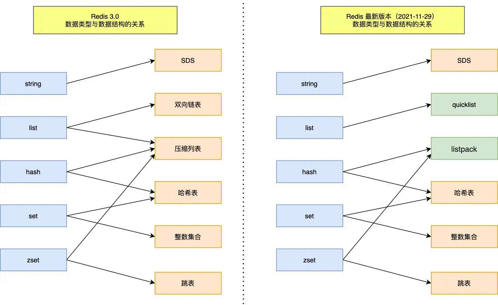


小林coding列出了 9 种底层数据结构：**SDS、双向链表、压缩列表、哈希表、跳表、整数集合、quicklist、listpack**。Redis 3.0 时代的 List 大数据用 linkedlist，Hash/Set/ZSet 大数据用 hashtable/skiplist；到了最新的代码中，ziplist 已被 listpack 全面替代。本文在这个演进脉络上逐层展开。

---

## 第〇章：C 语言基础知识（Java 程序员视角）————— 来自文档A

在看 Redis 内部实现之前，先把 C 语言中几个绕不开的概念搞清楚。**不需要精通 C，理解类比即可。**

### 0.1 malloc：C 语言的 `new`

```java
// Java：创建一个对象
User u = new User("张三");
//  JVM 自动在堆上分配内存，自动 GC 回收
```

```c
// C：分配一块内存
void* ptr = malloc(64);
//  向操作系统要 64 字节的堆内存
//  malloc 返回这 64 字节的「起始地址」
//  C 没有 GC！用完了必须手动 free(ptr) 归还内存
```

**简单理解：`malloc(大小)` = Java 的 `new byte[大小]`。** 本质都是从堆（Heap）上分配一块内存，返回这块内存的地址。

那么问题来了——**什么是"地址"？**

### 0.2 指针（Pointer）：就是 Java 的"引用"

```java
// Java：
User u = new User();    // u 是一个引用，指向堆中 User 对象的「地址」
u.getName();            // 通过引用访问对象的字段
```

```c
// C：
User* u = malloc(sizeof(User));  // u 是一个指针，存的是「内存地址」
u->name;                         // 通过指针访问字段（-> 等价于 Java 的 .）
```

**Java 的引用 = C 的指针。** 本质上都是存一个内存地址。

差别在于：
- Java 的引用你只能访问对象的字段/方法，不能做地址运算
- C 的指针你可以直接操作地址（+1、-1），这也是它强大和危险的地方

**在本文中，你看到"ptr"、"pointer"、"指针"——一律翻译成 Java 的"引用"即可。**

Redis 源码中的 `void *ptr` 就相当于 Java 的 `Object ref`——一个"指向某种东西的引用，具体类型不定"。

### 0.3 struct：C 语言的"只有属性的 Class"

```java
// Java：一个类
class User {
    String name;   // 字符串引用，指向堆中的 String 对象
    int age;       // 存的是值本身（基本类型）
}
```

```c
// C：一个结构体（struct）
struct User {
    char* name;    // 字符串指针，指向堆中的字符串
    int age;       // 存的是值本身
};
```

**struct = 只有属性没有方法的 Java class。** C 不是面向对象的，所以没有方法/继承/多态。struct 就是把一组数据打包成一个类型。

**sizeof(struct)**：编译器自动计算一个 struct 占多少字节。比如上面的 `struct User`：`char*` 占 8 字节（64 位系统）+ `int` 占 4 字节 = 12 字节（实际会因为内存对齐变成 16 字节，后面讲）。

### 0.4 sizeof：测量一个类型占用多少字节

```java
// Java 没有 sizeof 这个概念。但你潜意识里知道：
// int    = 4 字节，范围 -21亿 ~ 21亿
// long   = 8 字节，范围 -9e18 ~ 9e18
// 一个对象引用 = 4 字节（32位JVM，压缩指针）或 8 字节（64位JVM）
// Java 会自动管理，你不需要关心
```

```c
// C 中你需要精确知道每个类型占多少字节：
sizeof(char)   = 1    // 1 字节（够存一个字符或 0-255 小整数）
sizeof(int)    = 4    // 4 字节
sizeof(long)   = 8    // 8 字节（64位系统）
sizeof(void*)  = 8    // 指针（地址值）占 8 字节（64位系统）
```

**在本文中，字节数非常重要**——Redis 追求极致内存利用率，每一个字节都要精打细算。比如为什么 embstr 的 44 字节是分界线？因为 64 字节的分配块，减去必要结构 20 字节 = 44 字节可用。

### 0.5 内存分配器（jemalloc）：C 语言的"堆内存管家"

**背景知识：**

```
Java 程序员眼中的"分配对象"：
  new User()  →  JVM 堆分配  →  GC 自动回收
  你不需要关心：这块内存是堆里的哪个位置、多大、什么时候回收

C 程序员眼中的"分配内存"：
  malloc(64)  →  操作系统分配  →  必须手动 free()
  你必须在乎：malloc 背后是谁在管理堆？jemalloc / glibc malloc / tcmalloc？
```

**jemalloc 是什么？**

当你调用 `malloc(64)` 时，不是直接向操作系统要内存（那样太慢），而是由 **内存分配器** 从预先申请的大块内存中切一块给你。jemalloc 就是其中一种分配器。

**Redis 为什么默认用 jemalloc？**
- jemalloc 的分配块大小是 **固定的几个档次**：8, 16, 32, 64, 128, 256, 512, 1024 ...（按 2^n 增长）
- 你申请 50 字节 → jemalloc 给你一个 64 字节的块（多出 14 字节暂时浪费，但分配极快）
- 你申请 70 字节 → jemalloc 给你一个 128 字节的块

**这与 Redis 的 embstr 分界线直接相关**——后面会详细推导。

**Java 中也有类似的机制！** JVM 的 TLAB（Thread Local Allocation Buffer）也是预先批量分配内存，只不过你不会直接接触到。

### 0.6 柔性数组（Flexible Array）：变长数组的 C 语言方案

Java 有 `ArrayList`——自动扩容的变长数组。C 语言没有，但有一个巧妙的技巧叫 **柔性数组（flexible array member）**：

```c
// C 语言 struct 的最后一个字段可以是不写长度的数组：char buf[];
struct sdshdr {
    int len;      // 固定 4 字节
    int free;     // 固定 4 字节
    char buf[];   // 柔性数组——不占 struct 本身的空间，
};                // 实际数据紧跟 struct 之后存放

// sizeof(sdshdr) = 8（只算 len + free，buf 不占空间！）

// 使用方式：
// 要存 "hello" (5字节)，分配 sdshdr + 6 字节一块连续内存：
struct sdshdr* s = malloc(sizeof(struct sdshdr) + 6);
// s->buf 自动指向 struct 之后的 6 字节空间
```

**内存布局（一次 malloc 的结果）：**

```
malloc(sizeof(sdshdr) + 6)  →  连续 14 字节：
┌──────┬──────┬──────────────────┐
│ len  │ free │ buf[0..5]       │
│ 4字节│ 4字节 │ 6字节(存"hello\0")│
└──────┴──────┴──────────────────┘
       ← sdshdr →
              ← buf 紧跟其后 →
```

**类比 Java：** 可以理解为一个特殊的 class，其中最后一个字段是可变大小的 `byte[]`，而且这个 byte[] 的数据和对象头是连续存放的（Java 做不到这点，Java 对象的数组字段是独立的引用指向独立的数组对象）。

这个技巧在 Redis 中大量使用——**它让 "元数据" 和 "实际数据" 在同一块连续内存中，减少 malloc 次数，提升 CPU 缓存友好度。**

### 0.7 内存对齐：为什么结构体实际比肉眼算的大

```
你肉眼算：
  struct { char a; int b; } → 1 + 4 = 5 字节

编译器实际算：= 8 字节！
  ┌──────┬──────┬────────────────┐
  │  a   │ pad  │      b         │
  │ 1字节│3字节空│    4字节       │
  └──────┴──────┴────────────────┘

原因：CPU 一次读 4 或 8 字节，int 必须放在 4 的倍数地址上才能一次读完。
      编译器自动插入「填充字节(padding)」让 b 对齐到 4 字节边界。
```

**Java 同样存在内存对齐**，只是 JVM 帮你做了你不需要关心。Redis 追求极致紧凑，会使用 `__attribute__((packed))` 等手段关闭对齐，节省每一字节。

### 0.8 二进制安全：Redis 凭什么能存图片的字节流？

**C 语言的"字符串"其实是个谎言：**

```c
char* str = "hello";
printf("%s", str);   // 打印到 \0 为止
// C 认为：字符串 = 从起始地址开始，一直到遇到 \0（值为0的字节）为止。
```

致命问题：如果字符串内容本身就包含 `\0`（比如图片的二进制数据）→ C 会提前截断。

**Redis 的 SDS 怎么解决的？**

```c
struct sdshdr {
    int len;      // ← "用了多少字节"用 len 记录，不依赖 \0
    char buf[];   // ← 数据中可以有任意字节，包括 \0
};
// 判断字符串结束：看 len，不是看 \0！
```

**Java 程序员完全可以跳过这个问题**——Java 的 String 底层是 `char[]` 或 `byte[]`，长度由数组的 `.length` 决定，天然就是二进制安全的。**C 不是，所以 Redis 需要自研 SDS。**

---

## 第一章：RedisObject——所有类型的统一包装（来自文档A + 小林图解）

### 1.1 为什么需要一个包装盒

```
Java 类比：
  Object obj = "hello";     // "hello" 是 String，但可以赋值给 Object 类型变量
  obj.getClass();           // 运行时知道它实际是 String — RTTI（运行时类型信息）
```

Redis 用 C 写的，C 没有多态/RTTI。所以 Redis 自己造了一个统一的"头部"来描述任意数据：

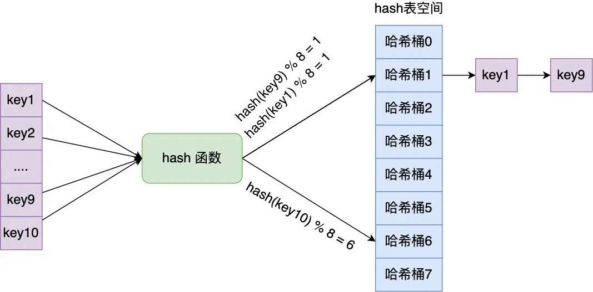

```
redisObject 结构（16 字节）：
┌──────────────┬──────────────┬────────────────────┬────────────┬──────────────┐
│ type         │ encoding     │ lru                │ refcount   │ ptr          │
│ 4 bit        │ 4 bit        │ 24 bit             │ 4 字节     │ 8 字节       │
│ 逻辑类型      │ 内部编码方式  │ LRU/LFU 淘汰用     │ 引用计数    │ 指向实际数据   │
└──────────────┴──────────────┴────────────────────┴────────────┴──────────────┘
        ← 4 字节 →               ← 4 字节 →           ← 8 字节 →  = 共 16 字节
```

| 字段 | 大小 | 含义 | Java 类比 |
|------|------|------|----------|
| `type` | 4 bit | 用户看到的类型（STRING/LIST/HASH/SET/ZSET） | `obj instanceof String` |
| `encoding` | 4 bit | 内部实际用什么数据结构存的 | 不直接对应——类似"底层实现标记" |
| `lru` | 24 bit | 存 LRU 时间戳或 LFU 计数器（淘汰用） | 类似 Guava Cache 的 accessTime |
| `refcount` | 4 字节 | 引用计数（共享对象用，如 0~9999 整数） | 可以理解为一个简化版 GC 引用计数 |
| `ptr` | 8 字节 | 指向实际数据的指针（64 位系统指针=8 字节） | **这就是 Java 的引用！** |

**关键理解：type vs encoding 是解耦的**

```
type = 用户视角（OBJECT TYPE 命令查看）
encoding = 内部视角（OBJECT ENCODING 命令查看）

比如 Hash 类型：
  type 永远是 "hash"
  但 encoding 可能是 "listpack"（小数据）或 "hashtable"（大数据）
  用户无感切换，Redis 自动决定

就相当于 Java 的：
  interface List<T>      ← type（用户看到的接口）
  class ArrayList<T>     ← encoding（底层实现）
  class LinkedList<T>    ← encoding（另一种底层实现）
  用户只关心 List 接口，不关心底层怎么存
```


---

## 第二章：SDS（Simple Dynamic String）—— Redis 的字符串引擎（融合版）

### 2.1 从 Java 的 String 到 Redis 的 SDS

**Java String 的内存模型：**

```
String s = "hello";
┌──────────────┐
│ String 对象  │
│ ● value ────▶│  char[] {'h','e','l','l','o'}  ← 存在堆上
│ ● hash       │  数组对象有长度字段，所以 O(1) 知道长度
└──────────────┘
```

Java String 是完美的——长度 O(1)、自动扩容、有 GC。**但 C 语言的 `char*` 不是：**

```
C 语言的 char*：
  char* s = "hello";
  内存中：['h']['e']['l']['l']['o']['\0']
         s 指针指向 'h'
         没有长度字段！要知道长度必须从 'h' 开始逐字节遍历到 '\0' → O(N)
         想拼接 " world" → 原位置后面没有空间 → 必须 malloc 新空间 → 低效
         中间出现 '\0' → 提前截断 → 图片/音视频数据全废
```

**所以 Redis 造了 SDS（Simple Dynamic String）：**

```
SDS = Java String 的 C 语言替代品
    = char* + 长度字段 + 容量字段 + 自动扩容 + 二进制安全
```

### 2.2 SDS 的结构和小林coding的图解

Redis 的 SDS 针对不同长度范围有 5 种变体，头部从 1 字节到 17 字节不等，极致压榨内存：

```
SDS 版本            │ 实际头大小 │ 适用数据长度    │ Redis 内部用名
────────────────────┼───────────┼────────────────┼──────────────
sdshdr5（已不用）    │ 1 字节    │ < 32 字节       │ TYPE_5
sdshdr8             │ 3 字节    │ < 256 字节      │ TYPE_8  ← embstr 用这个
sdshdr16            │ 5 字节    │ < 65536 字节    │ TYPE_16
sdshdr32            │ 9 字节    │ < 4GB           │ TYPE_32
sdshdr64            │ 17 字节   │ ≥ 4GB           │ TYPE_64
```

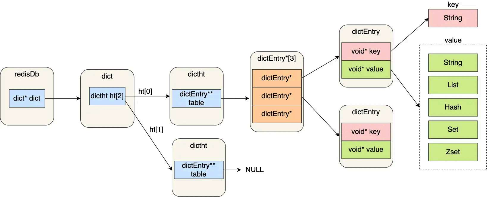

**以 sdshdr8 为例（存短字符串用，3 字节头）：**

```
sdshdr8 的内存布局（一共 3 字节头部 + 数据区）：
┌─────────────┬──────────────┬──────────────┬────────────────────┐
│ len         │ alloc        │ flags        │ buf[]（柔性数组）   │
│ uint8_t(1B) │ uint8_t(1B)  │ uint8_t(1B)  │ 实际数据 + '\0'    │
│ 已用长度     │ 总容量(-1)    │ 低3位=类型标记│                    │
└─────────────┴──────────────┴──────────────┴────────────────────┘
          ← 固定 3 字节，sizeof(sdshdr8) = 3 →
```

**逐个字段解释：**

| 字段 | 字节 | 含义 | Java 类比 |
|------|------|------|----------|
| `len` | 1 | 当前字符串长度 | `str.length()` |
| `alloc` | 1 | 总容量-1（不含头不含`\0`） | `ArrayList` 的 `elementData.length`（容量） |
| `flags` | 1 | 类型标记（低 3 位标识 TYPE_8） | 类似 `instanceof` 检查 |
| `buf[]` | 可变 | 实际数据 + 结尾自动加 `\0` | `ArrayList` 的 `elementData[]` |

### 2.3 SDS 的扩容策略

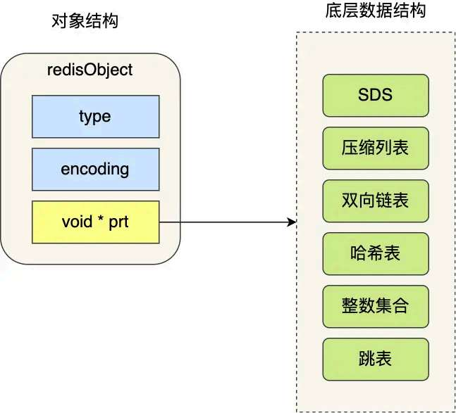

```
增长后新长度 <  1MB → 扩容为 2 × 新长度（翻倍）
增长后新长度 ≥  1MB → 扩容为 新长度 + 1MB（固定增量，避免巨大翻倍）

// Java ArrayList 也是类似逻辑：
// int newCapacity = oldCapacity + (oldCapacity >> 1); // 1.5 倍
// Redis 比 Java 更激进（翻倍 vs 1.5倍），以空间换时间
```

### 2.4 SDS 的三个杀手特性

**特性一：O(1) 获取长度**

```c
// C 原生字符串要 O(N) 遍历到 \0
size_t len = strlen(cstr);  // 内部是 while(*p != '\0') p++;

// SDS：直接读字段
size_t len = s->len;        // 就是读一个内存值，纳秒级
```

**特性二：杜绝缓冲区溢出（自动扩容）**

```c
// C 原生 strcat：如果 dst 后面没空间 → 覆盖了别的东西的内存 → 崩溃或安全漏洞
strcat(dst, src);

// SDS sdscat：先检查 free 够不够 → 不够自动扩容 → 再拼接
s = sdscat(s, " world");  // 内部分配足够空间再拼接，永远不会溢出
```

**特性三：惰性空间释放**

```java
// Java 类比：ArrayList 的 trimToSize()
List<String> list = new ArrayList<>(100);
list.add("a");
list.remove(0);
// 此时 elementData.length 还是 100，没有缩小！
```

SDS 同理——缩短字符串时只改 len，不回收 alloc 的内存。好处：下次再增长时，如果 free 够用，直接原地修改，不需要重新 malloc。

### 2.5 SDS 和 C 字符串的对比

| 特性 | C 字符串 | SDS |
|------|---------|-----|
| 获取长度 | O(n) 遍历 | O(1) 读取 len |
| 缓冲区溢出 | 容易 | 自动扩容，杜绝溢出 |
| 内存分配 | 每次修改都要分配 | 空间预分配 + 惰性释放 |
| 二进制安全 | 遇到 `\0` 截断 | 用 len 记录长度，存任意二进制 |
| 兼容性 | — | 仍然以 `\0` 结尾，兼容 C 函数 |

---

## 第三章：String（字符串）的三种内部编码（来自文档A完整内容）

### 3.1 String 的三种内部编码

当你执行 `SET key value` 时，Redis 会根据 `value` 的内容自动选择最省内存的编码：

```
OBJECT ENCODING key → 返回 "int" / "embstr" / "raw"
```

#### 3.1.1 int 编码——整数的极致优化

**条件：** value 能解析为整数，且不超过 `long`（64 位有符号）范围。

**做法：** 不分配 SDS！**直接把整数值存在 `redisObject` 的 `ptr` 字段里。**

```
正常的 RedisObject：
┌─────────────┐  ptr(8B)  ┌──────────┐
│ redisObject │──────────▶│   SDS    │  ← 这个 SDS 需要额外 malloc
│   16 字节   │           │ 堆中分配  │
└─────────────┘           └──────────┘

int 编码的 RedisObject（零额外内存！）：
┌─────────────┐
│ redisObject │  ptr = (void*)12345  ← ptr 字段不存地址，直接存整数值！
│   16 字节   │  读的时候：(long)obj->ptr → 12345
└─────────────┘
```

**这就像：**

```java
// Java 中不可能这样做——引用就是引用，不能当数字用
// 但 C 的指针本质就是 8 字节的整数（存的地址值），所以可以"借用"来存别的
// Redis 作者利用了这个 hack：ptr 字段不用来指向东西，直接存数字
```

#### 3.1.2 embstr 编码——对象和数据黏在一起的优化

**条件：** value 是字符串，长度 ≤ 44 字节。

**做法：** `redisObject` 和 `SDS` **在一次 malloc 中连续分配**。对象和数据是"粘在一起"的。

```
embstr 的内存布局（一次 malloc，64 字节块）：
┌──────────────────────64 字节──────────────────────────┐
│ redisObject │ sdshdr8 头 │  buf (字符串数据)  │ '\0'  │
│   16 字节   │   3 字节   │    最多 44 字节     │ 1 字节 │
└──────────────────────64 字节──────────────────────────┘

为什么是 44 字节？
  jemalloc 的分配块大小 = 2^n：8, 16, 32, 64, 128 ...
  64 字节的块正好装下：16 + 3 + 1 = 20 字节固定开销，剩 44 字节给数据

如果数据是 45 字节 → 64 字节块装不下 → 退化为 raw 编码
```

**embstr 的优点（对比 raw）：**

| 维度 | embstr | raw |
|------|--------|-----|
| malloc 次数 | 1 次 | 2 次（redisObject + SDS 分开分配） |
| free 次数 | 1 次（释放一个块即释放所有） | 2 次 |
| CPU 缓存 | **连续内存，cache line 友好** | 两块内存可能相距很远，cache miss |
| 修改操作 | **不支持原地修改**，一改就变 raw | 支持原地修改（SDS 有自己的扩容空间） |

**理解"cache 友好"：** CPU 从内存读数据时，不是按字节读，而是一次读 64 字节（一个 cache line）。`embstr` 的 redisObject 和 SDS 在同一个 64 字节块里，CPU 一次就读进来了。`raw` 的两块内存可能相距很远，CPU 需要两次内存访问。

#### 3.1.3 raw 编码——大字符串

**条件：** value 长度 > 44 字节。

**做法：** `redisObject` 和 `SDS` **分两次 malloc 分配**，redisObject.ptr 指向独立的 SDS。

```
raw 的内存布局（两次 malloc）：
                  ┌───────────────────────┐
┌─────────────┐   │ sdshdr8/16/32 头      │
│ redisObject │   │ + buf (数据 > 44 字节)│
│ ptr ────────┼──▶└───────────────────────┘
└─────────────┘
```

### 3.2 embstr 的"只读"特性

**embstr 是只读的——任何修改操作都会让它退化为 raw。**

为什么？因为你分配的是 64 字节的 jemalloc 块，**块已经封顶了，无法扩容。** 要对 SDS 做 APPEND/SETRANGE，必须扩容 → 但原块找不到相邻空闲空间 → 只能搬到一个新的大块 → 此过程要求 redisObject 和 SDS 分离。

```
127.0.0.1:6379> SET k "hello"
OK
127.0.0.1:6379> OBJECT ENCODING k
"embstr"              ← 5 字节 ≤ 44，用 embstr

127.0.0.1:6379> APPEND k " world，Redis 真的很快，因为他在内存中操作数据"
(integer) 71
127.0.0.1:6379> OBJECT ENCODING k
"raw"                 ← 71 字节 > 44，已经退化为 raw

// 以后不管怎么改，永远都是 raw，不会再回到 embstr
```

**类比 Java：** `String` 是不可变的（immutable）→ 每次修改都生成新 String。`StringBuilder` 是可变的，内部 `char[]` 自动扩容。Redis 的 `embstr` 相当于 `String`（不可变），`raw` 相当于 `StringBuilder`（可变，有自己的扩容空间）。

### 3.3 INCR 原子操作的内部实现路径

```
客户端发送：INCR counter

步骤 1. 解析 RESP 协议：命令=INCR, key=counter

步骤 2. 在 Redis 的全局 dict（键空间）中查找 key="counter"
       ├─ 不存在 → 创建一个 value=0 的 RedisObject(int 编码)
       └─ 存在 → 检查 value 能否解析为整数

步骤 3. 解析当前值（getLongLongFromObject）：
       ├─ encoding=INT → 直接取 (long)obj->ptr 就是整数值
       ├─ encoding=EMBSTR/RAW → 把 SDS 里的字符串转 long（如 "123" → 123L）
       └─ 不是数字 → 报错 "value is not an integer"

步骤 4. val = 当前值 + 1

步骤 5. 新值如果还在 LONG 范围内 → obj->ptr = (void*)新值（仍在 int 编码）
       新值如果超出 LONG 范围 → 转 embstr/raw 编码

全程在 Redis 主线程中一次性完成，中间不会被其他命令打断（单线程优势）
```

**为什么 INCR 是原子的？** 不是因为锁——是因为 **Redis 命令执行全程单线程**。INCR 的"读→加→写"中间不可能插入别的命令。但如果你在 Java 代码中写成两个命令：

```java
// ❌ 不原子的做法：
String val = jedis.get("counter");    // 命令 1
jedis.set("counter", String.valueOf(Integer.parseInt(val) + 1)); // 命令 2
// 两个命令之间可能被其他客户端的 INCR 插入 → 丢失更新
```

### 3.4 String 面试题

**Q1: embstr 为什么截在 44 字节？52 不行吗？**

答：不是 Redis 定的，是 **jemalloc 分配器的 64 字节块限制 + 结构体大小约束** 联立方程的结果：

```
变量：jemalloc 提供 64 字节块（2^6）
固定开销：redisObject(16B) + sdshdr8头(3B) + 结尾'\0'(1B) = 20B
可用 = 64 - 20 = 44B
```

**Q2: SET "12345"，encoding 是 int 还是 embstr？**

答：先尝试 `string2ll` 把 "12345" 转 `long` → 12345（成功，在 long 范围内）→ int 编码。`SET "99999999999999999999"`（20个9）超出 long 最大值 → `long long` 也溢出 → 放弃 int → 走 embstr（如果 ≤44 字节）。

---

## 第四章：双向链表——已被淘汰，但理解它的缺陷很重要（融合版）

### 4.1 链表节点和链表结构

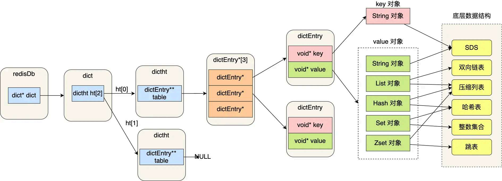

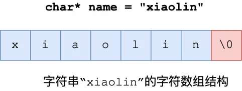

Redis 3.0 时代的 List 在大数据时使用双向链表。每个节点（listNode）有三个字段：`prev`、`next`、`value`——三个指针共 24 字节。如果数据本身才 3 字节（如 "abc"），结构开销是数据的 8 倍。

### 4.2 链表的致命缺陷

```java
// Java 的 LinkedList —— 双向链表
LinkedList<String> list = new LinkedList<>();
list.add("a");  // 创建 Node{prev=null, item="a", next=null}
list.add("b");  // 创建 Node{prev=Node(a), item="b", next=null}

// 每个 Node 的内存开销：
// 对象头(~12B) + prev引用(4B) + next引用(4B) + item引用(4B) = ~24 字节
// 但实际数据 item="a" 不过 2 字节（一个 char）
// 结构开销是数据的 10+ 倍！小数据时极度浪费！
```

Redis 早期版本的 `linkedlist` 编码就面临这个问题——存 1 万个 3 字节的短字符串，光链表指针就有 1万×16字节=160KB 额外开销。所以 Redis 一直在优化这件事。

---

## 第五章：压缩列表（ziplist）——已被 listpack 取代，但它是理解快速进化的重要一环（融合版）

### 5.1 ziplist 的设计初衷

ziplist 是 Redis 为了节省内存而设计的连续内存结构。它把所有元素紧凑地排在一起，用**相对偏移量**代替指针，省去了所有的 8 字节指针开销。


```
ziplist 的整体结构（一整块连续内存）：

┌──────────┬──────────┬──────────┬─────────┬─────────┬─────┬─────────┬────────┐
│ zlbytes  │ zltail   │ zllen    │ entry1  │ entry2  │ ... │ entryN  │ zlend  │
│ uint32_t │ uint32_t │ uint16_t │ 变长    │ 变长    │     │ 变长    │ 0xFF   │
│ 总字节数  │ 尾偏移量  │ 元素数量  │         │         │     │         │ 结束标记 │
└──────────┴──────────┴──────────┴─────────┴─────────┴─────┴─────────┴────────┘
     ←──────────── 固定 10 字节 header ────────────→
```

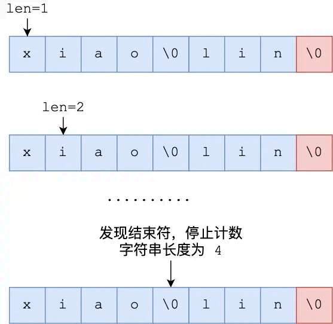

**每个 entry 的内部结构：**

```
┌──────────────────┬────────────────────┬──────────────────┐
│ prevlen          │ encoding + length  │ data             │
│ 前一个 entry 长度 │ 自己的数据类型+长度  │ 实际数据          │
│ (1 或 5 字节)     │ (1/2/5 字节)       │ (变长)           │
└──────────────────┴────────────────────┴──────────────────┘
```

**prevlen 的编码规则（这是 ziplist 最大的坑）：**

```
前驱 entry 长度 < 254 字节 → prevlen 用 1 字节存储
前驱 entry 长度 ≥ 254 字节 → prevlen 用 1 字节标记(0xFE) + 4 字节存实际值 = 5 字节

为什么有这道坎？→ 1 字节最大存 255，但留了一个 0xFF 给 zlend（结束标记）用
                  所以 254 以上需要"跳转标记" + 4 字节
```

### 5.2 连锁更新——ziplist 为什么被取代

**这是 Redis 数据结构中最精妙的陷阱之一。**

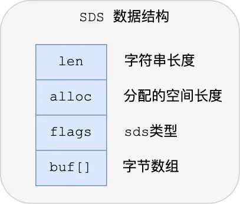


**场景：** 假设所有 entry 长度刚好在 253 字节（都在 prevlen=1 字节的这个舒适区）：

```
初始状态：
┌──────┬──────────┬──────┬──────────┬──────┬──────────┐
│ 1B   │  entry1  │ 1B   │  entry2  │ 1B   │  entry3  │
│prev=1│  253B   │prev=1│  253B    │prev=1│  253B    │  ← 每个 entry 共 254B
└──────┴──────────┴──────┴──────────┴──────┴──────────┘

在头部插入一个 254 字节的新 entry：
┌──────┬──────────┬─????─┬──────────┬─????─┬──────────┐
│ ?    │  new     │ prev │  entry2  │ prev │  entry3  │
│      │  254B    │      │  253B    │      │  253B    │
└──────┴──────────┴──────┴──────────┴──────┴──────────┘

entry2 的前驱变成了 254 字节！→ prevlen 必须从 1B 变 5B
→ entry2 本身从 254B 变成了 258B
→ entry3 的前驱从 253B 变成了 258B → prevlen 也必须从 1B 变 5B
→ entry3 本身从 254B 变成了 258B
→ entry4 同理...一直传到最后一个 entry！

最坏情况：每个 entry 都要扩容 → 每次扩容都要 memmove 搬迁后面所有数据
          → O(N²) 时间复杂度
```


**现实生产中极少触发——** 所有 entry 整齐落在 253/254 边界本身就需要巧合。但理论上它存在，Redis 7.0 决定彻底根治。

### 5.3 listpack——取而代之

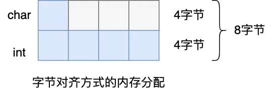


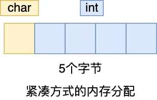

**listpack 怎么解决的——把 `prevlen` 改成 `backlen`（存自身长度，不存前驱长度）：**

```
ziplist entry：
  [prevlen][encoding+len][data]  ← prevlen 存前驱长度→连带受前驱影响

listpack entry：
  [encoding+len][data][backlen]  ← backlen 存自身长度→不受任何前驱影响！
  
反向遍历时：读当前 entry 的 backlen → 知道当前 entry 总长度 → 跳到前一个 entry
```

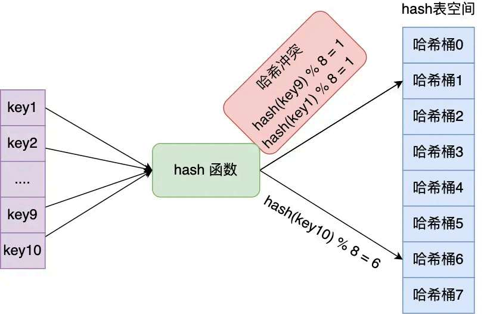

---

## 第六章：List 类型 —— 从层级演化到 quicklist（来自文档A完整内容）

### 6.1 List 的三代进化

```
Redis 2.x ~ 3.0：
  ziplist（小数据紧凑存储） / linkedlist（大数据双向链表）
  问题：linkedlist 内存碎片严重，两种编码切换不优雅

Redis 3.2 ~ 6.2：
  quicklist（统一实现） = 双向链表做骨干 + 每个节点内嵌 ziplist
  原理：链表少（比如 50 个节点），每个节点里装压缩的数组（省内存）

Redis 7.0+：
  quicklist 中的 ziplist 替换为 listpack
  原因：消除 ziplist 的"连锁更新"安全隐患
```

### 6.2 quicklist——链表的中间地带

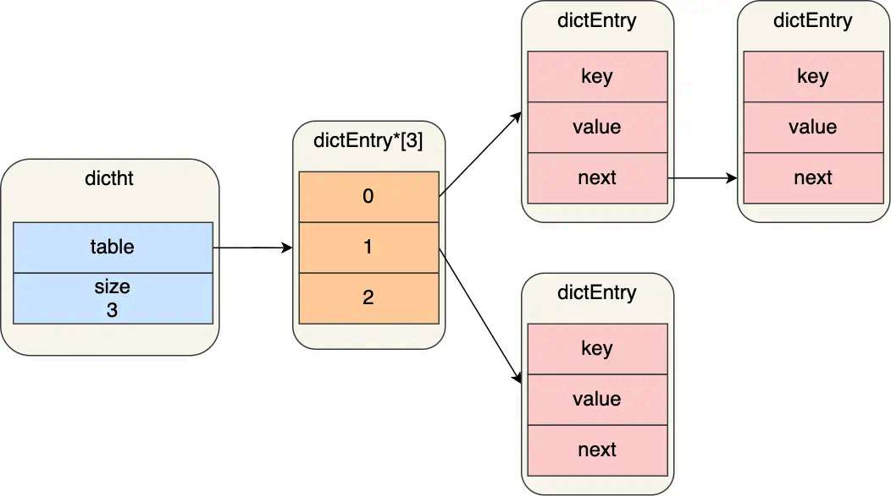

纯 ziplist/listpack 虽然省内存，但插入中间时需要搬移数据（O(N)）；纯 linkedlist 虽然插入快，但指针开销大。**quicklist 取两者之长。**

```
quicklist = LinkedList<Ziplist>：

┌─────────────────┐  prev/next  ┌─────────────────┐         ┌─────────────────┐
│  quicklistNode  │◄──────────▶│  quicklistNode  │◄───────▶│  quicklistNode  │
│  · ziplist      │            │  · ziplist      │         │  · ziplist      │
│  [a, b, c, d]   │            │  [e, f, g, h]   │         │  [i, j, k, l]   │
└─────────────────┘            └─────────────────┘         └─────────────────┘
   4个元素在一个节点               4个元素在一个节点             4个元素在一个节点

总共 12 个元素，只有 3 个链表节点 = 3 组前后指针 = 48 字节
vs 纯 linkedlist = 12 个 Node，每组 16 字节前后指针 = 192 字节
```

**quicklist 的节点源码定义（逐字段解释）：**

```c
typedef struct quicklistNode {
    struct quicklistNode *prev;  // 前驱节点引用（8字节）
    struct quicklistNode *next;  // 后继节点引用（8字节）
    unsigned char *entry;        // 指向 ziplist/listpack 数据的引用（8字节）
    size_t sz;                   // entry 的总字节数（8字节）
    unsigned int count : 16;     // 本节点内有多少个元素（2字节）
    unsigned int encoding : 2;   // 编码：1=无压缩, 2=LZF压缩（2bit）
    unsigned int recompress : 1; // 是否待重新压缩（1bit）
    // ...
} quicklistNode;
```

**从 Java 角度看 quicklist：**

```java
// 你可以把 quicklist 想象成这样（仅是概念类比，不是源码）：
class QuickList {
    static class QuickListNode {
        QuickListNode prev;
        QuickListNode next;
        byte[] compressedBlock;  // 里面装了多个元素（类似批量打包）
        int blockSize;
        int elementCount;
        boolean isCompressed;
    }
    QuickListNode head;
    QuickListNode tail;
    long totalElements;
    int nodeCount;
}
```

**当你 LPUSH 一个元素时：**

```
1. 找到 head 节点（链表头）
2. 检查 head 节点里的 ziplist 还有空间吗（< fill 限制，默认 8KB）
   ├─ 有空间 → 直接在 ziplist 头部插入
   └─ 无空间 → 创建新的 quicklistNode（含新 ziplist），元素放进去
                新节点成为 head，原 head 变为第二个
3. LPUSH 完成，O(1)
```

**head 和 tail 节点是特殊的（不压缩）：**

```
list-compress-depth 1 的含义：

  [不压缩] ←→ [压缩] ←→ [压缩] ←→ ... ←→ [压缩] ←→ [不压缩]
    head                                        tail

两端各 1 个不压缩：保证 LPUSH/LPOP/RPUSH/RPOP 极快（不需要解压）
中间的节点 LZF 压缩（类似 zip，极轻量，约 50% 压缩率）
```

### 6.3 List 面试题

**Q: 为什么 Redis 不用 Java 的 LinkedList 那种做法（每个元素一个 Node）？**

答：记忆溢出。Java LinkedList 每个 Node 大约 24 字节，而 listpack 里的小元素只需要 1-2 字节。存百万级小数据时，quicklist 可能只要 ~3MB，纯 linkedlist 需要 ~24MB。Redis 是内存数据库，每一字节都要省。

---

## 第七章：Hash（哈希）—— Redis 的"小 HashMap"（来自文档A完整内容 + 小林图解）

### 7.1 Java 的 HashMap 是怎么存储的？

先回顾 Java 的 HashMap，方便后面对比：

```java
// Java HashMap 的内部结构：
HashMap<String, User> map = new HashMap<>();
map.put("user:1", new User("张三"));

内部存储：
┌───┬───┬───┬───┬───┬───┬───┬───┬───┬───┬───┬───┬───┬───┬───┬───┐
│ 0 │ 1 │ 2 │ 3 │ 4 │ 5 │ 6 │ 7 │ 8 │ 9 │10 │11 │12 │13 │14 │15 │ ← 桶数组
└───┴───┴───┴─│─┴───┴───┴───┴───┴───┴───┴───┴───┴───┴───┴───┴───┘
               │
               ▼
            ┌─────────────┐
            │ Node(key=   │
            │ "user:1",   │
            │ value=User, │
            │ next=null)  │
            └─────────────┘
            
"user:1".hashCode() → 某个 int 值 → 取模映射到桶索引 3 → 放在桶[3] 上
如果哈希冲突 → 链表 / 红黑树
如果元素太多 → 扩容（容量翻倍），所有元素 rehash 重新打散
```

### 7.2 Redis Hash 的两种内部编码

```
小 Hash → listpack（内存紧凑）    类似 ArrayList<byte[]> 顺序存储
大 Hash → dict（真正哈希表）      类似 Java HashMap

切换阈值：
  hash-max-listpack-entries 512    ← field 个数 > 512 → 切换
  hash-max-listpack-value 64       ← 任一 field/value 长度 > 64 字节 → 切换
  两个条件都满足才切换
```

### 7.3 listpack 编码的 Hash

```
Hash 存在一个 listpack 中，field-value 交替排列：
[f1][v1][f2][v2][f3][v3]...

HGET key f2：
  从头遍历 → 找到 f2 → 读取下一个 entry = v2 → 返回
  O(N)，但 N ≤ 512，且连续内存无 cache miss，遍历一次可能只要几微秒
```

### 7.4 dict 编码——Redis 的"哈希表引擎"

**dict 是 Redis 中最核心的数据结构——全局键空间、Hash 类型大数据、Set 大数据、ZSet 的 member→score 映射都用 dict。**

#### 7.4.1 dict 的三层结构

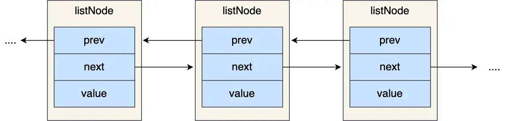

```
dict 整体的三层嵌套（从外到内）：

dict（字典）
 └─ dictht（哈希表）×2 —— ht[0] 当前用，ht[1] rehash 目标
     └─ dictEntry[]（桶数组）—— 每个桶是一个链表的头
         └─ dictEntry → dictEntry → dictEntry（拉链法）

Java 类比：
class RedisDict {
    HashTable ht0;  // 当前使用的哈希表
    HashTable ht1;  // 扩容时的目标表（平时为空）
    int rehashIdx;  // -1 = 不在 rehash；≥0 = 正在 rehash
}

class HashTable {
    DictEntry[] table;  // 桶数组
    int size;           // 桶数量（总是 2^n）
    int used;           // 已有 entry 数量
}

class DictEntry {
    Object key;        // SDS 字符串
    Object value;      // 实际数据（可能是 RedisObject、long、double）
    DictEntry next;    // 指向链表下一个（拉链法解决冲突）
}
```

**dictEntry 的 struct：**

```c
typedef struct dictEntry {
    void *key;                    // 指向 key（SDS 字符串）；指针 8 字节
    union {                       // 联合体——多个字段共享同一内存，只有一个有效
        void *val;                // 指向 value（指针）；8 字节
        uint64_t u64;            // 或直接存 64 位无符号整数；8 字节
        int64_t s64;             // 或直接存 64 位有符号整数；8 字节
        double d;                 // 或直接存 double；8 字节
    } v;                          // 联合体总共 8 字节
    struct dictEntry *next;       // 指向链表下一个 entry；指针 8 字节
} dictEntry;                      // 共 24 字节 = 3 × 8
```

**union 是什么？** Java 没有直接的对应物。可以理解为"一个字段，多种身份"——这个 8 字节的空间，有时候存指针、有时候存整数、有时候存 double，同一时间只有一种身份有效。Redis 用这个技巧避免为不同 value 类型分配不同大小的 entry。

#### 7.4.2 哈希表——桶数组（dictht）

```c
typedef struct dictht {
    dictEntry **table;        // 指向桶数组的指针（指针的指针）
    unsigned long size;       // 桶数组大小（总是 2^n：4,8,16,32...）
    unsigned long sizemask;   // = size - 1（用于快速 hash & sizemask 替代 % 取模）
    unsigned long used;       // 已经装了多少个 entry
} dictht;
```

**`dictEntry **table` 怎么理解？**

```java
// Java 类比：
// dictEntry** 等价于 Java 的 DictEntry[]（数组的引用）
// 每个 table[i] 是一个链表头（DictEntry 的引用）

DictEntry[] table;  // Java 版——数组，每个元素是链表的头节点引用
table = new DictEntry[16];  // 16 个桶
table[3] = new DictEntry(key1, val1, null);  // 桶[3]上放一个 entry
table[3].next = new DictEntry(key2, val2, null);  // 桶[3]上挂第二个 entry
```

#### 7.4.3 哈希取模的技巧——为什么桶数总是 2^n

```java
// Java：hash & (table.length - 1)   ← 位运算取模，前提是 length = 2^n
int index = hash & (table.length - 1);

// 如果 size = 16 (2^4)，sizemask = 15 (binary: 0000 1111)
// hash & 15 = hash 的低 4 位 → 正好映射到 0~15 → 等价于 hash % 16，但速度更快

// 扩容后 size = 32 (2^5)，sizemask = 31 (binary: 0001 1111)
// hash & 31 = hash 的低 5 位 → key 可能被重新分配到 16+新位置（稍后详述）
```

#### 7.4.4 扩容触发条件

```
扩容（ht[1].size = 大于等于 ht[0].used*2 的最小 2^n）：
  ├─ 负载因子 ≥ 1（used/size ≥ 1） 且 没有子进程在跑（dict_can_resize=1）
  └─ 负载因子 ≥ 5  →  强制扩容，不管子进程

缩容（used / size < 0.1，且 used > 4）：
  ht[1].size = 大于等于 used 的最小 2^n
```

**负载因子是什么？** 类比 Java HashMap 的 `threshold = capacity * loadFactor`。Redis 的负载因子阈值是 1——比 Java 的 0.75 更激进（Redis 愿意承受更多冲突以节省内存）。

### 7.5 渐进式 Rehash——Redis 最重要的性能设计之一

#### 7.5.1 为什么不能一次性 rehash？

```java
// Java HashMap 的扩容：一次性迁移所有元素
// 如果 HashMap 里有 100 万个 entry → 一次性 rehash 可能要几十毫秒
// Java 多线程环境下，这会导致一条线程长时间占有 CPU
// Redis 单线程环境 → 几十毫秒 = 几万个请求排队 → 用户明显感知延迟
```

**Redis 做法：把一个"大搬迁"拆成"无数次小搬迁"。**

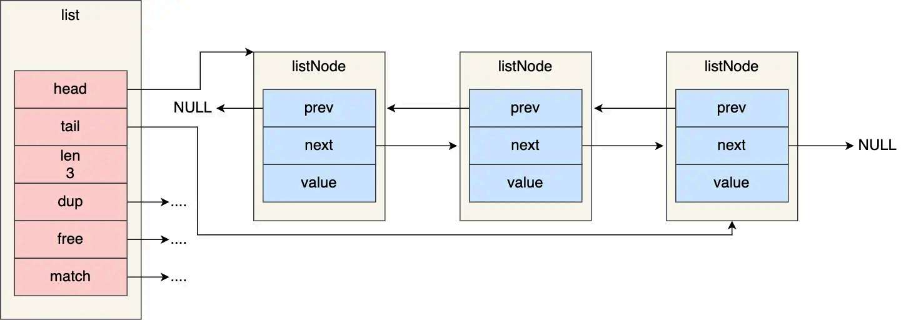


#### 7.5.2 渐进式 Rehash 的执行流程

```
启动 rehash：
  1. ht[1].size = 大于等于 ht[0].used*2 的最小 2^n
     例如 ht[0].used = 5, ht[0].size = 4 → ht[1].size = 16 (不小于 10 的 2^n)
  2. 分配 ht[1] 的桶数组
  3. rehashidx = 0（开始从 ht[0] 的第 0 个桶搬迁）

每次搬迁：
  dict 被访问时（增/删/改/查），顺带搬迁 ht[0].table[rehashidx]
  把一个桶及其链表上所有 entry 重新 hash 搬到 ht[1]
  rehashidx++

搬迁完成：
  当 rehashidx == ht[0].size（所有桶搬完）
  → 释放 ht[0]，ht[1] 升格为新的 ht[0]
  → rehashidx = -1（标志着 rehash 已完成）
```

**rehash 期间的查找：** 先去 ht[0] 找 → 没找到 + 正在 rehash → 再去 ht[1] 找。因为新增只写 ht[1]，所以 ht[1] 可能有 ht[0] 没有的 key。

#### 7.5.3 每次搬一个桶是什么体验？

```
假设 ht[0] 有 512 个桶，每个桶平均 2 个 entry：

客户端发了 512 次请求（每次请求触发一次搬迁）→ rehash 完成
用户完全感知不到——每次请求只是多了 "搬一个桶（平均 2 个 entry）的重新哈希" 这点时间
```

**如果没有任何请求怎么办？** Redis 的定时任务 `serverCron` 每 100ms 运行一次，每次用 1ms 时间片专门做 rehash 搬迁，确保空实例的 rehash 也会向前推进。

**类比 Java：** Java 的 `ConcurrentHashMap` 扩容时也是多线程分段迁移，但那是为了并发——Redis 单线程，分段迁移是 **为了不卡住主线程**。

---

## 第八章：Set（集合）—— 去重 + 集合运算的三板斧（来自文档A完整内容）

### 8.1 Set 的本质

```
Set = 不关心顺序，只关心"存在与否"的去重集合
    = Java 的 HashSet 语义
```

### 8.2 Set 的两种内部编码

```
小 Set（全为整数 + ≤ 512 元素）→ intset（有序整数数组，二分查找）
大 Set 或 有非整数 → dict（哈希表，value=NULL）

切换阈值：set-max-intset-entries 512
```

### 8.3 intset——Redis 最精致的整数压缩结构

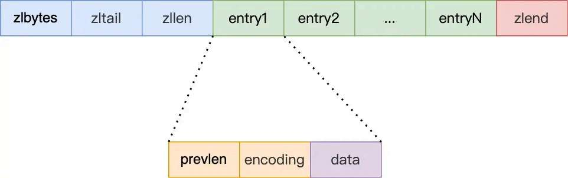

```
intset = 有序整数数组，不带任何指针

┌───────────────┬───────────────┬───────────────────────┐
│ encoding      │ length        │ contents[]            │
│ uint32_t(4B)  │ uint32_t(4B)  │ 按 encoding 定长存储   │
│ 编码类型       │ 元素个数       │ 升序排列，二分查找      │
└───────────────┴───────────────┴───────────────────────┘
    固定 8 字节头

encoding 三种取值：
  INTSET_ENC_INT16 = 2   → 每个元素占 2 字节（范围 -32768 ~ 32767）
  INTSET_ENC_INT32 = 4   → 每个元素占 4 字节（范围 -2^31 ~ 2^31-1）
  INTSET_ENC_INT64 = 8   → 每个元素占 8 字节（范围 -2^63 ~ 2^63-1）
```

**元素存储示例：**

```
encoding=INT16，length=3，存 [1, 100, 30000]

内存布局：
┌────┬────┬────┬────┬────┬────┬────┬────┬──────────┐
│enc │enc │len │len │  1 │ 100│30000│30000│          │
│    │    │    │    │(2B)│(2B)│(2B) │(2B) │          │
└────┴────┴────┴────┴────┴────┴────┴────┴──────────┘
 ← 4B header →← 4B header →← 3×2B = 6B contents →

一共 14 字节 = 3 个整数。如果存在 dict 里，仅指针就数倍于此。
```

**编码升级（intsetUpgradeAndAdd）：**


```
现有 encoding=INT16（2字节/元素），存 [1, 2, 3]
要插入 65536（超出 INT16 范围）

升级步骤：
  1. 新 encoding = INT32（4字节/元素）
  2. 重新分配 contents 数组：
     新大小 = 8B(header) + 4元素×4B = 24B
  3. 从后往前搬数据（关键！避免覆盖）：
     先把 3 从 2 字节转 4 字节 → 放在末尾
     再把 2 从 2 字节转 4 字节 → 放在倒数第二
     再把 1 从 2 字节转 4 字节 → 放在倒数第三
     65536 放在 1 之前(如果没找到位置)
  4. encoding = INT32, length = 4
  5. 释放旧 contents

只升级不降级：删掉 65536 后 encoding 仍然是 INT32
```

**为什么要保持有序？** 因为要支持 **二分查找**，O(logN)。增/删/查都是先二分定位再操作。

### 8.4 Set 的 dict 编码——空 value 技巧

```
当 Set 不是纯整数、或元素 > 512 → dict 编码

dict 中的每个 entry：
  key = member（SDS 字符串）
  value = NULL  ← 不存任何东西！key 本身就够判断"存在与否"

为什么存 NULL？
  Set 只关心 "member 在不在"，不需要额外存 value
  NULL 在 dictEntry 的 union 中就是 (void*)0 —— 零开销
```

### 8.5 集合运算——Set 的杀手锏

**SINTER（交集）内部算法：**

```
SINTER key1 key2 key3：

1. 把所有集合按 size 排序：key3(100个) < key2(1000) < key1(10000)
2. 遍历最小的集合 key3 的每个 member
3. 对每个 member，查它在 key2 和 key1 中是否存在
4. 都存在 → 加入结果

为什么从最小集合开始？→ 每个元素最多检查 (M-1) 次
总操作次数 = size(最小) × 检查次数 = 100 × (3-1) = 200 次 dict 查找
如果从最大开始 = 10000 × 2 = 20000 次 → 理论上差 100 倍
```

### 8.6 Set 面试题

**Q: intset 的二分查找 O(logN)，dict 的哈希查找 O(1)——但为什么 intset 在 ≤512 时反而更快？**

答：大 O 不计算常数因子。intset 的 512 个整数在 2KB 的连续内存中，二分查找 9 次比较（log₂512），每次比较都在 L1/L2 cache 中 → 总计约 20ns。而 dict 的哈希查找需要一次哈希计算 + 一次随机内存访问（指针跳转），如果目标不在 cache 中 → 50~100ns。所以 O(logN) < O(1) 在小 N 下成立——**CPU cache 决定了常数因子**。

---

## 第九章：跳表（skiplist）—— ZSet 的排序引擎（融合版）

### 9.1 跳表——理解它的本质

#### 9.1.1 为什么不用红黑树？

Java 的 `TreeMap` 用红黑树。跳表作者（William Pugh）提出跳表的动机就是：**红黑树太复杂了。**

```
Redis 跳表实现：约 200 行 C 代码
Java TreeMap（红黑树）：约 2500 行 Java 代码
```

#### 9.1.2 跳表的直觉——给链表加上"快速通道"

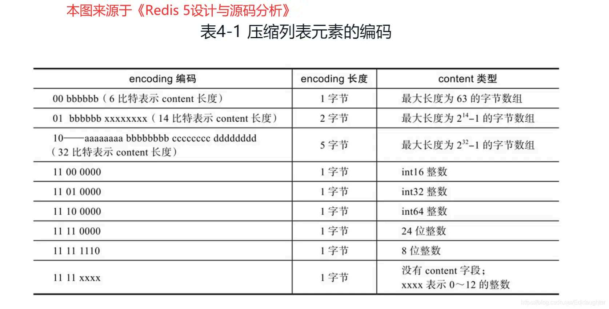

```
普通的排好序的单链表查找 30：
  HEAD → 10 → 20 → 30 → 40 → 50
  从头一个个往后找 → O(N)

给链表加一层"高速公路"：
  level 1: HEAD ────────▶ 30 ────────▶ 50   ← 快速通道
  level 0: HEAD → 10 → 20 → 30 → 40 → 50   ← 慢车道（全量）

查找 30：
  从高层开始走：HEAD → 30（一步！）→ O(logN)
查找 25：
  高层：HEAD → 30（过了，回退到 HEAD）
  低层：HEAD → 10 → 20（下一步30，过了）→ 25 不存在 → O(logN)
```

**这就是跳表的核心思想——给有序链表加多层"索引"，每层跳过更多节点。**

#### 9.1.3 Redis 跳表的完整结构

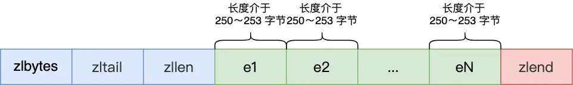

```
zset（总控结构）：
┌─────────────────────────┐
│ dict* dict              │ → member → score (O(1) 查分)
│ zskiplist* zsl          │ → 跳表 (O(logN) 范围查)
└─────────────────────────┘

两者共享 member 对象（SDS），不额外占用内存

zskiplist（跳表）：
┌─────────────────────────┐
│ header → 固定 64 层头节点 │ （不计入 length）
│ tail   → 尾节点          │
│ length → 节点总数         │
│ level  → 当前最高层数     │
└─────────────────────────┘

zskiplistNode（跳表节点）：
┌──────────────────────────┐
│ sds ele                  │ ← member（SDS 字符串，和 dict 共享）
│ double score             │ ← 分值
│ backward → 前驱节点(仅L0)│ ← 只有最低层有前驱（用于 ZREVRANGE）
│ level[0] {forward, span} │   第 0 层
│ level[1] {forward, span} │   第 1 层（可能空）
│ level[2] {forward, span} │   第 2 层（可能空）
│ ...最多 ZSKIPLIST_MAXLEVEL=64 层
└──────────────────────────┘
```

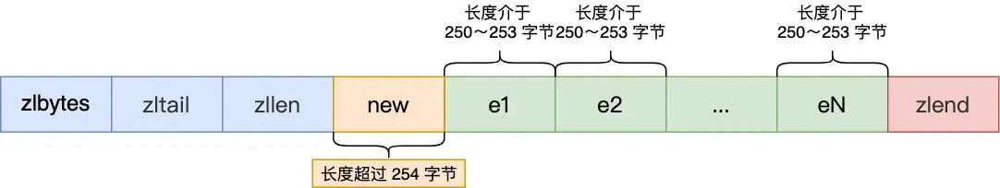

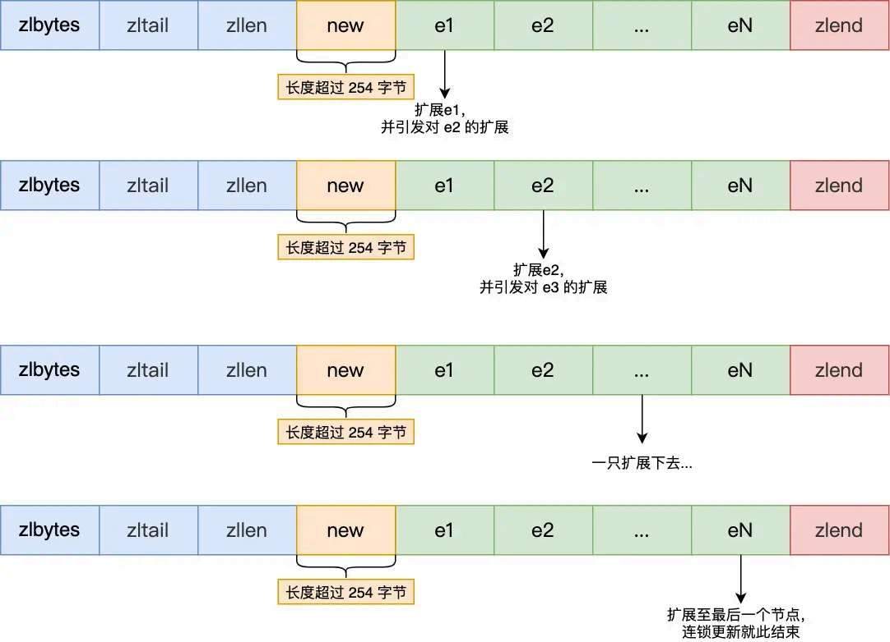

**span 是什么？** 本层从当前节点跳到 forward 节点，**中间跳过了几个节点**。这是 ZRANK（排名）O(logN) 的核心——不需要从 level 0 逐个往后数，而是每层累加 span 值。

#### 9.1.4 ZADD 的插入——完整的步骤

```
ZADD rank 95 "李四"：

1. 更新数组：从最高层往下遍历，每一层记录"在这一层，谁是新节点的前驱"→ update[64] 数组

2. 同层更新 rank（排名累加 span）：
   在遍历过程中累计每个"跳跃"跳过的 span

3. 随机生成新节点的层高（zslRandomLevel）：
   level = 1
   while (随机数 < 25% 概率) level++
   最多 64 层
   
   为什么 25%？期望每 4 个节点有 1 个升一层
   每 16 个节点有 1 个升两层（等比递减）
   类似二叉树——高度 O(logN)

4. 分层插入：
   对于 level 0 到 level(new) 每一层：
     把新节点插到 update[i] 和 update[i]->forward 之间
     更新 span：新节点的 span = 原跨度 - 跳过的
              update[i] 的新跨度 = 跳过的 + 1

5. 更新 backward 指针：只 level 0 需要（反向遍历用）
```

#### 9.1.5 ZSCORE 和 ZRANK 的实现

```
ZSCORE rank "李四"：
  直接查 dict → O(1)

ZRANK rank "李四"：
  在 dict 中 O(1) 找到 score=95
  在 skiplist 中查找 score=95 + member="李四"
      查找过程中累计 span:
      HEAD → 第1个节点 span=1 → ... → "李四" span=3
      rank = 1 + 2 + 3 = 6（从 0 开始）

  或者，最简单的理解：查找这个节点在跳表中的位置
  同时通过 span 计算它前面有多少个节点 → O(logN)
```

### 9.2 ZSet 面试题

**Q: 为什么是跳表而不是红黑树？**

答：（1）跳表实现约 200 行，红黑树 2000+ 行——简单即正确；（2）跳表的范围查询极度直观：找到起点顺着链表走就是；红黑树要做中序遍历（需要处理非叶子节点）；（3）跳表通过 span 天然支持 O(logN) 的 ZRANK；红黑树需要额外维护子树大小；（4）跳表的随机平衡比红黑树的旋转维护简单得多。

**Q: ZSet 一定需要 dict + skiplist 两个结构吗？只用一个行不行？**

答：不行。只有 dict → ZRANGE 需要先获取所有 member 排序，O(NlogN) 还要分配内存。只有 skiplist → ZSCORE 查分需要 O(logN) 而非 O(1)。两个结构互补，且 member 的 SDS 对象在两个结构中共享指针，不会多占用内存。

**Q: 跳表的层高是如何随机生成的？为什么用 1/4 而非经典跳表的 1/2？**

答：每层独立以 1/4 概率递增——大部分节点只有 1~2 层。期望高度 = 1/(1-1/4) = 1.33 层。1/2 会生成更多高层节点（期望 2 层），插入时需要多更新指针，多出来的查找效率提升微乎其微。Redis 选择 1/4，让跳表更"矮胖"，插入更快。

---

## ⭐️ 全类型总结（来自文档A）

| 类型 | 小数据编码 | 大数据编码 | 切换条件 |
|------|-----------|-----------|---------|
| **String** | int / embstr | raw | 非整数 or >44字节 |
| **List** | quicklist（统一实现） | ← 不分大小 | fill=8KB/节点 |
| **Hash** | listpack | dict (hashtable) | field>512 or 单 value>64B |
| **Set** | intset（有序数组） | dict (空value) | >512 元素 or 非整数 |
| **ZSet** | listpack | dict + skiplist | >128 元素 or 单 member>64B |

**核心设计哲学：**
- **小数据用紧凑结构（listpack/intset/embstr）**——连续内存、无指针、cache 友好
- **大数据用高效结构（dict/skiplist/quicklist+listpack）**——保证操作复杂度可控
- **编码从紧凑结构升到高效结构是单向不可逆的**（分配代价大，没必要降回来）

---

## ⭐️ 综合面试题（来自文档A）

**Q1: Redis 为什么每种类型搞多种底层编码？和 Java 的面向接口编程有什么相通之处？**

答：Java 中 `List<String> list = new ArrayList<>()`——你用的是 List 接口，底层可能是 ArrayList 也可能是 LinkedList。Redis 也是：Hash 类型对外统一接口（HSET/HGET/HGETALL），底层到底是 listpack 还是 dict ——使用者不需要知道。这本质上是 **策略模式**——小数据用紧凑实现（省内存），大数据换高效实现（保性能），运行中自动切换。

**Q2: Redis Object 的 encoding 字段有 4 bit，最多表示 16 种编码——现在用了哪些？**

答：`OBJ_ENCODING_RAW(0)`、`OBJ_ENCODING_INT(1)`、`OBJ_ENCODING_HT(2)`（即 dict）、`OBJ_ENCODING_ZIPLIST(5)`（旧版）、`OBJ_ENCODING_LINKEDLIST(4)`（已废弃）、`OBJ_ENCODING_INTSET(6)`、`OBJ_ENCODING_SKIPLIST(7)`、`OBJ_ENCODING_EMBSTR(8)`、`OBJ_ENCODING_QUICKLIST(9)`、`OBJ_ENCODING_STREAM(10)`、`OBJ_ENCODING_LISTPACK(11)`。11 种用了 4 bit 的 16 个位置。

**Q3: DEL 一个大 Hash（500 万 field）会发生什么？**

答：DEL 在主线程释放 dict（遍历所有 dictEntry 逐个 free），500 万的释放可能阻塞 Redis **几百毫秒到秒级**。解决：Redis 4.0+ 提供 `UNLINK` 异步删除（主线程只把 key 从键空间摘掉，实际内存释放交给后台线程 `BIO_LAZY_FREE`）。`DEL` 是同步阻塞的，`UNLINK` 是非阻塞的。这是大厂生产环境排查"Redis 为什么偶发 latency spike"的一个高频原因。

**Q4: 使用 `redis-cli --bigkeys` 扫描大 Key 会阻塞吗？**

答：不会。`--bigkeys` 用 `SCAN` 系列命令（分批返回），不会阻塞主线程。但它只统计元素数（SCARD/HLEN/LLEN/ZCARD），不统计内存占用。要看真实内存用 `MEMORY USAGE key`。

---

*Created: 2026-05-26 | 融合：03-Redis数据类型(104KB) + 小林coding图解(74KB) → 综合版 | Category: 25-Redis数据结构*
